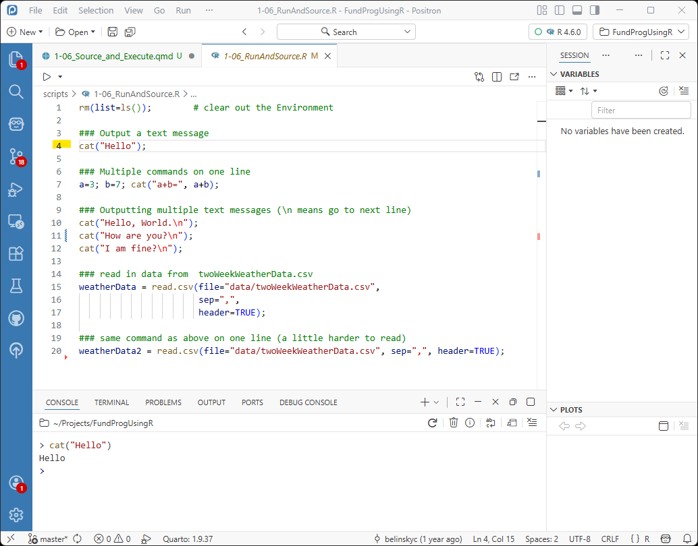
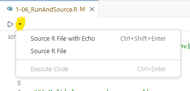
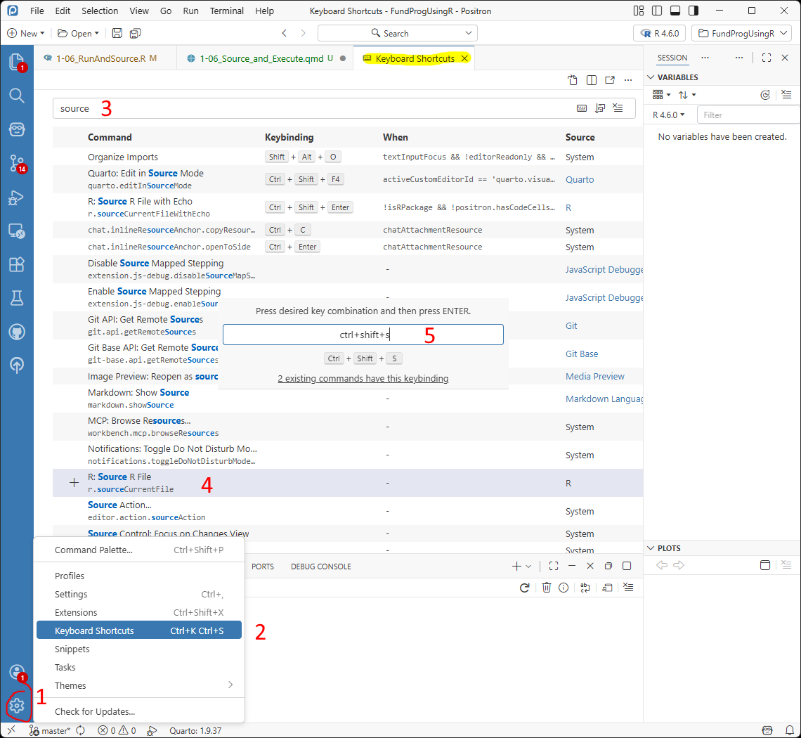
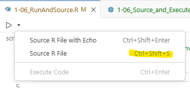
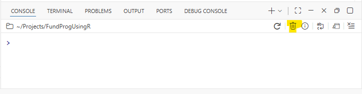

### Changes...

## Purpose

- look at some of the features of R and Positron

- explore uses for the Console

- run script using ***Execute*** and ***Source***

### Files for the lesson

The [script for the lesson is here](../scripts/1-06_RunAndSource.R)

The [data for this lesson is here](../data/twoWeekWeatherData.csv)

 

We are using the same script for this and the next lesson. In this lesson the focus is on the different ways to execute your code and other features in Positron.  In the next lesson the focus will be more on the content of the lesson's script.

 

If you have any questions about the material in this lesson, feel free to email them to the instructor, , at .

## Output to console

In this and the next lesson we are going to make extensive use of the ***Console*** tab, which can be used to execute code and as output for your script file.  Like the ***Variables*** tab, it is difficult to maintain lesson images so I will use text instead.

 

For example (the details will be explained later):

- open the script for this lesson in your Project Folder

- click on line **4** (i.e., put the cursor on line 4)

- click ***Control-Enter*** (***Command-Enter*** on Mac) to ***execute*** line 4

 

The Positron window looks like this:

{#fig-console-output .fs}

 

Instead of displaying the Positron image, I will display the output to the ***Console*** tab like this:

::: {#fig-consoleTab}
``` {.r tab="Console"}
> cat("Hello"); 
Hello
>
```

Output to the Console tab after executing line 4
:::

## Sourcing and echoing

The right-arrow button used to execute your script in Positron has a small down arrow next to it. That arrow presents three common options for executing commands in your script:

1.  ***Source R File with Echo***: Runs your whole script (***Source***) and outputs the code to ***Console*** (***echo***)

    - This is the same as clicking the right arrow

2.  ***Source R File***: Runs your whole script [without outputting code to ***Console***]{.hl}

3.  ***Execute Code***: Runs a single command, line, or highlighted code. It is grayed out when no code is selected

{#fig-executeCommands .fs}

### Echo vs no echo

When you click the right arrow, it always does a ***Source R File with Echo*** (i.e., the first option). This is what appears in the ***Console*** ([note: the first line is the command sent when you click the ***Source*** button]{.note}):

``` {.R tab="Console"}
> source("c:/Users/Charlie/Projects/FundProgUsingR/scripts/1-06_RunAndSource.R", «echo = TRUE»)

> rm(list=ls());        # clear out the Environment  

> ### Output a text message
> cat("Hello"); 
Hello
> ### Multiple commands on one line
> a=3; b=7; cat("a+b=", a+b);
a+b= 10
> ### Outputting multiple text messages (\n means go to next line)                    
> cat("Hello, World.\n");
Hello, World.

> cat("How are you?\n"); 
How are you?

> cat("I am fine?\n");
I am fine?

> ### read in data from  twoWeekWeatherData.csv
> weatherData = read.csv(file="data/twoWeekWeatherData.csv", 
+                        sep=",",
+      .... [TRUNCATED] 

> ### same command as above on one line (a little harder to read)
> weatherData2 = read.csv(file="data/twoWeekWeatherData.csv", sep=",", header=TRUE);
>
```

If you choose the second option, ***Source R File*** (without echo), this is what you see in the ***Console***:

``` {.R tab="Console"}
> source("c:/Users/Charlie/Projects/FundProgUsingR/scripts/1-06_RunAndSource.R")
Helloa+b= 10Hello, World.
How are you?
I am fine?
>
```

When you do not use echo, the only output in ***Console*** is the command to run your script (first line) and anything your script explicitly sends to ***Console*** (lines 2-4, which we cover later). When you use echo, all of the code (including comments) outputs to ***Console***.

### Source without echo keyboard shortcut

Most programmers prefer to Source ***without*** echoing (the default in RStudio) because the Console is much less cluttered. To make this easier, we will create a keyboard shortcut to ***Source R File*** (without echo):

1.  Click the Setting wheel in the bottom-left corner
2.  Choose ***Keyboard Shortcuts*** (a ***Keyboard Shortcuts*** tab will open)
3.  In the text box on top type `source`
4.  Double-click ***R: Source R File***
5.  Put in the keyboard shortcut you want and press ***enter***. I chose ***ctrl+shift+s*** because this is the shortcut in RStudio. This will overwrite Positron's ***Save as...*** shortcut so you might want to choose something else.

 

{#fig-keyboardShortcut .fs}

After you do this, you will be able to use ***ctrl+shift+s*** (or whatever keyboard combo you chose) to Source without echo. You will also see the new shortcut when you click on the down arrow:

{#fig-newShortcut .fs}

## Entering commands directly into Console

You can directly type commands in the ***Console*** . For instance, you can type the code to Source your script without echo (just the highlighted line and press enter):

``` {.R tab="Console"}
> «source("scripts/1-06_RunAndSource.R")»
Helloa+b= 10Hello, World.
How are you?
I am fine?
>
```

[note: this file path is relative to the Project Folder (i.e., Working Directory) and assumes you put the lesson script in the ***scripts*** folder and did not change its name.]{.note}

 

You can type in a simple output command in ***Console***:

``` {.r tab="Console"}
> «cat("Hello")»
Hello
>
```

A common issue for people using the ***Console*** is that they will not complete commands.  For example, type `cat("He` in the ***Console*** and press ***enter***:

``` {.r tab="Console"}
> «cat("He»
+
```

A ( **+** ) appears on the next line.  The ( **+** ) means that R sees an unfinished command and is prompting you to finish it.  You can finish it by typing `llo")` in the ***Console***. The result will still be a bit off:

``` {.r tab="Console"}
> cat("He 
+«llo")» 
He 
llo
>
```

### Quick view of variables

Another use for the ***Console*** is to quickly view some value.  If you want to see the ***highTemp*** column in ***weatherData*** you can type in the ***Console*** (this only work if you have already Sourced the script):

``` {.r tab="Console"}
> «weatherData$highTemp»
[1] 57 50 54 40 39 58 60 53 55 44 39 54 61 75
>
```

[Note: after you type **\$** in **weatherData\$**, Positron will start offering you column suggestions – a very convenient feature when you have large dataframes.]{.note}

## Execute vs. Source

***Source*** is used to execute the entire script (i.e., every command) while the ***Execute Code*** command (***Control/Command-Enter***) is used to selectively run commands.  ***Execute*** is a great tool for debugging and testing your code and we are going to almost exclusively use ***Execute*** for the next two lessons.

 

You can also ***Execute*** code by clicking the drop down arrow next to the Source button and choosing ***Execute Code*** (@fig-newShortcut) . [Note: ***Execute*** is *almost* equivalent to ***Run*** In RStudio.]{.note}

 

It is important to learn how to run individual commands but your goal with most scripts is still to be able to execute the whole file using ***Source***.  It takes longer to develop a script that can be cleanly ***Source*** but it forces you to automate your script which makes your script easier to debug and share.

### Executing one line

[note: ***Execute***, from now on, mean you either click ***Control/Command+Enter*** or click ***Execute Code***]{.note}

[ ]{.note}

We already have an example of using ***Execute*** to run one line in @fig-consoleTab.  When we put the cursor on line **4** and ***Execute***, R runs the ***cat()*** command on line **4**.  We will talk much more about ***cat()*** next lesson but ***cat()*** outputs to the ***Console*** whatever is in the parentheses.

 

Actually, ***Execute*** will execute the next line with a command. If you put your cursor on line 2 or 3 and ***Execute***, line 4 will still run because line 2 has nothing and 3 is a comment that R ignores. R looks for the next command (on line 4) and executes it.

::: {#fig-commandLines}
``` {.r tab="Console"}
>   cat("Hello");             
Hello            
>
```

The Console after ***Execute*** is clicked on line 3
:::

### Executing one command on multiple lines

Lines 15-17 contain the command to open the ***twoWeekWeatherData.csv*** file and save the data to a data frame named ***weatherData***.

``` r
  ### read in data from  twoWeekWeatherData.csv   
  weatherData = read.csv(file="data/twoWeekWeatherData.csv",                           
                         sep=",",                          
                         header=TRUE);
```

When you ***Execute***, R will either run the entire line or, if the line is part of a larger command, will run the whole command. Lines 15-17 is one command over 3 lines. If we put the cursor on any line from 15-17 and ***Execute***, R will run the whole command.

 

After ***Execute***, the ***Console*** shows lines 15-17 were executed -- the ( **+** ) at the beginning of the lines in the ***Console*** says that this line is a continuation of the command from the previous line.

::: {#fig-multiline}
``` {.r tab="Console"}
> weatherData = read.csv(file="data/twoWeekWeatherData.csv",  
«+»                        sep=",", 
«+»                        header=TRUE);
>
```

Console output when executing the multi-line command to open the csv file
:::

Executing lines 15-17 means that you have a new variable named ***weatherData*** and this variable is put in ***Variables***:

::: {#fig-readcsv}
``` {.r tab="Environment"}
weatherData   [14 rows x 5 columns] <data.frame>
```

The Variables tab after the read.csv() command was executed
:::

### Executing multiple commands on one line

You can put as many commands as you want on one line as long as there are semicolons between them.

 

The following line has three commands that

- create two variables (***a*** and ***b***)

- output the addition of them to the ***Console***. 

``` r
a=3; b=7; cat("a+b=", a+b);
```

***Execute*** that line will run all 3 commands: ***a*** and ***b*** are added to ***Variables***:

``` {.r tab="Variables"}
a:   3
b:   7
```

And the addition of ***a*** and ***b*** is displayed in the ***Console***:

``` {.r tab="Console"}
>   a=3; b=7; cat("a+b=", a+b);
a+b= 10
>
```

[note: removing the semicolons from that line means R will try to see the line as one command and that will cause an error.]{.note}

### Executing highlighted script

You can also highlight parts of your script and ***Execute*** will run exactly what is highlighted.

 

If you completely highlight lines 10, 11, and 12:

``` r
  cat("Hello, World.\n");
  cat("How are you?\n");
  cat("I am fine?\n");
```

and ***Execute***, the output to the ***Console*** is:

::: {#fig-threeCommands}
``` {.r tab="Console"}
> cat("Hello, World.\n");
+ cat("How are you?\n");
+ cat("I am fine?\n");
Hello, World.
How are you?
I am fine?
>
```

Three commands sent to Console
:::

### Erroneous highlight and Execute

When you highlight code and ***Execute***, R tries to run the exact code you highlighted. If you make a mistake and, for instance, highlight just a part of line 6 and click ***Execute*** .

``` r
### Multiple commands on one line
«a=3; b»=7; cat("a+b=", a+b);
```

R will either give you an error (in this case, the variable `b` not exist):

``` {.R tab="Console"}
> «a=3; b»
Error:
! object 'b' not found
>
```

Or, R will put the code into the ***Console***, [but not run it]{.hl}. This is the equivalent of you typing in code in the ***Console*** and not clicking ***enter***. For instance, if you accidentally highlight a bit of line 9 along with lines 10-12 (since the \### was not highlighted, R does not understand the highlighted text is part of a comment:

``` r
  ### Outputting multiple text messages «(\n means go to next line)»
  «cat("Hello, World.\n");»
  «cat("How are you?\n");»
  «cat("I am fine?\n");»
```

Then in the ***Console*** you will get this:

``` {.r tab="Console"}
(\n means go to next line)                    
cat("Hello, World.\n");
cat("How are you?\n"); 
cat("I am fine?\n");
```

The thing to notice here is that the bottom line is not:

``` r
>
```

This means that R has not ran the command yet – it is looking for more input from the user. This is a very similar situation to when you type `cat("He` in the ***Console***.

### Cleaning the Console

The above situation is awkward and usually you just want the clear the Console so that you have a `>` prompt again. The easiest way to do this is to press ***Control+C*** (Mac: ***Command+C***). This will remove the last entry in the ***Console*** and make the last line:

``` r
>
```

Occasionally, you need to do something more aggressive. In these case you ***Delete the Session*** by clicking the garbage. This closes R and prompts you to start a new session, which you will need to do before running any more code.



## Duplicating lines of code

Quite often in programming, you are producing multiple lines that are very similar.  For instance, you might have multiple lines that start with a ***cat()*** command.  In Positron you can duplicate a line by putting your cursor on the line and clicking ***Shift+Alt+DownArrow*** (Windows) or ***Shift+Option+DownArrow*** (Mac).

 

If you click ***Shift+Alt/Option+DownArrow*** on line ***12***, you will get:

::: {#fig-duplication}
``` r
  ### Outputting multiple text messages
  cat("Hello, World.");
  cat("How are you?");
  cat("I am fine?"); 
  «cat("I am fine?");»
```

Duplicating a line in Positron using ***Shift+Alt/Option+DownArrow***
:::

[note: ***Shift+Alt/Option+UpArrow*** does something very similar... I'll let you figure out what the difference is]{.note}

## Block Comments

Often when you are testing code you want to comment lines so they do not run.  In Positron you can comment a bunch of lines at once by highlighting the lines you want commented and clicking ***Control+/*** on Windows and ***Command+/*** on a Mac.

 

If you highlight lines 9-12 and press ***Control+/*** (Mac: ***Command+/***), a ( [\#]{.hl}) will appear at the beginning of each line:

::: {#fig-commentLines}
``` r
«#» ### Outputting multiple text messages
«#» cat("Hello, World");
«#» cat("How are you?");
«#» cat("I am fine?");
```

Commenting multiple line by using ***Control+/*** (Mac: ***Command+/***)
:::

[Note: A ( **\#** ) is added to all highlighted lines -- even those that were already commented like line 9]{.note}

### Uncommenting a block

If all the lines highlighted already have a ( **\#** ) then pressing ***Control/Command+/*** will uncomment all the lines (i.e., remove a #).  Uncommenting only removed the first **\#** -- so if you uncomment the lines from @fig-commentLines, then the lines will revert back to:

::: {#fig-uncommentLines}
``` r
### Outputting multiple text messages
cat("Hello, World");
cat("How are you?");
cat("I am fine?");
```

Uncommenting lines -- only 1 \# is removed so the first line is still commented
:::

## Breaking up long lines of code

Line 15-17 is one command stretched over multiple lines. Just like a period ends a sentence, [a semicolon designates the end of a command]{.hl}.  In this case, the ***read.csv()*** statement is coded over three line, so the semicolon goes at the end of the third line.  As a reminder, [R does not enforce semicolon usage]{.note}, but it is a good idea to put them in.

 

We could put the whole command on one line and it would execute exactly the same:

``` r
  ### same command as above -- this is a little harder to read
  weatherData2 = read.csv(file="data/twoWeekWeatherData.csv", sep=",", header=TRUE); 
```

***weatherData2*** appears in ***Variables*** alongside ***weatherData***, and it is exactly the same as ***weatherData***:

``` {.r tab="Variables"}
weatherData   [14 rows x 5 columns] <data.frame>
weatherData2  [14 rows x 5 columns] <data.frame>
```

### Avoid horizontal scrolling (when possible)

But, it is easier to read the multiple-line code.  As a general rule, [you should try to avoid horizontal scrolling of your script]{.hl} (anything beyond 90 characters) as this makes the script hard to read.

 

In R, you can break most lines of code into multiple lines with a few exceptions (one exception being long file-paths). You just need to be judicious about how you break up the line -- the best places to break up a line of code are after a comma or where a space occurs.

## Application

1.  Highlight `header=TRUE` in line 17 (do not highlight the `);`) and ***Execute***.  In comments explain what happens and why.

2.  In the Console, create a variable that is the multiplication of `a` and `b`. Make sure the variable appears in ***Variables*** and show what you did in comments.

3.  Combine the lines 10, 11, and 12 into one line -- don't change the ***cat()*** commands.

4.  In comments answer: How many commands are there in the script file for this lesson?

5.  In comments answer: If you rewrote the script, what is the minimum number of lines you would need to execute every command in this lesson's script? Assume there is no limit for line length.

 

