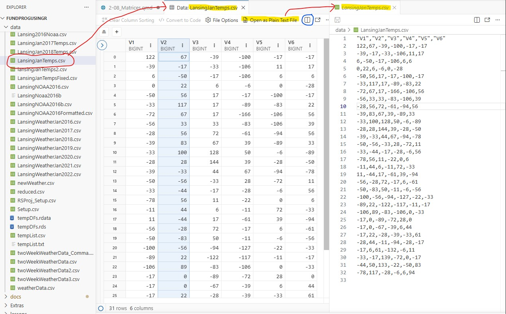
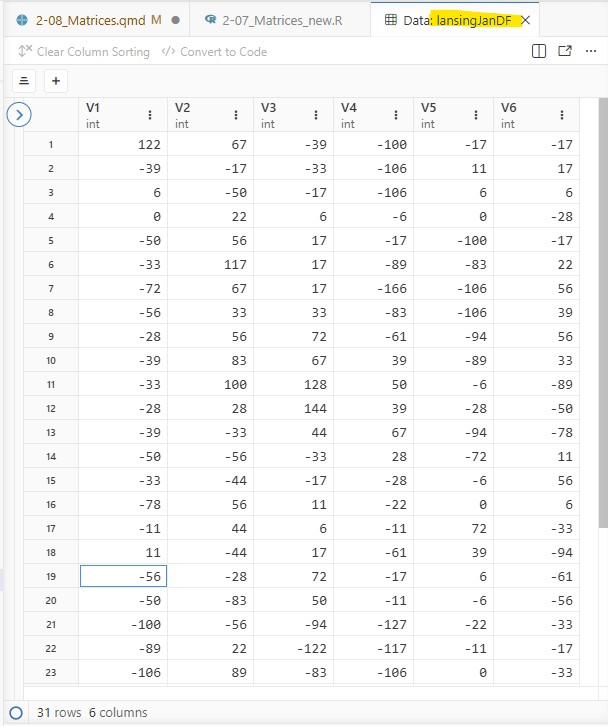
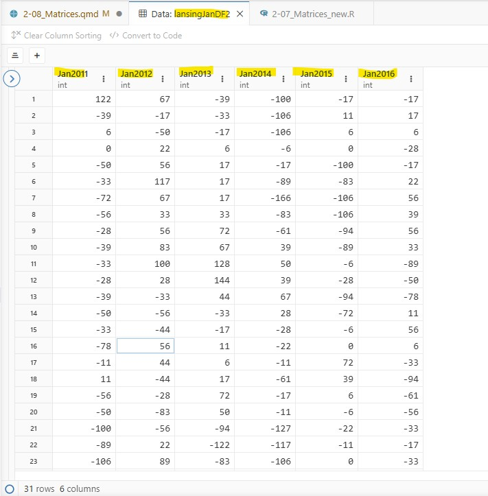
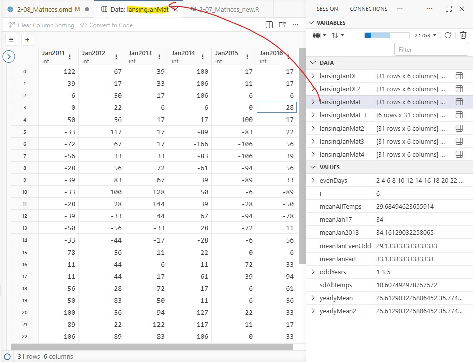
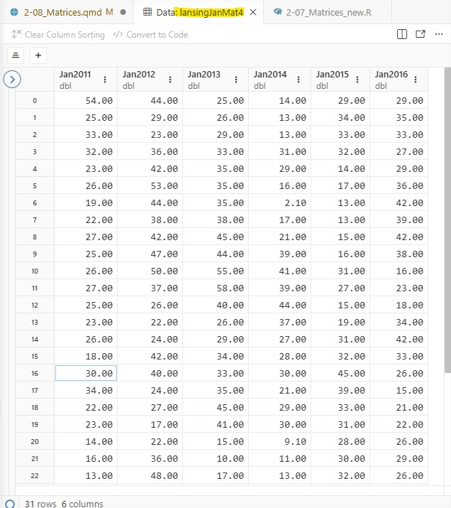
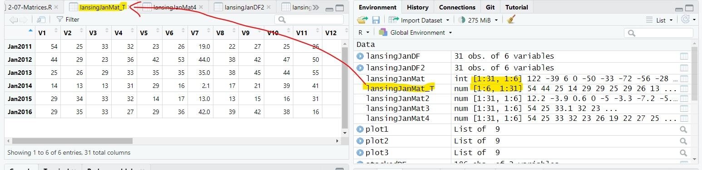

### to do

- talk about what happens if you use as.matrix() on a dataframe with multiple types of variables
- [Note: As of July 2026, Positron has a bug where it cannot display a Matrix with row names in the Data Viewer. This should be fixed soon and I will update this lesson to show the matrix in the viewer.]{.note}

## Purpose

- Using matrices for 2D data

- performing math and statistic on a matrix

## Script for the lesson

The [script for the lesson is here](../scripts/2-07_Matrices_new.R)

The [LansingJanTemps.csv](../data/LansingJanTemps.csv)

## CSV files

Let's first look at the CSV file, ***LansingJanTemps.csv***.  The data in the CSV file was downloaded from the NOAA/NCDC website and contains the high temperature for every day in January from 2011 to 2016.

 

A CSV file is a text file that can be read by any text editor, including Positron.  When you click on a CSV file, Positron will first open the file in a Data Viewer tab. From there you can click on ***Open as Plain Text File*** to view and edit the original file: [Note: I used the Split Editor button (circled blue) to see multiple files at once.]{.note}

{#fig-CSVinRStudio .fs}

The temperature values are in tenths of a Celsius degree and the columns have generic names -- we will deal with both of these issues later.

### Saving data to a data frame

Let's open the CSV file and save it to a data frame, named ***lansingJanDF***:

``` r
lansingJanDF = read.csv(file = "data/LansingJanTemps.csv");
```

***lansingJanDF*** is a data frame with 6 columns of January temperatures from the years 2011-2016.  This view of ***lansingJanDF*** is very similar to the Data Viewer tab in @fig-CSVinRStudio.

{#fig-dataframe_csv .fs}

### Column name change

Let's create a copy of the data frame so we can maintain the original data frame while making changes:

``` r
lansingJanDF2 = lansingJanDF;
```

We want to change the column names to something that has the years in it. We can change the name of all six columns at once to the six years 2011-2016 using the sequence ***2011:2016***:

``` r
colnames(lansingJanMat2) = 2011:2016;
```

But, [it is not recommended to start a column name with a number]{.hl}.  Column names are essentially variable names and variable names cannot start with a number.  R does allow you to start a column name with a number, but there are problems with this. You should always use variable naming standards for column names in a dataframe, even though R does not enforce this.

 

As a reminder, variable names :

- can only start with a letter, underscore ( \_ ) , or a dot ( . )

  - [remember: most programming language do not accept dots ( . ) in names]{.note}

- can consist of letters, numbers, underscore ( \_ ), or a dot ( . )

- cannot have spaces

- cannot be reserved words (e.g., ***if***, ***else***, ***TRUE***, ***FALSE***, ***function***, ***for***)

   

We are going to name the columns ***Jan2011***, ***Jan2012***... using ***paste()*** to create the six column names:

``` r
colnames(lansingJanMat2) = paste("Jan", 2011:2016, sep="");
```

[Note: we needed to set sep="", otherwise there would be a space in the name]{.note}

{#fig-rename_column .fs}

## Data frames and matrices (two-dimensional data)

A data frame is a two dimensional data structure that is a collection of related vectors (i.e., columns). For instance, the ***weatherData*** data frame used in previous lessons had different types of weather data (**columns**) collected every day (**rows**).

 

Data frames, by design, have [columns that hold different types of data]{.hl}.  The weather data from previous lessons had temperature columns, humidity columns, precipitation columns, etc..

 

However, in this lesson, we have a data frame where [all the columns are the same type of value]{.hl} (temperatures) and we will want to perform calculations across rows, columns, and the whole structure.  This cannot be done with a data frame, but it can be done with a matrix.

 

A [matrix]{.hl} is a [two-dimensional vector]{.hl} that is similar to a two-dimensional data frame except that all the columns are the same type of value.

 

We can convert a data frame directly into a matrix using ***as.matrix()***:

``` r
lansingJanMat = as.matrix(lansingJanDF2);
```

In ***Variables***, the matrix is placed in the ***Data*** section (like a data frame), but is presented as a two-dimensional vector (31 rows by 6 columns):

``` {.r tab="Variables"}
> lansingJanMat: [31 rows x 6 columns] <matrix>
```

You can expand the matrix to see the columns and can also expand the columns to see all the values

``` {.bash tab="Variables"}
🞃 lansingJanMat: [31 rows x 6 columns] <matrix>
   > [, 1]       122 -39 6 0 ...
   > [, 2]       67 -17 -50 22 ...
   > [, 3]       -39 -33 -17 6 ...
   > [, 4]       -100 -106 -106 -6 ...
   > [, 5]       -17 11 6 0 ...
   > [, 6]       -17 17 6 -38 ...
```

And, if you double-click on the matrix, it will show up in a ***Viewer*** tab and look like a data frame:

{#fig-matrixInRStudio .fs}

### Advantages of a matrix

A matrix has two advantages over a data frame:

- a matrix allows you to perform calculations across rows and the whole structure

- operations are faster on a matrix than on a data frame

   

If you are dealing with large data sets that is all of the same type, then it is best to use a matrix.

## Modifying the whole matrix

The temperature data in the ***lansingJanMat*** is in units of tenths of Celsius (this author does not know why NOAA/NCDC chose to store the data this way).  We will convert this to Fahrenheit.

 

Because this is a matrix, we can execute mathematical operations on all values at once -- just like a vector (remember, a [matrix is a two-dimensional vector]{.hl}).

 

In order, we will:

1.  change the units from tenth of a Celsius to Celsius 

2.  convert the temperatures from Celsius to Fahrenheit

3.  change values to two significant digits

### Calculations on the whole matrix

We are going to perform three operations on the matrix and show the results of the operations on the first 10 values of the matrix.

 

[Note: I create new matrices to maintain the old versions, but this is not necessary -- you could keep saving the results to ***lansingJanMat***. ]{.note}

 

The first 10 values in the matrix are:

``` {.r tab="Console"}
> lansingJanMat[1:10]
 [1] 122 -39   6   0 -50 -33 -72 -56 -28 -39
```

``` r
# Step 1) Divide by 10 to get units from tenths of Celsius to Celsius
lansingJanMat2 = lansingJanMat / 10;
```

``` {.r tab="Console"}
> lansingJanMat2[1:10]
 [1] 12.2 -3.9  0.6  0.0 -5.0 -3.3 -7.2 -5.6 -2.8 -3.9
```

``` r
# Step 2)  Converting from Celsius to Fahrenheit
lansingJanMat3 = (9/5) * lansingJanMat2 + 32;
```

``` {.r tab="Console"}
> lansingJanMat3[1:10]
 [1] 53.96 24.98 33.08 32.00 23.00 26.06 19.04 21.92 26.96 24.98
```

``` r
# Step 3) Set the number of significant digits to 2
lansingJanMat4 = signif(x=lansingJanMat3, digits=2);
```

::: {#fig-four_matrices}
``` {.r tab="Console"}
> lansingJanMat4[1:10]
 [1] 54 25 33 32 23 26 19 22 27 25
```

Displaying the first ten temperature values of the 4 matrices
:::

{#fig-fimal_matrix .fs}

### Statistical operation on the whole matrix

We can also apply statistical functions to the whole matrix.  For instance, we can find the mean and standard deviation of all values in the matrix:

``` r
meanAllTemps = mean(lansWeatherMat4);
sdAllTemps = sd(lansingJanMat4);
```

``` {.r tab="Console"}
> meanAllTemps
[1] 29.68495
> sdAllTemps
[1] 10.60749
```

## Subsetting matrices 

If we just want to work with part of the data in a matrix, then we need to subset the matrix.  Similar to the bracket notation, ***\[x\]***, for one-dimensional vectors, we can use two-dimensional bracket ***\[x,y\]*** notation to subset a matrix.

 

In this notation, ***x*** represents the row numbers to subset and ***y*** represents the column numbers to subset.

### Subset a column in a matrix

If ***x*** is not given, it means [take all rows (i.e., do not subset the rows)]{.hl}.  So, the following will find the mean of all rows in column 3 (i.e., all values in the year 2013):

``` r
meanJan2013 = mean(lansWeatherMat[ ,3]);
```

::: {#fig-console_matrix}
``` {.r tab="Console"}
> lansingJanMat4[,3]
 [1] 25 26 29 33 35 35 35 38 45 44 55 58 40 26 29 34 33 35 45 41
[21] 15 10 17 16 20 27 30 43 57 56 27
> meanJan2013
[1] 34.16129
```

Console output for the matrix subsetted by row 3 and the mean of this subset
:::

### Subset a row in a matrix

If ***y*** is not given, it means [take all columns (i.e., do not subset the columns)]{.hl}.  So, the following will find the mean of all columns in row 17 (i.e., the Jan 17^th^ value for every year):

``` r
meanJan17 = mean(lansWeatherMat[17,]);
```

::: {#fig-matrix_subsetted}
``` {.r tab="Console"}
> lansingJanMat4[17,]
Jan2011 Jan2012 Jan2013 Jan2014 Jan2015 Jan2016 
     30      40      33      30      45      26 
> meanJan17
[1] 34
```

Console output for the matrix subsetted by column 17 and the mean of this subset
:::

### Subset both rows and columns in a matrix

And you can use sequences for both ***x*** and ***y*** to get a two-dimensional subset of the matrix.  The following will get the mean of the 10^th^ through 19^th^ (Jan 10-19) values of the first three years (2011, 2012, 2013):

``` r
meanJanPart = mean(lansingJanMat4[10:19, 1:3]);
```

::: {#fig-console_matrix_subset}
``` {.r tab="Console"}
> lansingJanMat4[10:19, 1:3]
      Jan2011 Jan2012 Jan2013
 [1,]      25      47      44
 [2,]      26      50      55
 [3,]      27      37      58
 [4,]      25      26      40
 [5,]      23      22      26
 [6,]      26      24      29
 [7,]      18      42      34
 [8,]      30      40      33
 [9,]      34      24      35
[10,]      22      27      45
> meanJanPart
[1] 33.13333
```

Console output for the matrix subsetted by rows 10-19 and columns 1-3, and the mean of this subset
:::

### Non-continuous subsetting of rows and column

Finally, you can create more complicated sequences to subset the matrix.  The following will find the mean of all even days on odd years.

 

Since the subsetting is getting complex, it is best to first create variables that hold the subset values:

``` r
  evenDays = seq(from=2, to=31, by=2);
  oddYears = c(1,3,5);  
```

and then use the variables in the bracket notation:

``` r
meanJanEvenOdd = mean(lansingJanMat4[evenDays, oddYears]);
```

::: {#fig-complex_subset}
``` {.r tab="Console"}
> lansingJanMat4[evenDays, oddYears]
      Jan2011 Jan2013 Jan2015
 [1,]      25      26      34
 [2,]      32      33      32
 [3,]      26      35      17
 [4,]      22      38      13
 [5,]      25      44      16
 [6,]      27      58      27
 [7,]      23      26      19
 [8,]      18      34      32
 [9,]      34      35      39
[10,]      23      41      31
[11,]      16      10      30
[12,]      29      16      37
[13,]      29      27      26
[14,]      29      43      31
[15,]      24      56      23
> meanJanEvenOdd
[1] 29.13333
```

Console output for the matrix subsetted by even rows and odd columns 1-3, and the mean of this subset
:::

## Reversing the matrix (transpose)

In the previous examples, the rows represent days and the columns represent years.  We could easily reverse the matrix so that the rows represent the years and the columns represent the days. We do this using the transpose, ***t()***, function:

``` r
lansingJanMat_T = t(lansingJanMat4);
```

In Variables we see that the resulting matrix has 6 rows and 31 columns (the reverse of the previous matrix):

``` r
> lansingJanMat: [31 rows x 6 columns] <matrix>
🞃 lansingJanMat_T: [6 rows x 31 columns] <matrix>
   > [, 1]       54 44 25 14 29 29
   > [, 2]       25 29 26 13 34 35
   > [, 3]       33 23 29 13 33 33
   ...
   > [, 31]      18 53 27 31 33 49
```

[The Positron data viewer (as of July 2026) has a bug in it where it cannot display matrices with row names]{.hl}, so double-clicking on the matrix will not display anything.

 

This is the view from RStudio, notice the with temperature values for the months going horizontally across the matrix instead of vertically down:

{#fig-transpose .fs}

And, you can also view the matrix in the ***Console***:

``` {.r tab="Console"}

> lansingJanMat_T
        [,1] [,2] [,3] [,4] [,5] [,6] [,7] [,8] [,9] [,10] [,11] [,12] [,13] [,14] [,15] [,16]
Jan2011   54   25   33   32   23   26 19.0   22   27    25    26    27    25    23    26    18
Jan2012   44   29   23   36   42   53 44.0   38   42    47    50    37    26    22    24    42
Jan2013   25   26   29   33   35   35 35.0   38   45    44    55    58    40    26    29    34
Jan2014   14   13   13   31   29   16  2.1   17   21    39    41    39    44    37    27    28
Jan2015   29   34   33   32   14   17 13.0   13   15    16    31    27    15    19    31    32
Jan2016   29   35   33   27   29   36 42.0   39   42    38    16    23    18    34    42    33
        [,17] [,18] [,19] [,20] [,21] [,22] [,23] [,24] [,25] [,26] [,27] [,28] [,29] [,30] [,31]
Jan2011    30    34    22    23  14.0    16    13    29    29    29    27  29.0    26    24    18
Jan2012    40    24    27    17  22.0    36    48    32    32    36    40  33.0    29    41    53
Jan2013    33    35    45    41  15.0    10    17    16    20    27    30  43.0    57    56    27
Jan2014    30    21    29    30   9.1    11    13    19    25    25    15   8.2    19    28    31
Jan2015    45    39    33    31  28.0    30    32    37    33    26    27  31.0    32    23    33
Jan2016    26    15    21    22  26.0    29    26    32    40    43    29  34.0    29    47    49
```

## Statistics across all rows and columns

Earlier, we found the mean of a single column of temperature values (@fig-console_matrix_subset).  Often, we want to find the mean of every column.  We could just repeat the same line 6 times, once for each column:

``` r
meanJan2011 = mean(lansWeatherMat[ ,1]);
meanJan2012 = mean(lansWeatherMat[ ,2]);
...
```

But, this is not an efficient way to code and would become more burdensome as the number of columns increases.

 

There are two better ways to cycle through each column and get the means:

- Use ***for*** loops

- Use ***apply()***

### For loops

A ***for*** loop can be used to cycle through, and calculate the mean of, each column in the matrix.  Since there are multiple mean values that you are calculating, you need to save the mean values to a vector.

 

[The vector is a state variable and needs to be created before the **for** loop]{.hl} and assigned values during the ***for*** loop.  After, the ***for*** loop the vector will have the same number of values as the matrix has columns (i.e., 6).

``` r
# vector that holds the 6 yearly mean values
yearlyMean = c();

# cycle through the six column and find the mean of the temperature values
for(i in 1:6) 
{
  # get the mean of all values in column i and save it to yearlyMean[i]
  yearlyMean[i] = mean(lansingJanMat4[,i]);
}
```

The ***yearlyMean*** vector has 6 values, representing the mean for each of the 6 years:

``` {.r tab="Console"}
> yearlyMean
[1] 25.61290 35.77419 34.16129 23.36774 27.45161 31.74194
```

### apply()

***apply()*** is a useful, if somewhat archaic, function in base R that allows you to apply a statistical or mathematical function for every row or column in a matrix.

 

***apply()*** takes three arguments:

- the matrix you want to perform the function on

- ***MARGIN***: a number indicating whether you want to perform the action on rows or columns

  - **1** means all rows, **2** means all columns

- ***FUN***: the function to apply

 

So, to get the ***mean*** of all columns in the ***lansingJanMat4*** matrix:

``` r
  yearlyMean2 = apply(lansingJanMat4, MARGIN=2, FUN=mean);
```

And, ***yearlyMean2*** is a vector with 6 value, the same as ***yearlyMean*** above.

``` {.r tab="Console"}
> yearlyMean2
 Jan2011  Jan2012  Jan2013  Jan2014  Jan2015  Jan2016 
25.61290 35.77419 34.16129 23.36774 27.45161 31.74194 
```

***yearlyMean2*** is formatted differently than ***yearlyMean*** because ***yearlyMean2*** is a ***named*** variable.  The distinction is something we will look more into in the lesson on Objects in R.

## Saving the matrix

We are going to save ***lansingJanMat4*** to a CSV files so we can use it in the next lesson and avoid the hassle of reformatting the original CSV file:

``` r
write.csv(x=lansWeatherMat, file = "data/LansingJanTempsFixed.csv",    
          row.names = FALSE);
```

This will put a CSV file named ***LansingJanTempsFixed.csv*** in the ***data*** folder of your Project Folder.

## Application

1\) You are given a data frame with three columns:

- average temperature

- maximum temperature

- minimum temperature

   

Is it best to convert the data frame into matrix?  In comments in your application script give 1 reason why it is best to convert and one reason why it is not.

 

2\) Find:

- the minimum (***min()***) temperature value in January 2013

- the maximum (***max()***) temperature value in January 2013

- the minimum (***min()***) temperature value on January 14^th^

- the maximum (***max()***) temperature value in January 14^th^

   

3\) Using ***for*** loops, find the mean value for each day in January (i.e., mean of the rows)

 

4\) Using ***apply()***, find the mean value for each day in January (i.e., mean of the rows)

 

5\) Find the mean temperature of every 4th day in the years 2011, 2014, and 2016.

 

6\) Convert the temperature matrix so that it show how many degrees the temperature was above or below freezing on the Fahrenheit scale.  So, 25 would become -7,  and 60 would become 28.

