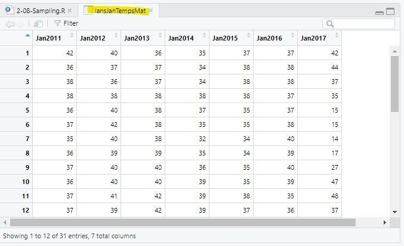
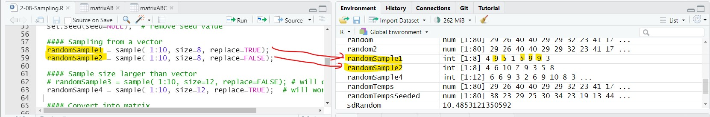
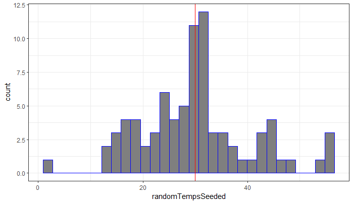
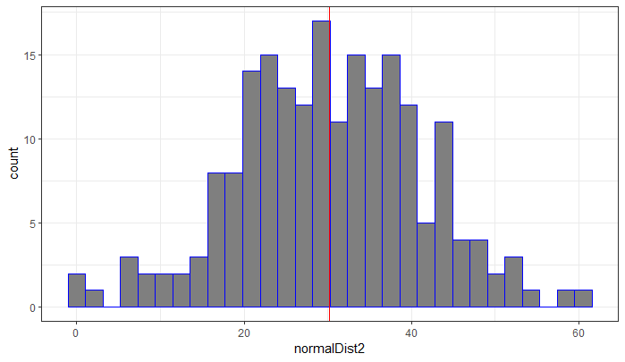

### To-do

- create a simple example showing what happens if you insert a random calculation in between set.seed() and another random calculation

## Purpose

- Creating a uniform random sample

- Creating a normal sample

- Creating repeatable pseudo-random values

- Saving and loading list objects

## Script and data for this lesson

The [script for the lesson is here](../scripts/2-08_BindingAndSampling_new.R)

[LansingJanTempsFixed.csv](../data/LansingJanTempsFixed.csv)

[LansingJan2017Temps.csv](../data/LansingJan2017Temps.csv)

## Binding multiple data frames

We are going to start by opening the CSV file created in the last lesson, ***lansingJanTempsFixed.csv*** file, that contains temperatures in Fahrenheit for January 2011-2016:

``` r
lansJanTempsDF = read.csv(file = "data/lansingJanTempsFixed.csv"); 
```

Next, we are going to add January 2017 data from ***lansingJan2017Temps.csv***.  First, let's read the 2017 weather data into a data frame:

``` r
lansJanTemps2017DF = read.csv(file = "data/lansingJan2017Temps.csv"); 
```

***lansJanTems2017DF*** is a data frame with one column (named ***x***) -- ***x*** has 31 temperature values (in Fahrenheit), one for each day in January 2017.  If we click on the arrow to the left of  ***lansJanTemps2017DF*** in ***Variables***, it looks like this:

``` {.r tab="Variables"}
🞃 lansJanTemps2017DF   [31 rows x 1 column] <data.frame>
   > x:                 42 44 37 35 15 15 ...   int [31]
```

Let's first change the column name from ***x*** to ***Jan2017***:

``` r
colnames(lansJanTemps2017DF) = "Jan2017";   # there is only one column to name
```

And then bind the 2017 data to the 2011-2016 data frame using ***cbind()***.  We will save the binded data to a new data frame, ***lansJanTempDF2***:

``` r
lansJanTempsDF2 = cbind(lansJanTempsDF, lansJanTemps2017DF);
```

***cbind()*** stands for column bind and it will bind two (or more) data frames together by their columns.  ***cbind()*** also will bind columns together between two matrices, or bind columns between a matrix and a data frame.  The only caveat is that the [columns need to be the same size]{.hl}.  In this example, the columns all have 31 rows ([note: the first row is labeled 0]{.note}):

{#fig-JanMatrix .fs}

### Binding vectors

You can also use ***cbind()*** to bind two vectors together -- as long as they are the same size.  The result will be a matrix with two columns (remember a matrix is a two-dimensional vector):

``` r
vectorA = 20:1;   # 20 values 20, 19, 18, ..., 1
vectorB = seq(from=100, to =195,  by=5);  # 20 values: 100, 105, 110, ..., 195
matrixAB = cbind(vectorA, vectorB);  # 2 columns with 20 values in each
```

or bind a vector to a data frame/matrix.  Again, the only caveat is that the number of values in the vectors are the same as the number of rows in the data frame/matrix:

``` r
vectorC = seq(from=-20, to=18,  by=2);  # 20 values: -20, -18, ..., 18
matrixABC  = cbind(matrixAB, vectorC);  # 3 columns with 20 values in each
```

***matrixABC*** contains three columns named ***vectorA***, ***vectorB***, and ***vectorC***:

``` {.r tab="Console"}
> matrixABC
      vectorA vectorB vectorC
 [1,]      20     100     -20
 [2,]      19     105     -18
 [3,]      18     110     -16
 [4,]      17     115     -14
 [5,]      16     120     -12
 [6,]      15     125     -10
 [7,]      14     130      -8
 [8,]      13     135      -6
 [9,]      12     140      -4
[10,]      11     145      -2
[11,]      10     150       0
[12,]       9     155       2
[13,]       8     160       4
[14,]       7     165       6
[15,]       6     170       8
[16,]       5     175      10
[17,]       4     180      12
[18,]       3     185      14
[19,]       2     190      16
[20,]       1     195      18
```

## Random values in programming

We are going to pick random values from our temperature matrix but, [in programming there is no such thing as a truly random value]{.hl}.  There has to be some calculation that determines the random number -- the calculation is just so complex that it seems random. As we will see later, these calculations can be manipulated (or, [seeded]{.hl}) so you get the same "random" numbers every time you ***Source*** your script.  This is very helpful when you are sharing and documenting your results.

 

For now, we are going to use unseeded calculations, which means that this part of the script will produce different results each time it is executed.  The following line enforces the unseeded random calculations:

``` r
set.seed(seed=NULL);  # remove seed value
```

### sample of numbers

We can use the ***sample()*** function to get a random sample from a set of observations.  In our first example, the "observations" will just be a vector of values from 1 to 10: ***1:10***.

 

***sample()*** has three arguments:

- ***x:*** the observations we are taking a random sample from (in this case, a sequence vector)

- ***size***: the number of samples we will take.

- ***replace***: whether we allow for an observation to be sampled multiple times (***replace=TRUE*** means we allow an observation to be sampled more than once)

   

In the following code, the arguments for ***sample()*** are set so that:

- The data set we are using is the sequence 1-10:  ***1:10***

- We are taking eight random samples: ***size***=**8**

- We allow repeat observations (***replace=TRUE***) in ***randomSample1*** but not in ***randomSample2*** (***replace=FALSE***)***.***

``` r
randomSample1 = sample( 1:10, size=8, replace=TRUE);
randomSample2 = sample( 1:10, size=8, replace=FALSE);
```

When I execute the script (@fig-random_sampling), ***randomSample1*** had three observations that were repeated **4**, **7**, and **2**), whereas ***randomSample2*** has no repeated observations.  [Each time you execute the script, you will get different observations]{.hl} but ***randomSample2*** will always have eight unique observations because ***replace=FALSE***.

 

{#fig-random_sampling .fs}

#### Sampling and replacement error

You will get an error if the argument ***size*** is greater than the population size and ***replace=FALSE:***

``` r
# randomSample3 = sample( c(1:10), size=12, replace=FALSE);  # will cause error
randomSample4 = sample( c(1:10), size=12, replace=TRUE);   # will work
```

This is because you cannot take **12** [unique]{.hl} samples from a population whose size is **10** (***replace=FALSE***), but you can take **12** samples from a population whose size is **10** (***replace=TRUE***) -- there will be at least two observations that are repeated.  In this case, observation **1** is repeated twice, observations **7** and **8** are repeated 3 times, and observations **3**, **4**, and **9** were never picked:

``` {.r tab="Console"}
> randomSample4
 [1]  10 7 7 8 2 7 1 8 8 1 5 6
```

### Randomly sampling the temperature values

In the previous examples we were sampling values from a vector. A [matrix is a two-dimensional vector]{.hl} so we can just as easily sample values from a matrix.  Let's first convert the data frame ***lansJanTempsDF2*** into a matrix:

``` r
lansJanTempsMat = as.matrix(x=lansJanTempsDF2);
```

And then randomly sample 80 values from the matrix:

``` r
randomTemps = sample(lansJanTempsMat, size=80, replace=TRUE);
```

The 80 samples will be different each time you ***Source*** your script...

``` {.r tab="Variables"}
> randomTemps
 [1] 13 55 13 14 24 16 35 21 24 37 34 30 16 44 29 35 29 37 16 35 18 35 32 27 16
[26] 55 26 26 40 26 25 29 48 23 26 35 19 30 23 45 38 42 42 18 42 19 45 32 13 37
[51] 30 11 30 33 30 22 29 32 44 14 23 38 41 43 27 22 22 37 37 31 44 21 25 34 21
[76] 40 29 55 42 29
```

A matrix is a single 2D vector, whereas a data frame is multiple vectors (each column is a vector) and sampling has a different effect. For more information go to [Extension: Sampling from a data frame]

### Setting the seed value

Every time your script is executed, a new "random" set of observations, called [pseudo-random]{.hl}, is produced using a complex algorithm that seems random to humans. 

 

To replicate your results (i.e., get the same "random" values), you use ***set.seed()*** and pass in a number:

``` r
set.seed(seed=12345);
```

The number is called the [seed number]{.hl} -- the seed number sets the initial conditions for the algorithm that creates the pseudo-random numbers.  This means that the pseudo-random number will be the same after the seed is set.  If you change the seed number, then you get a different set of the same pseudo-random numbers.

 

If you want to learn more, there is a really good [video on PBS Infinite Series](https://www.youtube.com/watch?v=C82JyCmtKWg) about random number generators, pseudo-random number generators, and seed numbers.  [The discussion on seed numbers starts at 2:15](https://www.youtube.com/watch?v=C82JyCmtKWg&t=02m15s).

### Sampling a data vector

We will take another 80 random samples from ***lansJanTempsMat*** allowing for repeats:

``` r
randomTempsSeeded = sample(x=lansJanTempsMat, size=80, replace=TRUE);
```

The 80 sampled values from the ***lansJanTempsMat*** matrix:

``` {.r tab="Console"}
> randomTempsSeeded
 [1] 38.0 23.0 29.0 25.0 30.0 34.0 23.0 19.0 13.0 44.0 34.0 32.0
[13] 29.0 31.0 19.0 44.0 16.0 55.0 32.0 19.0 29.0 27.0 23.0 25.0
[25] 26.0 15.0 44.0 29.0 35.0 32.0 32.0 43.0 19.0 25.0 29.0 55.0
[37] 29.0 48.0 17.0 32.0  2.1 34.0 27.0 21.0 26.0 44.0 53.0 39.0
[49] 32.0 29.0 16.0 26.0 30.0 43.0 29.0 35.0 27.0 42.0 32.0 41.0
[61] 32.0 47.0 15.0 56.0 26.0 25.0 38.0 17.0 25.0 27.0 32.0 27.0
[73] 14.0 29.0 32.0 25.0 13.0 32.0 35.0 21.0
```

And let's find the mean and standard deviation of the sample, which we will use later in the lesson:

``` r
meanRandom = mean(randomSampleSeeded); 
sdRandom = sd(randomSampleSeeded);     
```

``` {.r tab="Variables"}
meanRandom:  29.98875
sdRandom:    10.485...
```

Since the random values were seeded, [**randomSampleSeeded** will be the same values every time you **Source** the script]{.hl}.  If you change the seed number (from **12345** to anything else), then you will get another set of the same "random" values every time you ***Source*** your script.

 

For instance, if we change the seed number from **12345** to **54321** then you will get these values every time for ***randomTempsSeeded***:

``` {.r tab="Console"}
> randomTempsSeeded
 [1] 38.0 23.0 29.0 25.0 30.0 34.0 23.0 19.0 13.0 44.0 34.0 32.0 29.0 31.0 19.0
[16] 44.0 16.0 55.0 32.0 19.0 29.0 27.0 23.0 25.0 26.0 15.0 44.0 29.0 35.0 32.0
[31] 32.0 43.0 19.0 25.0 29.0 55.0 29.0 48.0 17.0 32.0  2.1 34.0 27.0 21.0 26.0
[46] 44.0 53.0 39.0 32.0 29.0 16.0 26.0 30.0 43.0 29.0 35.0 27.0 42.0 32.0 41.0
[61] 32.0 47.0 15.0 56.0 26.0 25.0 38.0 17.0 25.0 27.0 32.0 27.0 14.0 29.0 32.0
[76] 25.0 13.0 32.0 35.0 21.0
```

## A last note about random value and seed numbers

R uses a Random Number Generator (RNG) to produce random numbers. The RNG is actually a deterministic algorithm that produces a sequence of values that appear random. The initial state of the RNG is determined by a seed value. After each random value is generated, the RNG updates its internal state, and that updated state is used to generate the next random value.

 

This code will always produce the same results for **a** and **b**:

``` r
set.seed(321)
a = sample(1:10, 1);    # RNG in intial state with seed=321
b = sample(30:40, 1);   # RNG in next state
```

``` {.r tab="Variables"}
a:   6
b:   31
```

This code will also always produce the same results for **a** and **b**. But, the results are different from above because the RNG is in a different state when calculating **a** and **b**:

``` r
set.seed(321)
b = sample(30:40, 1);   # RNG in intial state with seed=321
a = sample(1:10, 1);    # RNG is in next state
```

``` {.r tab="Variables"}
a:   2
b:   35
```

### setting the seed

If the user chooses a seed number with set.seed(), they can guarantee that the same sequence of "random" values will be generated every time the script is executed.

 

If the user does not choose a seed, R automatically initializes the RNG with a seed obtained from the opeerating system. Because this seed will usually be different each time the script is run, the resulting sequence of random values will also be different. Calling `set.seed(NULL)` tells R to reinitialize the RNG with a new, automatically chosen seed.

### Transforming the random value

The RNG itself produces values that are approximately uniformly distributed. R then transforms these values using an appropriate algorithm to produce random values from the distribution requested by the user (such as a normal, Poisson, or exponential distribution).

## A Histogram in GGplot

We can visualize the 80 sampled values using a histogram and add a vertical line to represent the mean value.

 

The mean value, ***mean(randomTempsSeeded)***, is very close to **30**.

``` {.r tab="Console"}
> mean(randomTempsSeeded)
[1] 29.98875
```

The ggplot component that creates a histogram is ***geom_histogram*** and you only need to map the x value for a histogram (the y-axis in a histogram is the count).  The vertical line is created using the component: ***geom_vline*** where x (***xintercept***) is set to the mean value:

``` r
  #### Plot a histogram with the mean value
  plot1 = ggplot() +
    geom_histogram(mapping=aes(x=randomTempsSeeded),
                   fill="gray50",
                   color="blue") +
    geom_vline(xintercept = mean(randomTempsSeeded),
               color="red") +
    theme_bw();
  plot(plot1);
```

[Note: in a ***geom_histogram*** (and many other plot objects in GGPlot), ***fill*** is the background color whereas ***color*** is the outline color.]{.note}

{#fig-histogram .fs}

You will get this warning when plotting a histogram: [\`stat_bin()\` using \`bins = 30\`. Pick better value with \`binwidth\`]{.hl}.  This is GGPlot telling you (in an awkward way) that you are using the default 30 bins and that you can change this using the arguments ***bins*** or ***binwidth***. You can change this if you want, but there is no need.

## Sampling from a normal distribution

***sample()*** creates a random sample where each observation has the same chance of being picked (i.e., uniform probability). If we want to create a random set of observations that comes from a normal distribution with a specified mean and standard deviation, we use the function ***rnorm()***.

 

***rnorm()*** has 3 arguments:

- ***n***: the number of observations to sample

- ***mean***: the mean of the distribution we are sampling from

- ***sd***: the standard deviation of the distribution we are sampling from

 

The following code samples **200** observations from a normal distribution with a mean of **20** and a standard deviation of **4**:

``` r
normalDist1 = rnorm(n=200, mean=20, sd=2);
```

[note: the sampled valued are weighted but they are still random]{.note}

 

Looking at the first 20 random values, we can see their values are centered around 20:

``` {.r tab="Console"}
> normalDist1[1:20]
 [1] 19.99109 18.17063 21.53481 21.20402 20.78958 21.00338 23.53383
 [8] 19.72381 18.93655 18.74356 22.54336 18.14803 17.84504 19.18242
[15] 16.70889 20.53722 23.31189 16.91820 19.35975 17.85754
```

### Plot a normal distribution

We can also create a normal distribution using the mean and standard deviation from the sampled temperature values (@fig-hist_bell):

``` r
normalDist2 = rnorm(n=200, 
                    mean=mean(randomTempsSeeded), 
                    sd=sd(randomTempsSeeded));
```

In the code above, we generated 200 temperature observations from a normal distribution based on the mean and standard deviation of ***lansJanTempsMat.*** The data generated are saved in the vector ***normalDist2***.\*\*\*\*

Then we use a histogram to make a visual representation of ***normalTemp*** and, to the histogram, we add a vertical line at the mean value of the samples, ***mean(normalDist2)***:

``` r
plot2 = ggplot() +
  geom_histogram(mapping=aes(x=normalDist2),
                 fill="gray50",
                 color="blue") +
  geom_vline(xintercept = mean(normalDist2),
             color="red") +
  theme_bw();
plot(plot2);
```

The result is a histogram that looks like a bell diagram -- and would look more so if you increased the sample size.

{#fig-hist_bell .fs}

## Application

A\) In comments, answer the following:

- What is the minimum number of [unique observations]{.hl} you can get from this code?  Explain your answer.

  - `sample(1:10, size=8, replace=TRUE)`

- If you get repeat values after executing this code, what does it say about ***observations***?:

  - `sample(observations, size=8, replace=FALSE)`

- If you move the code ***set.seed(54321)*** from line **40** (right before ***randomTempSeeded*** was set) to line **35** (right before ***randomTemps*** is set):

  - Did you get the same values for ***randomTempSeeded***?  (test it!)

  - Why or why not?

 

B\) Get 50 non-repeating samples from the even numbers between 100 and 999

- You probably want to use the [***seq()*** function](1-04_Vectors_And_Data_Frames.html#sec-seq)

 

C\) Get 50 samples that can repeat from the first 40 numbers that are a multiple of 7 starting with 7 (so, 7, 14, 21, 28...).

 

D\) Using the row binding function ***rbind()***, bind two more rows to ***lansJanTempsMat*** (this is sort of like adding a 32^nd^ and 33^rd^ day to January)

- the vectors you bind need to have the same number of values as columns in ***lansJanTempMat***

 

E\) Using ***set.seed(seed=10)*** and ***rnorm()***:

- create a vector that has [these exact 20 observations]{.hl}.  

- the ***mean*** and ***sd*** used to in ***rnorm()*** to create these observations were both whole numbers.

``` {.r tab="Console"}
> normExample
 [1] 12.056239 11.447242  7.886008 10.202497 12.883635 13.169383  8.375771
 [8] 10.908972  7.119982 11.230565 15.305339 14.267345 11.285299 14.962334
[15] 14.224170 12.268042  9.135168 11.414549 14.776564 13.448936
```



## Extension: Sampling from a data frame

When you sample from a matrix, ***sample()*** sees each value in the matrix as an observation.

 

When you sample from a data frame, [***sample()*** sees each column as an observation]{.hl}.

This means that ***sample()*** will choose random columns from a data frame -- not random values

 

If you try to sample 80 values from the data frame ***lansJanTempsDF2*** without replacement:

``` {.r tab="Console"}
> sample(lansJanTempsDF2, size=80, replace=«FALSE»)
```

You will get an error because there are only 7 columns in ***lansJanTempsDF2*** and you are asking for 80 values without replacement.

 

If you try to sample 80 values from the data frame ***lansJanTempsDF2***, with replacement:

``` {.r tab="Console"}
> sample(lansJanTempsDF2, size=80, replace=«TRUE»)
```

You will get the original 7 columns randomly repeated 80 times.