### To-do

## Purpose

- stacking dataframe

- creating line plots and box plots

- mapping values other than x and y

- creating a List object

## Script and data for this lesson

The [script for the lesson is here](../scripts/2-09_StackingAndMapping_new.R)

Data for the lesson: [LansingJanTempsFixed.csv](../data/LansingJanTempsFixed.csv)

## GGPlot mapping

This lesson is designed to give an overview of the many issues that occur when you are creating plots in GGPlot and some of the fixes. Mapping is a huge topic in GGPlot that will not be fully explained in this lesson (I go into much more detail in the dedicated GGPlot class...).  Concisely, mapping is how you relate data in a data frame to a visual aspect of a plot.  We have already mapped data in a data frame to the x and y axis of a plot -- but, you can map many other visual aspects to data like size, shape, and, in this lesson, color. 

## Reading in the data frame

We will be using the data from ***lansingJanTempsFixed.csv*** that has 6 years of January temperatures in Fahrenheit.  First we need to read in the file, ***lansJanTempsFixed.csv***, and save the temperature data to a data frame:

``` r
lansJanTempsDF = read.csv(file = "data/lansingJanTempsFixed.csv");
```

## Line Plots

We are going to go over the multiple ways in GGPlot to make a line plot for each of the 6 temperature column in one canvas.  The ggplot component that creates a line plot is ***geom_line()***.

 

The simplest way to do it is to create six ***geom_line()*** components -- one for each column in the data frame:

``` r
plot1 = ggplot( data=(lansJanTempsDF), 
                «mapping = aes(x=1:31)») + 
  geom_line( mapping=aes(y=Jan2011),
             color = "red") +
  geom_line( mapping=aes(y=Jan2012),
             color = "green") +
  geom_line( mapping=aes(y=Jan2013),
             color = "orange") +
  geom_line( mapping=aes(y=Jan2014),
             color = "blue") +
  geom_line( mapping=aes(y=Jan2015),
             color = "purple") +
  geom_line( mapping=aes(y=Jan2016),
             color = "black") +
  labs( title="January Temperature",
        subtitle="Lansing, MI -- 2011-2016",
        x = "January Days",
        y = "temperature (F)") +
  theme_bw();
plot(plot1);
```

Since the x-axis gets mapped to the same date values (1 to 31) for each line plot, we can place the ***x*** mapping in ***ggplot()*** call.  This makes the ***x*** mapping of **1:31** universal for all components in the canvas area.

 

Each ***geom_line*** component is also customized with a ***color*** subcomponent.

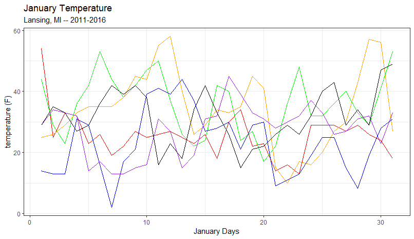{#fig-line_plot .fs}

## Adding a legend

The problem with @fig-line_plot is that the individual line plots are not labeled. We would like to add a legend to the plot that maps the color to the year.  In generally, [GGPlot automatically adds a legend when something other than **x** or **y** is mapped]{.hl}.  We are going to map ***color***.  To do this, we move ***color*** from being a subcomponent of the ***geom_line*** to being a mapped element for each ***geom_line***.

``` r
plot2 = ggplot( data=(lansJanTempsDF), 
                mapping = aes(x=1:31)) +  
  geom_line( mapping=aes(y=Jan2011, «color = "Jan2011"») ) +
  geom_line( mapping=aes(y=Jan2012, «color = "Jan2012"») ) +
  geom_line( mapping=aes(y=Jan2013, «color = "Jan2013"») ) +
  geom_line( mapping=aes(y=Jan2014, «color = "Jan2014"») ) +
  geom_line( mapping=aes(y=Jan2015, «color = "Jan2015"») ) +
  geom_line( mapping=aes(y=Jan2016, «color = "Jan2016"») ) +
  labs( title="January Temperature",
        subtitle="Lansing, MI -- 2011-2016",
        x = "January Days",
        y = "temperature (F)") +
  theme_bw();
plot(plot2);
```

In this plot, we moved ***color*** to the mapping of the ***geom_line*** and set ***color*** to the text we want displayed in the legend.  This solution adds a legend with the text with line colors chosen by GGPlot.  [Note: There is a way to customize these color but that is beyond the scope of this class.]{.note}

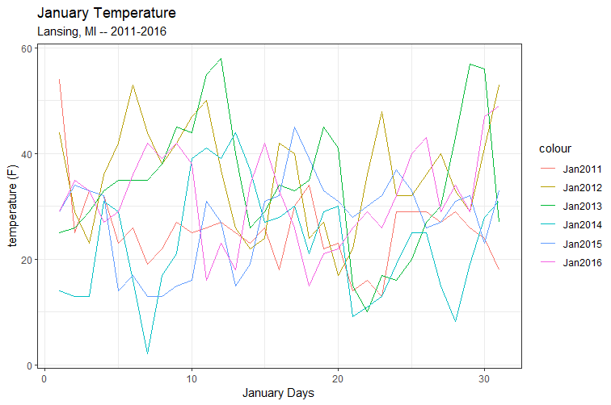{#fig-legend .fs}

## Stacking the data frame

Plotting multiple columns one at a time can get quite cumbersome. The most common technique used to plot multiple line plots on one canvas is to create a new data frame that has all the data in two columns -- this process is often called [melting]{.hl} or [stacking]{.hl} the data frame.

 

We can use ***stack()*** to create a stacked data frame:

``` r
stackedDF = stack(lansJanTempsDF);
```

The stacked data frame has the same data as the original data frame but everything is put in two columns:

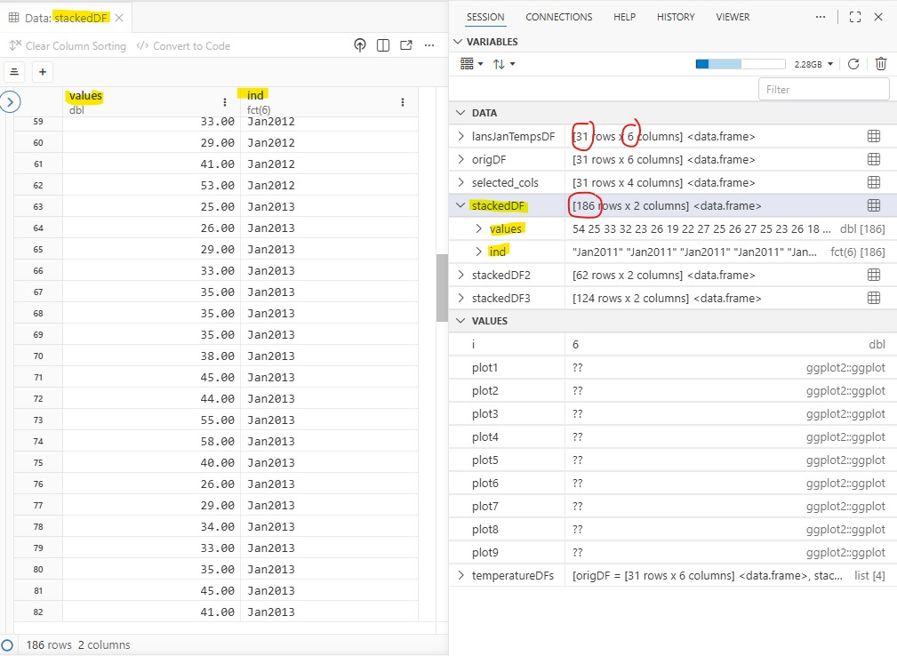{#fig-two_col_stacked .fs}

The stacked data frame has **186** rows (**31** days \* **6** years) and two columns:

- ***column 1:*** combined the 6 temperature columns into one column called ***values***

- ***column 2***: contains the names of the six temperature columns (2011 to 2016) called ***ind***

   

[The 6 years of data are now stacked on top of each-other]{.hl} with the first **31** rows containing values from **2011**, the next **31** rows containing values from **2012**, etc...  The ***ind*** columns give the year the temperatures came from.

### A note from the author about stacked data frame

The author considers stacking data frames to be poor programming practice, although it is a commonly encouraged in R. The primary concern is that stacking restructures the data solely to meet the requirements of a function, rather than preserving the data in its natural form. Ideally, a data frame should remain unchanged, and functions should instead be written to operate on the existing structure of the data. While designing functions this way is not inherently difficult, much of R's ecosystem is built around stacked (long-format) data, leaving few practical alternatives in many situations – we will explore one way to do this.

### Plotting the stacked data frame

With the stacked data frame, we only need one ***geom_line*** component to plot all 6 lines.  This works because of the ***color*** mapping.  The ***color*** mapping tells GGPlot to create a distinct line for each different value in the ***ind*** column -- and set each to a different color.  The ***ind*** column has 6 different value -- the 6 column names from the original data frame (***Jan2011***, ***Jan2012***,...).

 

The x-axis represents the days from 1 to 31.  We have 186 rows but every 31 rows represents a new line plot (31 \* 6 = 186).  So, we want to repeat the values 1 to 31 six times.

 

The ***y*** mapping is the temperature values from the original data frame put into one long ***values*** column.

``` r
plot3 = ggplot( data=(stackedDF)) +  
  geom_line( mapping=«aes(x=rep(1:31, times=6)», y=values, color=ind) ) +
  labs( title="January Temperature",
        subtitle="Lansing, MI -- 2011-2016",
        x = "January Days",
        y = "temperature (F)") +
  theme_bw();
plot(plot3);
```

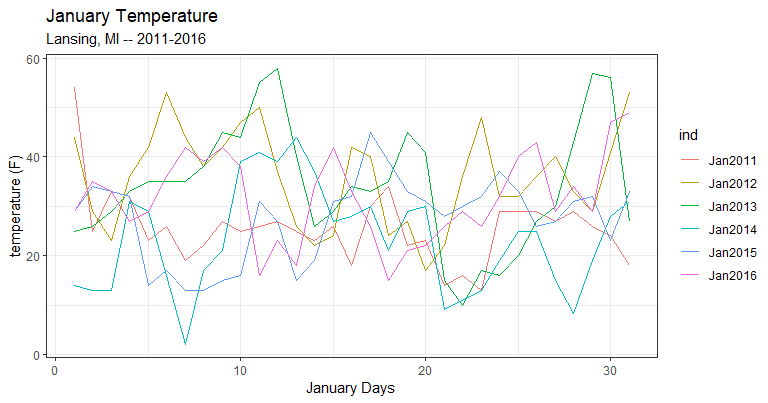{#fig-plot_stacked .fs}

## Using for loops to plot 6 columns

I consider ***for*** loops to be the most robust solution because it gives you more control over the plot and [it maintains the integrity of the original data frame]{.hl}.  It is also, initially, the more difficult method:

``` r
  plot4 = ggplot( data=(lansJanTempsDF));  # create a canvas
  for(i in 1:ncol(lansJanTempsDF))         # add plots to canvas one at a time
  {
    # replace i by with !!(i) -- avoids Lazy Evaluation
    «plot4 = plot4» + geom_line( mapping=aes(x=1:nrow(lansJanTempsDF), 
                                             y=lansJanTempsDF[,«!!(i)»], 
                                             color=colnames(lansJanTempsDF)[«!!(i)»]) )
  }
  # add the labels and theme to the canvas
  «plot4 = plot4» + labs( title="January Temperature",
          subtitle="Lansing, MI -- 2011-2016",
          x = "January Days",
          y = "temperature (F)") +
  theme_bw();
  plot(plot4);
```

In this example, the ***for*** loop cycles through and adds the six plot components to the ***plot4*** canvas one at a time.  When mapping in a ***for*** loop, you need to replace the index variable, ***i***, with ***!!(i)***.  This is a quirk of R and a detailed explanation is here: [Extension: Lazy Evaluation]

 

After the plot components are added, we then add the labels and theme to ***plot4***.

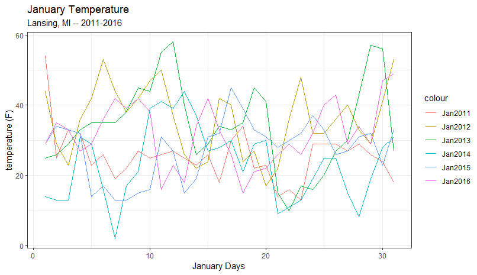{#fig-for_stacked .fs}

## Unstacking the data frame

You can take a stacked data frame and return it to original state using ***unstack()***:

``` r
origDF = unstack(stackedDF);
```

And ***origDF*** looks just like the original ***lansJanTempDF***

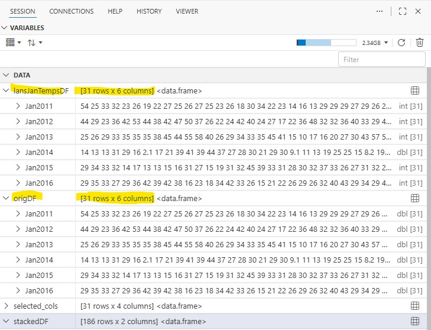{#fig-unstacking .fs}

 

[Note: The stacked version of a dataframe is often called **long format** and the original dataframe called **wide format.**]{.note}

## Boxplots

A good way to visually compare the six years of January temperatures is to use a boxplot.  In GGPlot, the component to use is ***geom_boxplot.***   For our first attempt, we will just create two boxes representing the columns ***Jan2011*** and ***Jan2012***.

 

Like all plotting components in GGPlot, ***geom_boxplot*** needs to be mapped.  The y-axis represents the temperatures so we can map ***y*** to the columns, ***Jan2011*** in one box and ***Jan2012*** in the other.

 

We also need to map ***x*** to some value otherwise the two boxplots will appear right on top of each other (try it!). We can start by mapping ***x*** to the years the two boxplots represent:

``` r
plot5 = ggplot(data=lansJanTempsDF) +
  geom_boxplot(mapping=aes(x=2011, y=Jan2011)) +
  geom_boxplot(mapping=aes(x=2012, y=Jan2012)) +
  theme_bw();
plot(plot5);  
```

This code successfully creates two boxplots but the x-axis is a bit weird:

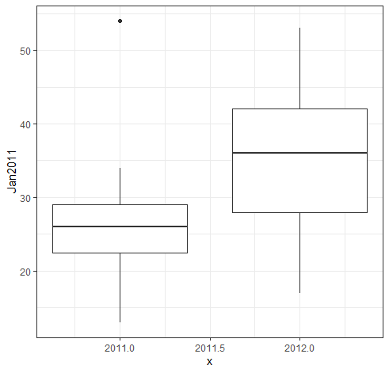{#fig-boxplot1 .fs}

 

Because we used numbers to map the x-axis, GGPlot assumed a continuous and numeric x-axis.  But, the [x-axis in a boxplot is really a discrete axis]{.hl} -- we are not plotting value in between 2011 and 2012.  If we want a discrete axis, then we need to put the years in quotes (i.e., make the year a string value):

``` r
  plot6 = ggplot(data=lansJanTempsDF) +
    geom_boxplot(mapping=aes(«x="2011"», y=Jan2011)) +
    geom_boxplot(mapping=aes(«x="2012"», y=Jan2012)) +
    theme_bw();
  plot(plot6);
```

Now, we have a discrete x-axis:

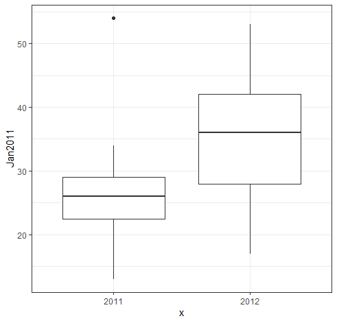{#fig-boxplot_discrete .fs}

## Box Plots using the stacked dataframe

Just like with lines plots, there is no great way to create boxes from multiple columns in a dataframe.  We could plot all six columns by creating six ***geom_boxplot*** components, one for each year.  But, in programming, you generally do not want to repeat code -- this would get messy if there were 20 columns.

 

The most common technique used for plotting multiple columns is to use a stacked dataframe.

 

Using the stacked dataframe, we can plot all 6 years using one ***geom_boxplot*** component.  The works by mapping ***x*** to the ***ind*** column (which has the years) and mapping ***y*** to the ***values*** column (which has all the temperature values).

``` r
plot7 = ggplot(data=stackedDF) +
  geom_boxplot(mapping=aes(x=ind, y=values)) +
  theme_bw();
plot(plot7);
```

The x-axis of the boxplot is labelled with the names of the columns and the y-axis has the box for each year:

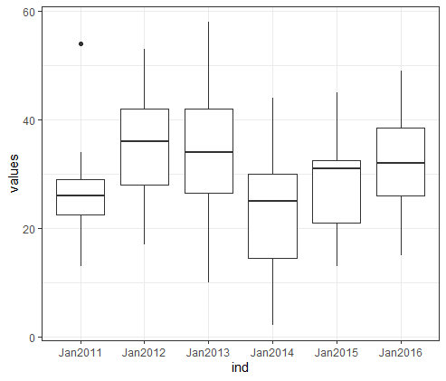{#fig-six_boxes_stacked .fs}

## Stacking a subset of the columns

We might not want all of the data from the original dataframe. We can create a stacked dataframe that only has a subset of the columns from the original data frame.

 

This stacked dataframe only has the values from **2** columns, the 3^rd^ (2013) and 6^th^ (2016) -- **62** values in all:

``` r
stackedDF2 = stack(lansJanTempsDF[,c(3,6)]); # 2013 and 2016
```

And this stacked dataframe has the values from **4** columns: the1^st^, 2^nd^, 5^th^, and 6^th^ (2011, 2012, 2015, & 2016 -- **124** values in all):

``` r
stackedDF3 = stack(lansJanTempsDF[,c(1,2,5,6)]); # 2011, 2012, 2015, & 2016
```

In ***Variables*** we see the two new stacked dataframes, both with 2 columns (***values*** and ***ind***) and 62 values (two Januaries) and 124 values (four Januaries). [Note: `fct(2) [62]` means that this is a ***factor*** with ***2*** levels and ***62*** values.]{.note}

``` {.r tab="Environment"}
🞃 stackedDF2:   [62 rows x 2 columns]
     > values:  25 26 29 33 35 35 ...                  int [62]
     > ind   :  "Jan2013" "Jan2013" "Jan2013" ...   fct(2) [62]
🞃 stackedDF3:   [124 rows x 4 columns]
     > values:  54 25 33 32 23 ...                    int [124]
     > ind   :  "Jan2011" "Jan2011" "Jan2011" ...  fct(4) [124]
```

### Plotting the subset stacked dataframe

We can plot the four boxes from dataframe ***stackedDF3*** just like we plotting all six boxes using ***stackedDF***:

``` r
plot8 = ggplot(data=«stackedDF3») +
  geom_boxplot(mapping=aes(x=ind, y=values)) +
  theme_bw();
plot(plot8);
```

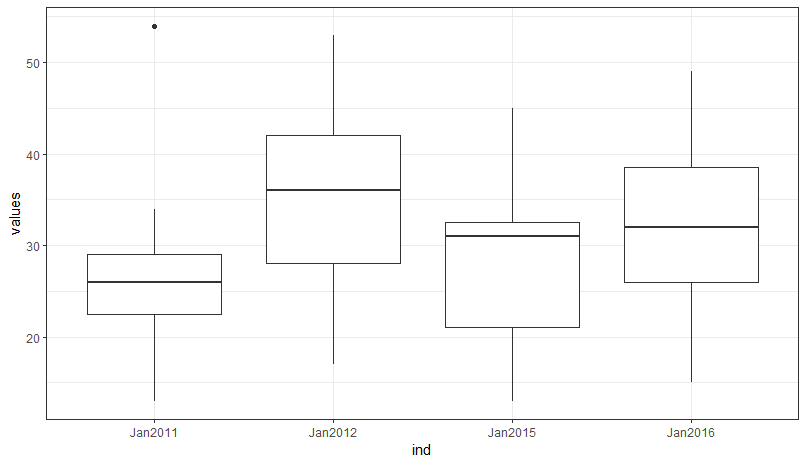{#fig_box_subset_stacked .fs}

### Plotting a subset using for loops

Again, this author believes the most robust way to plot the subset data is to use ***for*** loop.  Once again, this allows you to work with the original data frame -- there is no need to create a stacked data frame.

``` r
plot9 = ggplot( data=(lansJanTempsDF)); 
for(i in «c(1,2,5,6)»)   # cycle through the four columns
{
  ## map the column names to x and the column values to y
  plot9 = plot9 + geom_boxplot(mapping=aes(x=colnames(lansJanTempsDF)[!!(i)], 
                                           y=lansJanTempsDF[,!!(i)] ))
}
plot9 = plot9 + theme_bw();
plot(plot9);
```

In this code,

- the ***for*** loops only cycles through the four columns we want to plot ***c(1,2,5,6)***. 

- ***x*** is mapped to the subsetted column name

- ***y*** is mapped to the subsetted column values

- `i` is replaced with `!!(i)`

   

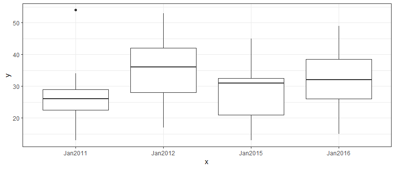{#fig-boxplot_for_loops .fs}

## Saving data frames to one object

In this lesson, we created four data frames:

- ***lansJanTempsDF***: the original data frame

- ***stackedDF***: a stacked version of the full data frame

- ***stackedDF2***: a stacked version of columns 3 and 6 only

- ***stackedDF3***: a stacked version of columns 1, 3, 5, and 6

   

We are going to use these data frames in the next lesson.  In the next lesson, we could just reopen the ***lansingJanTempsFixed.csv*** file, save the data to a data frame and then create the stacked dataframes.  But, since we have already done the work, it would be easier to pass the data frames from this lesson to the next lesson.

 

We will create one object that holds all four data frame using ***list()***.  The object is a ***List*** object (we will be talking a lot more about ***List*** objects in the next few lessons):

``` r
temperatureDFs= list("origDF" = lansJanTempsDF,
                     "stackedDF" = stackedDF,
                     "stackDF_3_6" = stackedDF2,
                     "stackedDF_1_2_5_6" = stackedDF3);
```

The value in quotes is the name of the object -- you can choose the name but you should use variable naming conventions.

 

***temperatureDFs*** appear in ***Variables*** as a ***List*** object with four data frames inside it (`list [4]`).  We can view the data frames inside ***temperatureDFs*** by double-clicking on them. However, the data viewer lists them by their index within the List object starting with ***0***. So, the ***third*** data frame in ***temperatureDFs*** shows up in the viewer as ***2***:

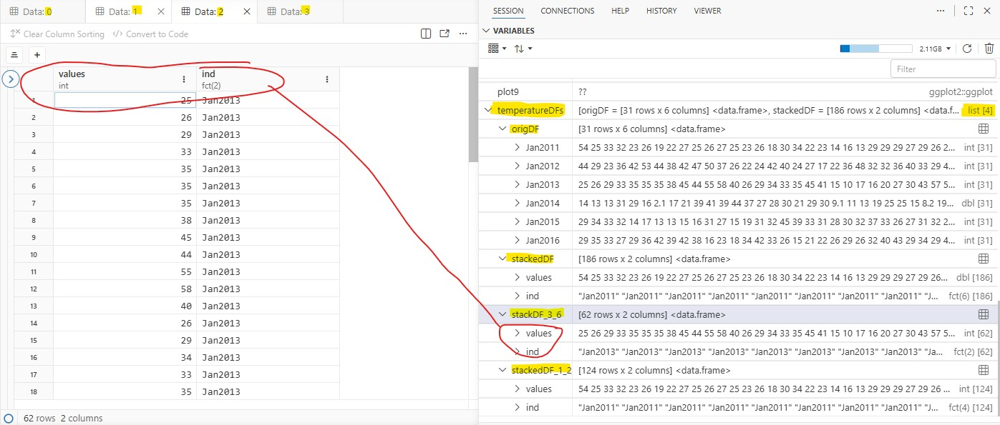{#fig-list_object .fs}

### Saving the List object to a file

We want to use the ***List*** object with four data frames in the next lesson.  To do this, [we need to save the **List** to a file]{.hl} -- a file we will open in the next lesson. There are two different types of file we can use: ***rdata*** and ***rds***. We are going to use both to show the pro and cons of each in the next lesson.

``` r
save(temperatureDFs, file = "data/tempDFs.rdata");   # save to rdata file
saveRDS(temperatureDFs, file = "data/tempDFs.rds");  # save to rds file
```

There should now be files named ***tempDFs.rdata*** and ***tempDFs.rds*** in the ***data*** folder. Both of these files contain the List object ***temperatureDFs***.

## Application

A\) [Open the file Lansing2016Noaa.csv](../data/Lansing2016Noaa.csv) and save the contents of the file to a data frame named ***weatherData***

 

B\) Create a stacked data frame named ***stackedWD*** that only contains the three temperature columns from ***weatherData*** (***maxTemp***, ***avgTemp***, and ***minTemp***). 

- ***stackedWD*** will have 2 columns (***values*** and ***ind***) and 1098 rows (366 \* 3).

   

C\) Create six GGPlot canvases, the individual canvases will contain:

1.  Three lines plots (***maxTemp***, ***avgTemp***, and ***minTemp***) using ***weatherData*** and three ***geom_line*** components -- the method used in @fig-line_plot

2.  Three lines plots (***maxTemp***, ***avgTemp***, and ***minTemp***) using ***stackedWD*** and one ***geom_line*** component.

3.  Three lines plots (***maxTemp***, ***avgTemp***, and ***minTemp***) using ***weatherData*** and a ***for*** loop.

4.  Three box plots (***maxTemp***, ***avgTemp***, and ***minTemp***) using ***weatherData*** and three ***geom_boxplot*** components

5.  Three box plots (***maxTemp***, ***avgTemp***, and ***minTemp***) using ***stackedWD*** and one ***geom_boxplot*** component.

6.  Three box plots (***maxTemp***, ***avgTemp***, and ***minTemp***) using ***weatherData*** and a ***for*** loop.

     



## Extension: Lazy Evaluation

Lazy Evaluation is probably the one programming topic that has caused the most agony in this author's life! [Lazy Evaluation]{.hl} means that the evaluation of an expression is delayed until, theoretically, the results are actually needed. This can increase the efficiency of a script but it can also lead to some very unexpected behavior. In GGPlot's case, the index values in a ***for*** loop are not evaluated at the expected time leading to a unintuitive situation...

 

There are **7** columns in ***lansJanTempsDF***, which means the ***for*** loop will cycle **7** times. Each time with a different value for the index value, ***i*** (1, 2, 3, 4, 5, 6, and 7).

``` r
for(i in 1:ncol(lansJanTempsDF))         # add plots to canvas one at a time
{
  plot4 = plot4 + geom_line( mapping=aes(x=1:nrow(lansJanTempsDF), 
                                         y=lansJanTempsDF[,«i»], 
                                         color=colnames(lansJanTempsDF)[«i»]) )
}
```

However, if you execute the code above you will only see one plot – the plot for the seventh cycle (when ***i=7***). In reality, [the seventh plot was plotted seven times]{.hl}, and, since it is the exact same plot, the seven plots completely overlap.

 

The reason this happens is that R, in the background, will first stack up the code from all seven cycles of the ***for*** loop like this:

``` r
plot4 = plot4 + geom_line( mapping=aes(x=1:nrow(lansJanTempsDF), 
                                       y=lansJanTempsDF[,«i»], 
                                       color=colnames(lansJanTempsDF)[«i»])
plot4 = plot4 + geom_line( mapping=aes(x=1:nrow(lansJanTempsDF), 
                                       y=lansJanTempsDF[,«i»], 
                                       color=colnames(lansJanTempsDF)[«i»])
plot4 = plot4 + geom_line( mapping=aes(x=1:nrow(lansJanTempsDF), 
                                       y=lansJanTempsDF[,«i»], 
                                       color=colnames(lansJanTempsDF)[«i»])
... (3 more) ...
plot4 = plot4 + geom_line( mapping=aes(x=1:nrow(lansJanTempsDF), 
                                       y=lansJanTempsDF[,«i»], 
                                       color=colnames(lansJanTempsDF)[«i»])
```

And then execute each command in the stack. This happens all the time when programming ***for*** loops and it is normally not an issue. Except, in this case, R does not realize that ***i*** is the index variable. R assumes that ***i=7*** because that is the value of ***i*** at the end of the ***for*** loop (i.e., after the seventh cycle). So, R replaces ***i*** with 7 for every command.

``` r
plot4 = plot4 + geom_line( mapping=aes(x=1:nrow(lansJanTempsDF), 
                                       y=lansJanTempsDF[,«7»], 
                                       color=colnames(lansJanTempsDF)[«7»])
plot4 = plot4 + geom_line( mapping=aes(x=1:nrow(lansJanTempsDF), 
                                       y=lansJanTempsDF[,«7»], 
                                       color=colnames(lansJanTempsDF)[«7»])
plot4 = plot4 + geom_line( mapping=aes(x=1:nrow(lansJanTempsDF), 
                                       y=lansJanTempsDF[,«7»], 
                                       color=colnames(lansJanTempsDF)[«7»])
... (3 more) ...
plot4 = plot4 + geom_line( mapping=aes(x=1:nrow(lansJanTempsDF), 
                                       y=lansJanTempsDF[,«7»], 
                                       color=colnames(lansJanTempsDF)[«7»])
```

This is called [Lazy Evaluation]{.hl} and I cannot explain why it happens here, but I can say that I have experienced this behavior many times in many programming languages in my career.

### Forcing immediate (i.e., non-lazy) evaluation

***!!()*** is a function that forces R to immediately evaluate what is inside the parentheses (i.e., before R stacks the commands).

``` r
for(i in 1:ncol(lansJanTempsDF))         # add plots to canvas one at a time
{
  plot4 = plot4 + geom_line( mapping=aes(x=1:nrow(lansJanTempsDF), 
                                         y=lansJanTempsDF[,«!!(i)»], 
                                         color=colnames(lansJanTempsDF)[«!!(i)»]) )
}
```

This means the stacked commands will look like this and execute properly:

``` r
plot4 = plot4 + geom_line( mapping=aes(x=1:nrow(lansJanTempsDF), 
                                         y=lansJanTempsDF[,«1»], 
                                         color=colnames(lansJanTempsDF)[«1»])
plot4 = plot4 + geom_line( mapping=aes(x=1:nrow(lansJanTempsDF), 
                                         y=lansJanTempsDF[,«2»], 
                                         color=colnames(lansJanTempsDF)[«2»])
plot4 = plot4 + geom_line( mapping=aes(x=1:nrow(lansJanTempsDF), 
                                         y=lansJanTempsDF[,«3»], 
                                         color=colnames(lansJanTempsDF)[«3»])
... (3 more) ...
plot4 = plot4 + geom_line( mapping=aes(x=1:nrow(lansJanTempsDF), 
                                         y=lansJanTempsDF[,«7»], 
                                         color=colnames(lansJanTempsDF)[«7»])
```