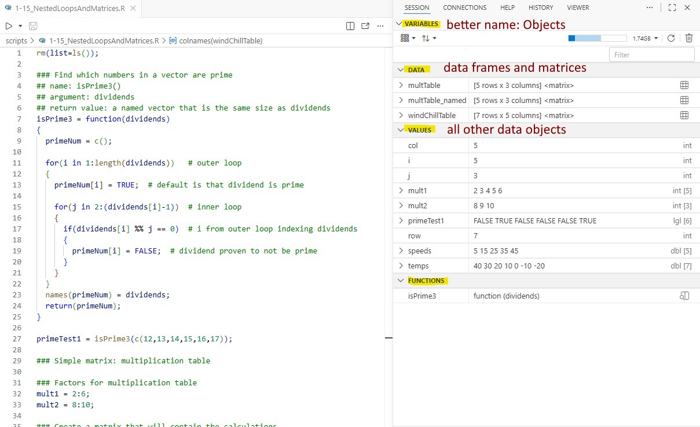

### To-do

- note that \[ \] is better to subset vectors whereas \[\[ \]\] is better to subset lists (however, both operators can be used for both objects)

## Purpose

- Distinguish between atomic vectors and Lists

- Show the different types of vectors

- Apply attributes to a vector: names, dimensions, and class

- Subsetting a vector

## Script for this lesson

The [script for the lesson is here](../scripts/2-12_ObjectsAndAttributes.R)

## Terminology

This lesson requires the use of terminology that has been inconsistently used in R or has morphed in meaning throughout the years, so you will find different definitions online.  In general, I will be using the terminology from the 2^nd^ edition of [Hadley Wickham's Advanced R book](https://adv-r.hadley.nz/) and mention places where there is commonly used terminology that is different.

## Objects in R

In the R world, anything stored in memory that has a name is called an [object]{.hl}. In base-R, there are three main types of objects: atomic vectors (usually shortened to vector), functions, and Lists. Broadly speaking:

- [(atomic) vectors]{.hl}: objects that hold values of the same type. The word ***atomic*** is rarely used but does occasionally appear as in the error message in @fig-errorAtomicVec.

- [functions]{.hl}: objects that hold operations

- [lists]{.hl}: objects that hold other objects (including Lists) – covered in next lesson ([note: data frames are a type of List]{.note})

### Relationship between the objects

The three types of objects (vectors, functions, and lists) are quite analogous to the different types of files and folders on a computer. A vector is like a data file, a function is like an executable file, and a list (covered in the next lesson) is like a folder: a container that stores objects, including vectors, functions, and even other lists.

 

[Note: Vectors are often referred to as ***homogeneous objects*** and Lists are often referred to as **heterogeneous objects,** but I believe these terms are not helpful as they do the capture the main difference between the objects like the file/folder analogy. ]{.note}

### Objects in Positron

When you execute a script in Positron, all of the current objects are put in the ***Variables*** tab. ***Variables*** is a poor name because, technically speaking, only vectors are variables. A better name would be ***Objects***.

 

The ***Variables*** tab is divided into three sections: DATA, VALUES, and FUNCTIONS. These three categories are not a mapping to the three types of objects in R:

- **FUNCTIONS**: holds function objects

- **DATA**: holds 2D data structure

  - Data frames are matrices are the most common 2D data structures

  - Double-clicking on a item in DATA will open it in a data viewer tab

- **VALUES**: holds everything else

  - Lists that are not data frames and vectors that are not matrices

{#fig-object_in_var .fs}

## The simplest object in R: the vector

Because R is a programming language designed to work with data, the vector represents the most basic object in R.  A [vector ]{.hl}is a named object that hold values of the same type (or class) -- usually string or numeric.

 

This code creates a vector named ***randomTemps*** with 40 integer values between -20 and 120:

``` r
set.seed(123);
randomTemps = sample(-20:120, size=40);
```

And, ***Variables*** shows that it is a integer (int) vector with forty values \[40\] ([note: ***sample()*** always returns integer values]{.note}):

``` {.r tab="Variables"}
randomTemps:  90 88 86 77 81 83 80 80    int [40]
```

In the Console, the 40 values are listed and, at the beginning of each line is the index value for the first value in the line. So, **-7** is the 1^st^ value, **-12** is the 16^th^ value, and **20** is the 31~~st~~ value. Your Console will look different because of the width.

``` {.r tab="Console"}
> randomTemps
 «[1]»  «-7»  29  97  22 120 118  69  70 113  71  78  51   5 -14  21
«[16]» «-12»  62  15  57  60 117  82  96  55  -6  11  85  88 107 105
«[31]»  «20»  53   2   6  39  32  92  94  87  75
```

### Single-value vectors

[Even a single value is stored in a vector.]{.hl}  Setting a variable to one value creates a one-value vector**:**

``` r
temperature = 80; # a vector, named temperature, with one value, 80
```

In ***Variables***, ***temperature*** is listed as a double (***dbl***) without any index number, but this is equivalent to ***dbl \[1\].***

``` {.r tab="Variables"}
temperature:  80     dbl
```

The ***Console***, with the **\[1\]**, better shows the vector nature of all R variables:

``` {.r tab="Console"}
> temperature
[1] 80
```

## Types of vector

There are six basic types/***classes*** of vectors in R:

- characters (strings)

- numeric (decimal numbers)

- integers (numbers without decimals)

- complex (numbers with real and imaginary parts -- these are not covered in this class)

- Boolean/logical (TRUE/FALSE values)

- raw (hold bytes -- rarely used and are not covered in this class)

   

We have mentioned character and numeric vectors multiple times in previous lessons.  We are going to look a little deeper into integer and Boolean vectors.

### Integer vectors

Integer vectors can be useful when you need counting values because integer values take up less space in memory and can be processed faster than numeric (i.e., decimal) vectors.

 

The issue is that, R will often coerce integer vectors to numeric vectors, effectively taking away the memory and speed advantages.

 

We can use ***as.integer()*** to explicitly create an integer vector:

``` r
intValues = as.integer(c(3,4,5));
```

And then add 1 and save the results a a new vector:

``` r
intValues2 = intValues + 1;
```

In ***Variables*** we see that ***intValues*** is an integer vector but ***intValues2*** is double (i.e., numeric):

``` {.r tab="Variables"}
intValues:    3 4 5   int [3]
intValues2:   4 5 6   dbl [3]
```

If we want the results to be an integer, then we need to also declare **1** as an integer:

``` r
intValues3 = intValues + as.integer(1);
```

Now, R will see the results as integers:

``` {.r tab="Variables"}
intValues3:  4 5 6   int [3]
```

[Extension: rounding functions in R]

### A Boolean/logical vector (TRUE/FALSE values)

We have not talked much about Boolean vectors but they are useful in programming because they are fast as they only have two possible values: **TRUE** and **FALSE**.  [Note: It is bad programming practice (and potentially dangerous) to use **T** and **F** to represent **TRUE** and **FALSE**.]{.note}

 

There are two general ways to create a Boolean vector: manually or with a conditional statement

#### Manually create a Boolean vector

We can use ***c()*** to create a vector with Boolean values.  Let's create a vector that that tells whether it rained on the eight days:

``` r
rainyDays = c(FALSE, FALSE, TRUE, FALSE, FALSE, TRUE, TRUE, FALSE);
```

In ***Variables***, ***rainyDays*** is given as a ***lgl***, which stands for ***logical*** -- which is just another name for Boolean:

``` {.r tab="Variables"}
rainyDays:  FALSE FALSE TRUE ...   lgl [8]
```

and we can check which values are ***TRUE*** using ***which()***:

``` {.r tab="Console"}
which(rainyDays)
[1] 3 5 6
```

#### Conditional statements create a Boolean vector

A conditional statement always creates a Boolean vector.  We typically used conditional statements in ***if()*** statements:

``` r
JulyTemps = c(90, 88, 86, 77,81, 83, 80, 80);  

for(i in 1:length(JulyTemps))
{
  # Output Boolean value instead of executing the if() statement:  if(JulyTemps[i] > 85)
  cat("day", i, (JulyTemps[i] > 85), "\n");
}    
```

The output from the above ***for*** loop is:

``` {.r tab="Console"}
day 1 TRUE 
day 2 TRUE 
day 3 TRUE 
day 4 FALSE 
day 5 FALSE 
day 6 FALSE 
day 7 FALSE 
day 8 FALSE 
```

This means that the first three days in ***JulyTemps*** were more than 85, the rest were less than or equal to 85.

 

We could also save Boolean results to a vector.  ***(JulyTemps \> 85)*** instructs R to check the 8 values in ***JulyTemps*** against the number **85**:

``` r
hotterThan85 = (JulyTemps > 85);
```

And the answer is given as a Boolean vector:

``` {.r tab="Console"}
> hotterThan85
[1]  TRUE  TRUE  TRUE FALSE FALSE FALSE FALSE FALSE
```

## Attributes of a objects

[Attributes]{.hl} is a very broad term in R.  All R objects can have attributes and there are two types of attributes.

 

1\) Attributes that are [properties of the object]{.hl} -- these are defined by R and they include:

- ***names***: names for the [values inside an object]{.hl} -- not to be confused with the name of the object

- ***class***: the type of object is it (numeric, boolean...)

- ***dim***: dimension -- this is one way to create a 2D matrix, 3D array, or higher dimension arrays

 

2\) Attributes that act as [metadata for the object]{.hl}.  These attributes are defined by the user and are analogous to comments in a script.

 

Attributes can be confusing because there is not a consistent way to apply or view them in R.

## names attribute

All objects have a ***name*** and they can be assigned an attribute called ***names***.  [The ***name*** of the object and the **names** attribute are two different things]{.hl}*.* The attribute ***names*** refers to names given to the values [within the object]{.hl} and are assigned using the ***names()*** function.

 

Let's first create a copy of our ***JulyTemps*** vector:

``` r
JulyTempsNamed = JulyTemps;
```

And we will use ***names()*** to give the date to each temperature value:

``` r
names(JulyTempsNamed) = c("July22", "July23", "July24", "July25",
                          "July26", "July27", "July28", "July29");
```

In ***Variables,*** you can see the names when you expand ***JulyTempsNames***:

``` {.r tab="Variables"}
🞃 JulyTempsNames:  90 88 86 77...    dbl [8]
     July22     :  90
     July23     :  88
     July24     :  86
     July25     :  77
     July26     :  81
     July27     :  83
     July28     :  80
     July29     :  80
```

And in the ***Console***, ***JulyTempsNamed*** has two rows, the first contains the names and the second contains the values:

``` {.r tab="Console"}
> JulyTempsNamed
July22 July23 July24 July25 July26 July27 July28 July29 
    90     88     86     77     81     83     80     80
```

### Subsetting named values with square brackets \[ \]

The main advantage to naming vectors is that you can use the names to subset the value within the object.

 

To get the second value in ***JulyTempsNamed***, you can subset with the position `[2]` or the name `["July23"]`:

::: {#fig-subset_named_vec}
``` {.r tab="Console"}
> JulyTempsNamed[2]
July23 
    88 
> JulyTempsNamed["July23"]
July23 
    88 
```

Subsetting a named vector with the position and the name -- the results are the same
:::

You can subset multiple values by position or name:

``` {.r tab="Console"}
> JulyTempsNamed[c(2,4,6)]
July23 July25 July27 
    88     77     83 
> JulyTempsNamed[c("July23", "July25", "July27")]
July23 July25 July27 
    88     77     83 
```

From a functional perspective, [named values and unnamed values will work exactly the same in any computation]{.hl}.  The difference between the two is only how they are displayed and how they can be referenced. 

 

Here we subtract all values in ***JulyTempsNamed*** by **20** – the names stay the same but the values change:

::: {#fig-math_named_unamed}
``` {.r tab="Console"}
> JulyTempsNamed - 20
July22 July23 July24 July25 July26 July27 July28 July29 
    70     68     66     57     61     63     60     60 
```

You can do mathematics on named values just like unnamed values
:::

### Subsetting named values with double-square brackets \[\[ \]\]

You can also subset a named vector with double square brackets **\[\[  \]\]** and you will just get the value (without the name):

::: {#fig-double_brackets}
``` r
> JulyTempsNamed[[2]]
[1] 88
> JulyTempsNamed[["July23"]]
[1] 88
```

Using double brackets to subset named vectors will give you just the value
:::

This is generally not recommended because you cannot select multiple elements using **\[\[ \]\]**

::: {#fig-single_double_brackets}
``` r
> JulyTempsNamed[2:4]
July23 July24 July25 
    88     86     77 
> JulyTempsNamed[[2:4]]
Error in JulyTempsNamed[[2:4]] : 
  attempt to select more than one element in vectorIndex
```

using single brackets and double brackets to subset multiple values in a vector
:::

[Note: **element** here means the same as **values** (so, the  8 elements in **JulyTempsNamed** are the eight values)]{.note}

## dimension (dim) attribute

When you create a vector using ***c()***, you are creating an object that, functionally, has one dimension.  This is why you can subset values in ***JulyTemps*** using their position within the vector (@fig-subset_named_vec).

 

However, data is sometimes best represented in multiple dimensions -- for instance you might have temperatures that are stored by both location and date.

### two-dimensional vectors

We can use ***dim()*** to add more dimensions to a vector.

 

We are going to make a two-dimensional vector (also called a [matrix ]{.hl}or a [2D array]{.hl}) using ***JulyTemps***.  First, we will create a copy of ***JulyTemps*** and then set the dimensions of the copy to two values (**4** and **2**).  Those two dimension values (which can be thought of as **4** rows and **2** columns) must multiply to the number of values in the vector (**8**).

``` r
JulyTemps2D = July Temps;
dim(JulyTemps2D) = c(4,2);
```

The ***Console*** reflects the dimensions in ***JulyTemps2D***: whereas, in ***Variables***, ***JulyTemps2D*** appears as a matrix in the DATA section:

``` {.r tab="Console"}
> JulyTemps2D
     [,1] [,2]
[1,]   90   81
[2,]   88   83
[3,]   86   80
[4,]   77   80
```

::: {#fig-2D_display}
``` {.r tab="Variables"}
🞃 JulyTemps2D: [4 rows x 2 columns] <matrix>
   > [, 1]    : 90 88 86 77
   > [, 2]    : 81 83 80 80
```

Displaying a 2D value in the Console and Variables
:::

Now we have a 2D object that can be subset using the **\[ , \]** operator (which can be thought of as a dimensional subset operator):

``` {.r tab="Console"}
> JulyTemps2D[3,2]
[1] 80
```

### 3-dimensional vectors

We could also create a three-dimensional object (called a 3D array) by setting the dimensions to three values.  The numbers still need to multiply to **8**:

``` r
JulyTemps3D = JulyTemps;
dim(JulyTemps3D) = c(2,2,2); # each dimension has length of 2
```

In the ***Console***, the third dimension is show vertically as multiple 2D arrays (the 1 and 2 highlighted represent the third dimension):

``` {.r tab="Console"}
> JulyTemps3D
, , «1»

     [,1] [,2]
[1,]   90   86
[2,]   88   77

, , «2»

     [,1] [,2]
[1,]   81   80
[2,]   83   80
```

In ***Variables***, this object will appear under VALUES as a ***dbl*** with 3 dimensions ***\[2, 2, 2\]***:

``` {.r tab="Variables"}
JulyTemps3D:  90 88 86 77 81 83 80 80     dbl [2, 2, 2]
```

And we can subset the 3D vector using three values in the array operator:

``` {.r tab="Console"}
> JulyTemps3D[1,2,2]
[1] 80
```

### accessing rows and columns in matrices

Let's take the 2D matrix we created and add names for the rows and columns using ***rownames()*** and ***colnames()***:

``` r
JulyTemps2DNamed = JulyTemps2D;
rownames(JulyTemps2DNamed) = paste("date", 1:4, sep="");
colnames(JulyTemps2DNamed) = c("location1", "location2");
```

And we can see the names in the ***Console***:

``` {.r tab="Console"}
> JulyTemps2DNamed
      location1 location2
date1        90        81
date2        88        83
date3        86        80
date4        77        80
```

We can now access values in the matrix by name or position using the dimensional operator:

``` {.r tab="Console"}
> JulyTemps2DNamed[3,2]
[1] 80
> JulyTemps2DNamed["date3","location2"]
[1] 80
```

And we can access whole rows or columns by leaving the other blank:

``` {.r tab="Console"}
> JulyTemps2DNamed[3,]
location1 location2 
       86        80 
> JulyTemps2DNamed[,2]
date1 date2 date3 date4 
   81    83    80    80 
> JulyTemps2DNamed[,"location2"]
date1 date2 date3 date4 
   81    83    80    80 
```

### matrices are vectors

The ***\[ , \]*** operator is really the same thing as the ***\[ \]*** operator.  The difference is that ***\[ , \]*** is used for 2D objects (matrices) whereas ***\[ \]*** is used for 1D objects (vectors).

 

You can use the 1D operator on a matrix -- ***\[ \]*** will flatten the matrix to one dimensional vector:

``` {.r tab="Console"}
> JulyTemps2DNamed[1:8]
[1] 90 88 86 77 81 83 80 80

> JulyTemps2DNamed[5]
[1] 81
```

### The \$ operator

You cannot use **\$** to subset any Atomic Vector (vector, matrix, or array). You will get the [\$ operator is invalid for atomic vectors]{.hl} error:

::: {#fig-errorAtomicVec}
``` r
> JulyTemps2DNamed$col2
Error in JulyTemps2DNamed$col2 : $ operator is invalid for atomic vectors
```

R does not allow use of \$ operator on vectors
:::

## class attribute and typeof()

***class()*** is a function that allows you to either view or set the class of an object (e.g., change a numeric vector to a character vector).  [However, you should never use **class()** to changes the class of an object, instead use a specialized function like **as.character()**.]{.hl}

 

Using ***class()*** to get the class of an object will produces inconsistent results.  Using class on an object will return the value type if the vector has no dimensions set, and will return the object type if there are dimensions set:

``` {.r tab="Console"}
> class(JulyTemps2D)
[1] "matrix" "array" 
> class(JulyTemps)
[1] "numeric"
```

Instead of class, you should use [typeof()]{.hl}*.* It will always give you the class of the values:

``` {.r tab="Console"}
> typeof(JulyTemps2D)
[1] "double"
> typeof(JulyTemps)
[1] "double"
```

[Note: **double** means the values are **numeric**.  In other programming languages (especially older ones), there is a corresponding **single** class that does not exist in R. ]{.note}

## Other attributes (metadata or comments)

You can create any attribute you want and add it an object using ***attr()***.  We are going to add two attributes using ***attr()*** to a copy of ***JulyTemps2DNamed***.  The attributes will be named ***timeChecked*** and ***unit*** and they will be set to ***noon*** and ***Fahrenheit***:

``` r
JulyTemps2DNamed_2 = JulyTemps2DNamed;
attr(JulyTemps2DNamed_2, "timeChecked") = "noon";
attr(JulyTemps2DNamed_2, "unit") = "Fahrenheit";
```

[note: while not enforced, attribute names should follow variable variable naming conventions]{.note}

 

We can also use ***attr()*** to get the attributes of an object:

``` {.r tab="Console"}
> attr(JulyTempsNamed_2, "timeChecked")
[1] "noon"
> attr(JulyTempsNamed_2, "unit")
[1] "Fahrenheit"
```

[User-defined attributes should be treated as comments or metadata]{.hl}*.*  Attributes give information that might interest the user of your script but attributes should not be a functional part of the script. 

### Viewing all attributes

If you view a object in the ***Console***, the user-defined attributes will be displayed:

``` {.r tab="Console"}
> JulyTemps2DNamed_2
      location1 location2
date1        90        81
date2        88        83
date3        86        80
date4        77        80
attr(,"timeChecked")
[1] "noon"
attr(,"unit")
[1] "Fahrenheit"
```

For a more robust view of the attributes in an object, you can use ***attributes()***:

``` {.r tab="Console"}
> attributes(JulyTemps2DNamed_2)
$dim
[1] 4 2
$dimnames
$dimnames[[1]]
[1] "date1" "date2" "date3" "date4"
$dimnames[[2]]
[1] "location1" "location2"

$timeChecked
[1] "noon"
$unit
[1] "Fahrenheit"
```

[Note: **dimnames** is an attribute set in the background when you set the row and column names]{.note}

## Application

A\) In comment at the top of your script answer:

- What happens when you create this vector:  **c(1, "a", 2, "b")**?  Why?  Explain in terms of atomic vectors and class types.

 

B\) Open the [Lansing2016Noaa-3.csv](../data/Lansing2016Noaa-3.csv) CSV file above and save it to the dataframe ***weatherData***

- Add a logical/Boolean column to ***weatherData*** call ***wasPrecip*** that gives whether there was any precipitation for the day

- Add a logical/Boolean column to ***weatherData*** call ***wasMild*** that gives whether a day had high temperatures between 50 and 70

- Add a logical/Boolean column to ***weatherData*** call ***wasMuggy*** that gives whether a day had high temperatures greater than 70 and humidity greater than 80

 

C\) Save the ***windSpeed*** column from ***weatherData*** to a vector named ***windSpeed***

- Add two user-defined attributes to ***windSpeed***-- one that gives the unit (miles/hour), the other that gives the year (2016)

- use variable naming conventions when naming the attributes

 

D\) Save ***averageTemp*** to a vector and add a names attribute for the first five values in ***averageTemp*** that gives the day (Jan1, Jan2...)

- Answer in comments: What happens to the other 361 unnamed values?

 

E\) Using ***sample()***, create a vector with 800 random values from 1-100

- Make this vector a 4D vector

- subset two values in the 4D vector



## Extension: rounding functions in R

There are three rounding functions in R:

- ***round()***   \# rounds to nearest integer (**5.3** become **5** and **5.7** becomes **6**)

- ***floor()***    # always rounds down (both **5.3** and **5.7** become **5**)

- ***ceiling()***  \# always rounds up  (both **5.3** and **5.7** become **6**)

   

Even though these function create integer-like values, R will still see the values as numeric:

``` {.r tab="Console"}
> a = c(2.5, 3.6, -1.3)
> b = round(a)
> b
[1]  2  4 -1
> class(b)
[1] "numeric"
```

If you actually want integer values, then you need to to convert the vector to an integer:

``` {.r tab="Console"}
> b = as.integer(b)
> b
[1]  2  4 -1
> class(b)
[1] "integer"
```

Integer values have a speed advantage over numeric values, which you will notice if you are processing 100,000 values.