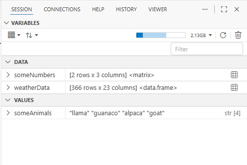
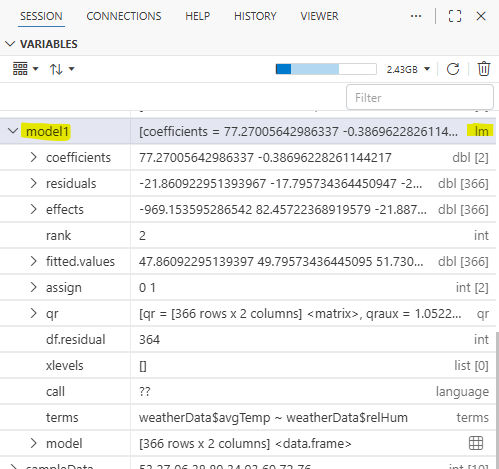
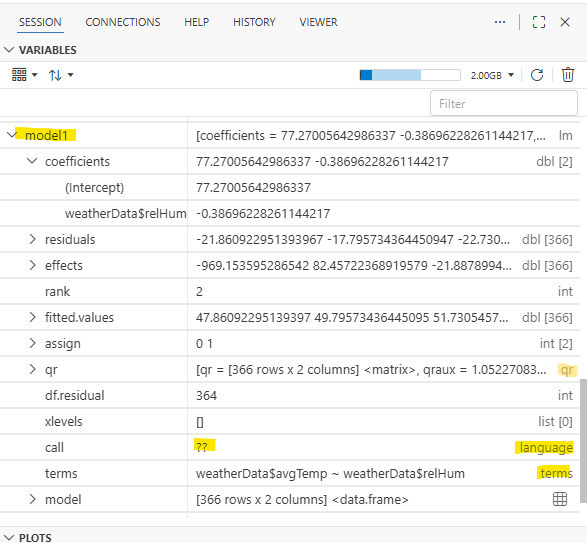

### To-do

- expand lesson to include reading/writing Lists to RDS file (save lm to RDS?)
- talk about attributes on a matrix vs data frame
  - how matrix and data frame determine rows and columns

## Purpose

- Creating you own List

- Subsetting a List

- Reading a List return from plots and models

## Script for this lesson

The [script for the lesson is here](../scripts/2-12_Lists_new.R)

The [data used for this lesson and the application](../data/Lansing2016Noaa.csv) is here

## Objects in R

As mentioned in last lesson, there are 3 types of objects in R:

- Vectors (sometimes called atomic vectors): objects that hold values of the same type (e.g., numeric, string, logical)

- Lists: objects that hold other objects (including more Lists)

- Functions: objects that hold operations

   

Last lesson we talked mostly about atomic vectors. This lesson we will talk mostly about Lists. As you will see in this lesson, Lists create a tree-like structure for your data. 

### Creating objects to put in a List

We are going to create a List object and add other objects to it. The objects we will add are:

- a character vector called ***someAnimals***

- a 2x3 matrix consisting of a sequence of six numbers called ***someNumbers***

- the ***weatherData*** dataframe from previous lessons

``` r
someAnimals = c("llama", "guanaco", "alpaca", "goat");
someNumbers = matrix(nrow=2, ncol=3, seq(from=30, to=4, length.out=6)) 
weatherData = read.csv(file="data/Lansing2016NOAA.csv");
```

***someAnimals*** is a one-dimensional vector, ***someNumbers*** is a two-dimensional vector (i.e., a matrix), and ***weatherData*** is a data frame.

 

In ***Variables***, ***someNumbers*** and ***weatherData*** are put in the DATA section. In general, only 2D data objects are put into the DATA section – everything else goes into VALUES (including ***someAnimals***).

{#fig-data-values .fs}

### Matrices vs. data frames

Matrices and data frames are both 2D structures that contain data – but they are formed very differently. A matrices is a single vector object with the ***dim*** attributes modified to defining how many rows and column are in the data. A data frame is a List object where each column is a separate vector – and all vectors have the same number of values.

## Lists

A List is an object that holds other (usually related) objects, much like a folder holds files. A data frame is a special type of List that holds only vectors with the same number of values. Lists are often used to organize and send data. For instance, when you perform a statistical test, the results are often stored as Lists, as we will see later in the lesson.

 

A List is usually used as a data structure and contains vectors and subLists. A List can also include functions – this is often done when programming using the Object-Oriented Programming (OOP) paradigm, a topic not covered in this class.

### Creating the new List

We can create a List with the three objects above using the ***list()*** function:

``` r
list1 = list(someAnimals, someNumbers, weatherData);
```

When you expand List1 in ***Variables***, you can see the three objects that were added to the List, but they do not have names – they just have index numbers. [Objects do not retain their names when put in to a List.]{.hl}

``` {.r tab="Variables"}
🞃 list1:     ["llama" "guanaco" ...]              list [3]
    > [[1]]:  "llama" "guanaco" "alpaca" "goat"      str[4]
    > [[2]]:  [2 rows x 3 columns] <matrix>     
    > [[3]]:  [366 rows x 23 columns] <data.frame>
```

### Including names for the objects

If we want the objects inside the List to have names, then we have to specify the names while creating the List ([note: you can use a different name]{.note}).  You do that by setting a name equal to the object when calling ***list()***:

``` r
  list2 = list(animals = someAnimals,
               numbers = someNumbers, 
               weather = weatherData);
```

This makes ***animals***, ***numbers***, and ***weather*** the names of the objects ***someAnimal***, ***someNumbers***, and **weatherData** inside the List.

``` r
🞃 list2:       ["llama" "guanaco" ...]               list [3]
    > animals:  "llama" "guanaco" "alpaca" "goat"      str[4]
    > numbers:  [2 rows x 3 columns] <matrix>     
    > weather:  [366 rows x 23 columns] <data.frame>
```

[Note: names inside Lists, like variables, should follow programming naming conventions -- but this is not enforced in R.]{.note}

## Creating a dynamic List

In the previous example, all the objects put in the List were put in at once.  What often happens is that data is generated and gets dynamically added to a List, so the objects are put in the List separately.  We are going to create a List equivalent to ***list2*** except the three object will be put in one at a time.

 

First we create a List with nothing in it (i.e., an empty list):

``` {.r tab="Variables"}
list3 = list();
```

``` {.r tab="Variables"}
list3:  list [0]
```

### Appending to the List

Then add the object ***someAnimals*** to the List. 

``` r
list3[["animals"]] = someAnimals;  
```

Now ***list3*** is a List with one string object in it named animal.

``` {.r tab="Variables"}
🞃 list3:       ["llama" "guanaco" ...]               list [1]
    > animals:  "llama" "guanaco" "alpaca" "goat"      str [4]
```

We can now add the other two objects using the same format:

``` r
list3[["numbers"]] = someNumbers;
list3[["weather"]] = weatherData;
```

And ***list3*** looks exactly like ***list2***:

``` {.r tab="Variables"}
🞃 list2:       ["llama" "guanaco" ...]               list [3]
    > animals:  "llama" "guanaco" "alpaca" "goat"      str[4]
    > numbers:  [2 rows x 3 columns] <matrix>     
    > weather:  [366 rows x 23 columns] <data.frame>
```

### Appending by index

When you are automating the generation of a List, you often do not want to name objects, you just want to keep appending objects to the List. What you want to do is more like this:

``` r
#### To put in objects in a list by index a name
list4 = list()
list4[[1]] = someAnimals; 
list4[[2]] = someNumbers; 
list4[[3]] = weatherData; 
```

And list4 will look exactly like list1 – a list with unnamed objects:

``` {.r tab="Variables"}
🞃 list4:     ["llama" "guanaco" ...]              list [3]
    > [[1]]:  "llama" "guanaco" "alpaca" "goat"      str[4]
    > [[2]]:  [2 rows x 3 columns] <matrix>     
    > [[3]]:  [366 rows x 23 columns] <data.frame>
```

### Appending by index automated

But the problem with the above code is that you have to manually add the index number – a likely impractical task in large scripts! Instead, we can tell R to append to the next open index by using ***length()***, which gives the current number of objects in the list:

``` r
#### To automate the numbering of objects in a list
list5 = list()
list5[[length(list5)+1]] = someAnimals; 
list5[[length(list5)+1]] = someNumbers; 
list5[[length(list5)+1]] = weatherData; 
```

and list5 looks exactly like list4.

 

Something like this would probably be done in a ***for*** loop where you are adding data to a list each cycle:

``` r
list6 = list();
for (i in 1:5)
{
  sampleData = sample(1:100, size=10);    # pick 10 random numbers
  list6[[length(list6)+1]] = sampleData;  # at to list in next spot
}
```

And list6 has stored the 5 sets of random numbers:

``` {.r tab="Variables"}
🞃 list6:     [37 8 51 74 ...]                     list [5]
    > [[1]]:  37 8 51 74 50 97 86 76 84 46 
    > [[2]]:  17 62 46 54 35 94 79 24 87 7     
    > [[3]]:  93 79 23 26 32 7 27 42 5 70
    > [[4]]:  16 24 32 21 55 75 36 83 89 39
    > [[5]]:  54 90 9 71 48 77 83 56 39 68 
```

## Subsetting within a List

There are three ways to subset a List

1)  using name inside \[\[ \]\]

2)  using name after \$

3)  by index number (this is the only option when there is no name)

[Note that you can combine these]{.note}

 

The ***Variables*** tab does a good job of showing the structure of a List object. Here we see the object within model1 and there are multiple object (highlighted) that are three levels deep:

``` r
listDynamic5[["weather"]][["avgTemp"]]
```

We can view any of those objects using the \[\[ \]\] operator:

anim4 = list5\["animal"\];

### Subsetting with \$ and \[\[ \]\]

Every object in the List Viewer with a value under ***Name*** in @fig-viewer_to_Console can be accessed with both the **\$** and **\[\[ \]\]** subset operators.

 

Here are two ways to subset the ***animal*** object inside ***listDynamic5*** -- the results are saved to ***anim1*** and ***anim2***:

``` r
anim1 = listDynamic5[["animal"]];
anim2 = listDynamic5$animal;
```

The ***string*** (chr) vectors ***anim1*** and ***anim2*** have the same values as the original ***someAnimals*** vector:

``` {.r tab="Environment"}
anim1:       chr [1:4] "llama" "guanaco" ...
anim2:       chr [1:4] "llama" "guanaco" ...
someAnimals: chr [1:4] "llama" "guanaco" ...
```

Here are three ways to subset the ***dewPoint*** vector within ***weather***, which is within ***listDynamic5***: 

``` r
dewPoint1 = listDynamic5$weather$dewPoint;
dewPoint2 = listDynamic5[["weather"]][["dewPoint"]];
dewPoint3 = listDynamic5[["weather"]]$dewPoint;
```

Again, all three saved values are identical to the original ***weatherData\$dewPoint***:

``` {.r ta="Environment"}
dewPoint1:       20 22 20 13 10 16 ...
dewPoint2:       20 22 20 13 10 16 ...
dewPoint3:       20 22 20 13 10 16 ...
🞃 weatherData:  366 obs. of 23 variables
    $ dewPoint:    20 22 20 13 10 16...
```

**\$** and **\[\[ \]\]** are equivalent operators when you are working with named objects within a List.  **\$** is more convenient to use because it involves less typing and RStudio will give you suggestions.

### Numeric subsetting (only with \[\[ \]\])

Objects within a Lists can also be accessed by their numeric order using **\[\[ \]\]**:

``` r
anim3 = listDynamic5[[1]];
dewPoint4 = listDynamic5[[3]][[7]];
```

But, you cannot use the **\$** operator to subset by number:

``` r
# anim3 = listDynamic5$1;   # will cause an error
```

So, if the object inside a List does not have a name, as in ***listAtOnce*** (@fig-list_viewer), then you have to use **\[\[ \]\]** to subset the unnamed object by numeric placement.

### The \[ \] subset operator

You can use **\[ \]** to subset the List, but instead of getting the object, you will get a List with the object in it:

``` r
anim4 = listDynamic5["animal"];
```

In the ***Environment***, we can see that  ***anim1***, ***anim2***, and ***anim3*** (subsetted with either **\[\[ \]\]** or **\$**) are all character vectors with 4 values.  But, ***anim4*** (subsetted with **\[ \]**) is a List with a character vector that has 4 values:

::: {#fig-double_single_brackets}
``` {.r tab="Environment"}
anim1:   chr [1:4] "llama" "guanaco" ...
anim2:   chr [1:4] "llama" "guanaco" ...
anim3:   chr [1:4] "llama" "guanaco" ...

🞃 anim4:   List of 1
   $ animal: chr [1:4] "llama" "guanaco" ...
```

The difference between using \[\[ \]\] or \$ vs \[ \] for subsetting objects within a List
:::

This is not very useful so **\[ \]** is rarely used to subset a List.

## Returned List from functions

We are going to move from creating our own Lists to looking at Lists that are returned when you call certain functions, specifically ***lm()***.

 

When we create a linear regression model of humidity vs temperature using ***lm()***, the results are saved to a list, in this case named ***model1***:

``` r
«model1» = lm(formula=weatherData$avgTemp~weatherData$relHum);
```

And then look at a summary of the model using ***print(summary(model1))***:

::: {#fig-summary_linear_reg}
``` r
>   print(summary(model1));
Call:
lm(formula = weatherData$avgTemp ~ weatherData$relHum)
Residuals:
    Min      1Q  Median      3Q     Max 
-44.213 -14.424  -0.213  15.479  36.461 
Coefficients:
                   Estimate Std. Error t value Pr(>|t|)    
(Intercept)        77.27006    6.07644  12.716  < 2e-16 ***
weatherData$relHum -0.38696    0.08722  -4.437 1.21e-05 ***
---
Signif. codes:  
0 ‘***’ 0.001 ‘**’ 0.01 ‘*’ 0.05 ‘.’ 0.1 ‘ ’ 1
Residual standard error: 18.59 on 364 degrees of freedom
Multiple R-squared:  0.0513,    Adjusted R-squared:  0.04869 
F-statistic: 19.68 on 1 and 364 DF,  p-value: 1.213e-05
```

Summary of a model of a linear regression
:::

### The returned List: linear model

***model1*** is a List object and the information for the linear model is stored in the List:

{#fig-returned_list .fs}

In ***Variables***, ***model1*** is listed as ***lm*** (linear model), but ***lm*** is a type of list. In fact using ***typeof()***, you can see that model1 is a List.

``` {.r tab="Console"}
> typeof(model1)
[1] "list"
```

### Subsetting the linear model List

***model1*** has information that is inside the summary, for instance the estimate for the intercept is at:

``` {.r tab="Console"}
> model1$coefficients["(Intercept)"]
(Intercept) 
   77.27006 
```

[Note: **(Intercept)** does not follow good programming naming practices!]{.note}

 

We need to use **\[ \]** to subset ***coefficients*** because ***coefficients*** is an atomic vector.  [Note: Subsetting operators are a bit inconsistent in R.]{.note}

 

We can also subset the first ten ***residuals*** from ***model1***:

``` {.r tab="Console"}
> model1$residuals[1:10]
          1           2           3           4           5 
-21.8609230 -17.7957344 -22.7305458 -30.0869984 -32.5696589 
          6           7           8           9          10 
-24.8914326 -19.4392818 -12.3130738  -0.1216773 -20.0869984 
```

Or, subset every twentieth value in ***fitted.values***:

``` {.r tab="Console"}
> model1$fitted.values[seq(from=1, to=366, by=20)]
       1       21       41       61       81      101      121      141 
47.86092 45.92611 52.11751 44.76522 57.53498 46.31307 49.02181 57.92194 
     161      181      201      221      241      261      281      301 
54.43928 57.53498 54.82624 55.21321 47.47396 45.15219 50.56966 43.60434 
     321      341      361 
48.24789 46.31307 46.70004 
```

There are also a lot of other, more obscure, values in the List object which we will not go through.  The point is that there is a lot of information inside the List and that information can be extracted using subset operators.

### New variables types

If you look through ***model1***, you will find three new variable types: ***language***, ***symbol***, and ***formula***.  These variables types are used by R programmers to store the code that created the List -- this is not something you will need to deal with at this point.

{#fig-less_common_var_types .fs}

## Application

A\) Create one List named ***app2_13_List*** that contains the objects from parts A, B, and C in this application

B\) Why is it better to subset objects by name instead of position numbers?

- Save the answer to a 1-character vector

- Add the ***name*** "comment" to the value

   

C\) Using ***weatherData***, create a linear model of dewpoint vs temperature

- Save the model to a List named ***linearModel1***

   

D\) Using only values in ***linearModel1***, find and save:

- the slope and the intercept

- the last 10 effects values

- the first 10 values from the original temperature vector

- the most extreme residual value (i.e., furthest from 0 -- could be positive or negative)

 

E\) Write the List to an RDS file named ***app2-13List.RDS*** in the ***data*** folder.

