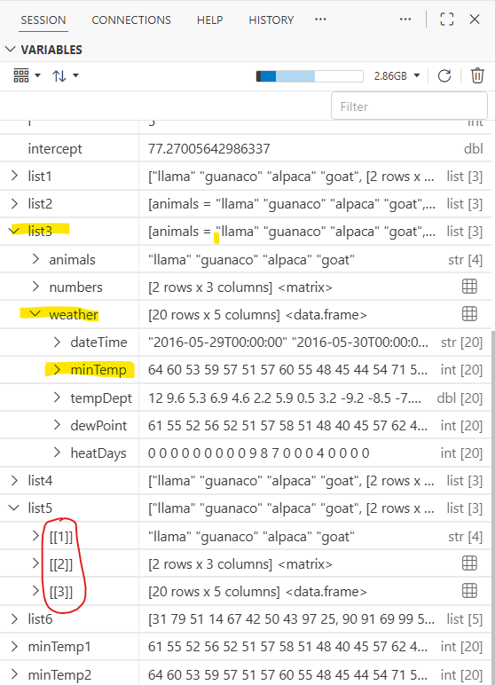

### To-do

## Purpose

- Creating you own List

- Subsetting a List

- Reading a List return from plots and models

## Script for this lesson

The [script for the lesson is here](../scripts/2-13_Lists.R)

The [data used for this lesson and the application](../data/Lansing2016Noaa.csv) is here

## Objects in R

As mentioned in last lesson, there are 3 types of objects in R:

- Vectors (a.k.a. atomic vectors): objects that hold multiple values of the same type (e.g., numeric, string, logical)

  - vector are like data files on your computer

- Lists: objects that hold other objects (including more Lists)

  - lists are like folders on your computer

- Functions: objects that hold operations

  - functions are like executable files on your computer

     

Last lesson we talked mostly about vectors. This lesson we will talk mostly about Lists, which create a tree-like structure for your data. 

### Creating objects to put in a List

We are going to create a List object and add objects to it. The objects we will add are:

- a character (string) vector called ***someAnimals***

- a 2x3 matrix consisting of a sequence of six numbers called ***someNumbers***

- a subset of the ***weatherData*** dataframe from previous lessons – named ***weatherData_reduced***

``` r
someAnimals = c("llama", "guanaco", "alpaca", "goat");
someNumbers = matrix(nrow=2, ncol=3, seq(from=30, to=4, length.out=6)) 
weatherData = read.csv(file="data/Lansing2016NOAA.csv");

### reduce the dataset to 20 rows (150-169) and 5 columns (1,3,5,7,9)
weatherData_reduced = weatherData[150:169, seq(from=1, to=10, by=2)];
```

***someAnimals*** is a one-dimensional vector, ***someNumbers*** is a two-dimensional vector (i.e., a matrix), and ***weatherData_reduced*** is a data frame.

 

In ***Variables***, ***someNumbers,*** ***weatherData***, and ***weatherData_reduced*** are put in the DATA section. Positron only puts 2D data objects into the DATA section. Objects in DATA can be double-clicked and put into a data viewer tab – in @fig-data-values, ***weatherData_reduced*** is in a data viewer. All other data goes into VALUES (including ***someAnimals***).

{#fig-data-values .fs}

### Matrices vs. data frames

Matrices and data frames are both 2D structures that contain data – but they are formed very differently.

 

[A matrix is a single vector]{.hl} object. In a matrix, the number of rows and columns are defined by the ***dim*** attribute, which is set when you declare the matrix using the ***nrow*** and ***ncol*** arguments.

 

[A data frame is structured like a folder]{.hl} (i.e., List object) that holds multiple vectors of the same size – the vectors can be of different types (e.g., string, Boolean, numeric, integer, Datetime). In a data frame, the number of columns is the number of vectors in the List/folder and the number of rows is the number of values in each vector, which must be the same.

### Subsetting a data frame

When ***weatherData*** was reduced to ***weatherData_reduced***, the row and column names stayed the same. It is easy to see the column names in ***weatherData_reduced*** are still ***dateTime***, ***minTemp***, ***tempDept***, ***dewPoint***, and ***heatDays***. If you look at the row names in the data viewer, you can see they are still **150 - 169**, matching the row numbers extracted out of ***weatherData***. This can also be seen in ***Console***:

``` {.r tab="Console"}
> rownames(weatherData_reduced)
 [1] "150" "151" "152" "153" "154" "155" "156" "157" "158" "159" "160" "161" "162" "163" 
[15] "164" "165" "166" "167" "168" "169"
```

The ***Console*** also shows that the row names are not number, but string values consisting of numbers. So, you can refer to the row using the index number or the row name. Here we are extracting row 4, or "153":

``` {.r tab="Console"}
> weatherData_reduced[«4»,]
               dateTime minTemp tempDept dewPoint heatDays
153 2016-06-01T00:00:00      59      6.9       56        0
> weatherData_reduced[«"153"»,]
               dateTime minTemp tempDept dewPoint heatDays
153 2016-06-01T00:00:00      59      6.9       56        0
```

## Lists

A List is an object that holds other objects, much like a folder holds files. A data frame is a special type of List that hols multiple vectors of the same length. Lists are often used to organize and send data. For instance, when you perform a statistical test, the results are often stored in a List, as we will see later in the lesson.

 

A List is usually used as a data structure that contains vectors and subLists. A List can include functions – this is often done when programming using the Object-Oriented Programming (OOP) paradigm, a topic beyond the scope of this class, but you will see functions inside Lists in some advanced packages (e.g., shiny, terra, RTMB).

### Creating the new List

Let's create a List with the three objects above using the ***list()*** function:

``` r
list1 = list(someAnimals, someNumbers, weatherData_reduced);
```

When you expand ***list1*** in ***Variables***, you can see the three objects were added to the List, but they do not have names – they just have index numbers. When put in a list, [objects retain their data but not their names.]{.hl}

``` {.r tab="Variables"}
🞃 list1:     ["llama" "guanaco" ...]              list [3]
    > [[1]]:  "llama" "guanaco" "alpaca" "goat"      str[4]
    > [[2]]:  [2 rows x 3 columns] <matrix>     
    > [[3]]:  [20 rows x 5 columns] <data.frame>
```

### Including names for the objects

If we want the objects inside the List to have names, then we have to specify a name while creating the List.  You do that by setting a name equal to the object when calling ***list()***:

``` r
#### Same List but give a name to each of the objects
list2 = list(animals = someAnimals,
               numbers = someNumbers, 
               weather = weatherData_reduced);
```

The names in the List can be different from the original. In this case, ***animals***, ***numbers***, and ***weather*** are the names of the original objects ***someAnimal***, ***someNumbers***, and ***weatherData_reduced***.

``` r
🞃 list2:       ["llama" "guanaco" ...]               list [3]
    > animals:  "llama" "guanaco" "alpaca" "goat"      str[4]
    > numbers:  [2 rows x 3 columns] <matrix>     
    > weather:  [20 rows x 5 columns] <data.frame>
```

[Note: names inside Lists, like variables, should follow programming naming conventions -- but this is not enforced in R.]{.note}

## Creating a dynamic List

In the previous example, all the objects were put in the List at once.  However, data is often generated dynamically and added to a List – so the objects are put in the List separately.  We are going to create a List equivalent to ***list2*** except the three objects will be put in one at a time.

 

First we create a List with nothing in it (i.e., an empty list):

``` {.r tab="Variables"}
list3 = list();
```

In ***Variables***, an empty list looks like this:

``` {.r tab="Variables"}
list3: []                    list [0]
```

### Appending to the List

Then add the object ***someAnimals*** to the List. 

``` r
list3[["animals"]] = someAnimals;  
```

[Note: double brackets **\[\[ \]\]** are used to access or create objects within a list, single brackets **\[ \]** are used to access or create values within a vector.]{.note}

 

Now ***list3*** is a List with one string object in it named animal.

``` {.r tab="Variables"}
🞃 list3:       ["llama" "guanaco" ...]               list [1]
    > animals:  "llama" "guanaco" "alpaca" "goat"      str [4]
```

We can now add the other two objects using the same format:

``` r
list3[["numbers"]] = someNumbers;
list3[["weather"]] = weatherData;
```

And ***list3*** looks exactly like ***list2***:

``` {.r tab="Variables"}
🞃 list2:       ["llama" "guanaco" ...]               list [3]
    > animals:  "llama" "guanaco" "alpaca" "goat"      str[4]
    > numbers:  [2 rows x 3 columns] <matrix>     
    > weather:  [20 rows x 5 columns] <data.frame>
```

### Appending by index

When you are automating the insertion of object into a List, you often do not care about naming the objects. Here we are saying that the 1^st^ object in ***list4*** is ***someAnimals***, the 2^nd^ object is ***someNumbers***, and the 3^rd^ object is ***weatherData_reduced***:

``` r
#### To put in objects in a list by index a name
list4 = list()
list4[[1]] = someAnimals; 
list4[[2]] = someNumbers; 
list4[[3]] = weatherData_reduced; 
```

***list4*** has the same data in the same order as ***list1***, but without the names:

``` {.r tab="Variables"}
🞃 list4:     ["llama" "guanaco" ...]              list [3]
    > [[1]]:  "llama" "guanaco" "alpaca" "goat"      str[4]
    > [[2]]:  [2 rows x 3 columns] <matrix>     
    > [[3]]:  [20 rows x 5 columns] <data.frame>
```

### Using length() to appending objects

But the problem with the above code is that you have to know the number of object in the list beforehand – an impractical task in large scripts! Instead, we can tell R to append to the next open index by using ***length()***, which gives the current number of objects in the list.

``` r
#### To automate the numbering of objects in a list
list5 = list()
list5[[length(list5)+1]] = someAnimals;           # 0+1 = 1
list5[[length(list5)+1]] = someNumbers;           # 1+1 = 2
list5[[length(list5)+1]] = weatherData_reduced;   # 2+1 = 3
```

and ***list5*** looks exactly like ***list4***.

#### Using for loops to append objects

Appending objects to a list is often done in a ***for*** loop where you are adding data to a list each cycle. In this case, 10 random numbers are chosen each cycle of the ***for*** loop and then added to ***list6***:

``` r
set.seed(123);     # use the same "random" numbers

list6 = list();
for (i in 1:5)
{
  sampleData = sample(1:100, size=10);    # pick 10 random numbers
  list6[[length(list6)+1]] = sampleData;  # at to list in next spot
}
```

And ***list6*** has stored the ***5*** sets of random numbers as ***5*** objects:

``` {.r tab="Variables"}
🞃 list6:     [37 8 51 74 ...]                     list [5]
    > [[1]]:  37 8 51 74 50 97 86 76 84 46 
    > [[2]]:  17 62 46 54 35 94 79 24 87 7     
    > [[3]]:  93 79 23 26 32 7 27 42 5 70
    > [[4]]:  16 24 32 21 55 75 36 83 89 39
    > [[5]]:  54 90 9 71 48 77 83 56 39 68 
```

## Object within within a List

The ***Variables*** tab does a good job of showing the structure of a List object. You can see that ***list3*** has 3 objects (***animals***, ***numbers***, ***weather***) and that ***weather***, in turn, has 5 subobjects.

{#fig-list-viewer}

### Subsetting a list

There are three ways to subset a List:

1)  using name inside double brackets **\[\[ \]\]**

2)  using name after dollar sign **\$**

3)  by index number inside double brackets – [this is the only option when objects do not have a name]{style="hl"}

... and we can combine these.

 

Here are various ways to subset ***minTemp*** within ***weather*** within ***list3***

``` {.r tab="Console"}
> list3$weather$minTemp
 [1] 64 60 53 59 57 51 57 60 55 48 45 44 54 71 56 50 60 62 62 53
> list3[["weather"]][["minTemp"]]
 [1] 64 60 53 59 57 51 57 60 55 48 45 44 54 71 56 50 60 62 62 53
> list3$weather[["minTemp"]]
 [1] 64 60 53 59 57 51 57 60 55 48 45 44 54 71 56 50 60 62 62 53
> list3[["weather"]]$minTemp
 [1] 64 60 53 59 57 51 57 60 55 48 45 44 54 71 56 50 60 62 62 53
> list3[[3]][[2]]
 [1] 64 60 53 59 57 51 57 60 55 48 45 44 54 71 56 50 60 62 62 53
> list3[[3]]$minTemp
 [1] 64 60 53 59 57 51 57 60 55 48 45 44 54 71 56 50 60 62 62 53
> list3[["weather"]][[2]]
 [1] 64 60 53 59 57 51 57 60 55 48 45 44 54 71 56 50 60 62 62 53
```

[Note: \$ is generally easier to use than \[\[ \]\] because it is less typing and Positron gives suggestions, but \$ can only be used with names, not index values.]{.note}

### Numeric subsetting (only with \[\[ \]\])

Objects within a Lists that do not have a name have to be subset using **\[\[ \]\]** and their index number:

``` r
animal1 = list5[[1]];                  # 1st level is index only
dewPoint1 = list5[[3]][["dewPoint"]];  # 2nd level, in this case, does have a name 
```

So, if the object inside a List does not have a name, as in ***list5*** (@fig-list-viewer), then you have to use **\[\[ \]\]** to subset the unnamed object by numeric placement.

### The \[ \] subset operator

You can use **\[ \]** to subset the List, but instead of getting the object, you will get a List with the object in it:

``` r
animal2 = list5[1];
```

In ***Variables***, we can see that  ***animal1*** (subsetted with **\[\[ \]\]**) is a string vectors with 4 values.  But, ***animal2*** (subsetted with **\[ \]**) is a List that has a string vector with 4 values:

::: {#fig-double_single_brackets}
``` {.r tab="Environment"}
> animal1:   "llama" "guanaco" "alpaca" "goat"                 str [4]
🞃 animal2:    [animals = "llama" "guanaco" "alpaca" "goat"]   list [1]
   $ [[1]]:  "llama" "guanaco" "alpaca" "goat"                 str [4]
```

The difference between using \[\[ \]\] or \$ vs \[ \] for subsetting objects within a List
:::

This is not very useful so **\[ \]** is rarely used to subset a List, **\[ \]** is best used to subser values in a vector

## Returned List from functions

Statistical functions often return a List. We are going to run a linear model using ***lm()*** and view the List returned from ***lm()***.

 

When we create a linear regression model of humidity vs temperature using ***lm()***, the results are saved to a list, in this case named ***model1***:

``` r
«model1» = lm(formula=weatherData$avgTemp~weatherData$relHum);
```

And we can look at a summary of the model using ***print(summary(model1))***:

::: {#fig-summary_linear_reg}
``` r
>   print(summary(model1));
Call:
lm(formula = weatherData$avgTemp ~ weatherData$relHum)
Residuals:
    Min      1Q  Median      3Q     Max 
-44.213 -14.424  -0.213  15.479  36.461 
Coefficients:
                   Estimate Std. Error t value Pr(>|t|)    
(Intercept)        77.27006    6.07644  12.716  < 2e-16 ***
weatherData$relHum -0.38696    0.08722  -4.437 1.21e-05 ***
---
Signif. codes:  
0 ‘***’ 0.001 ‘**’ 0.01 ‘*’ 0.05 ‘.’ 0.1 ‘ ’ 1
Residual standard error: 18.59 on 364 degrees of freedom
Multiple R-squared:  0.0513,    Adjusted R-squared:  0.04869 
F-statistic: 19.68 on 1 and 364 DF,  p-value: 1.213e-05
```

Summary of a model of a linear regression
:::

### The returned List: linear model

***model1*** is a List object with the information returned from the ***lm()*** call:

{#fig-returned_list .fs}

In ***Variables***, ***model1*** is listed as ***lm*** (linear model), but ***lm***, like a data frame, is a type of list. In fact using ***typeof()***, you can see that ***model1*** is a List.

``` {.r tab="Console"}
> typeof(model1)
[1] "list"
```

### Subsetting the linear model List

The summary of ***model1*** is based on information within the list. For instance, we can find the estimate for the intercept inside the ***coefficients*** object:

``` {.r tab="Variables"}
🞃 model1:   
   🞃 coefficients:          77.27 ...
       (Intercept):          77.27 ...
       weatherData$relHum:  -0.3869 ...
   > residuals:             -21.86 ...
   > effects:               -969.15...
```

And we can subset to get the intercept [note: **(Intercept)** does not follow good programming naming practices!]{.note}:

``` {.r tab="Console"}
> model1$coefficients["(Intercept)"]
(Intercept) 
   77.27006 
```

We use **\[ \]** to subset ***coefficients*** because ***coefficients*** is a vector. ***(Intercept)*** is the name of the value inside the vector. We could also subset by the index number:

``` {.r tab="Console"}
> model1$coefficients[1]
(Intercept) 
   77.27006 
```

### Subsetting vectors within a list

We can also subset the first ten ***residuals*** from ***model1***:

``` {.r tab="Console"}
> model1$residuals[1:10]
          1           2           3           4           5 
-21.8609230 -17.7957344 -22.7305458 -30.0869984 -32.5696589 
          6           7           8           9          10 
-24.8914326 -19.4392818 -12.3130738  -0.1216773 -20.0869984 
```

Or, subset every twentieth value in ***fitted.values***:

``` {.r tab="Console"}
> model1$fitted.values[seq(from=1, to=366, by=20)]
       1       21       41       61       81      101      121      141 
47.86092 45.92611 52.11751 44.76522 57.53498 46.31307 49.02181 57.92194 
     161      181      201      221      241      261      281      301 
54.43928 57.53498 54.82624 55.21321 47.47396 45.15219 50.56966 43.60434 
     321      341      361 
48.24789 46.31307 46.70004 
```

There are also a lot of other, more obscure, values in the List object which we will not go through.  The point is that there is a lot of information inside the List and that information can be extracted using subset operators.

### New variables types

If you look through ***model1***, you will find three new variable types: ***qr***, ***language***, and ***terms***.

 

***qr***, like data frames and lm, is a special type of List with a predefined structure. ***language***, and ***terms*** are more advanced types of objects that you do not have to worry about at this point. [Note: Positron's viewer cannot (as of Aug 2026) read a ***language*** object – hence the ***??***.]{.note}

{#fig-less_common_var_types .fs}

## Application

A\) Create one List named ***app2_13_List*** . The list will contains the objects from parts B-D in this application

 

B\) Why is it better to subset objects by name instead of position numbers?

- Save the answer to a 1-character vector

- Add the ***name*** "comment" to the value

   

C\) Using ***weatherData***, create a linear model of dewpoint vs temperature

- Save the model to a List named ***linearModel1***

   

D\) Using only values in ***linearModel1***, find and save:

- the slope and the intercept

- the last 10 effects values

- the first 10 values from the original temperature vector

- the most extreme residual value (i.e., furthest from 0 -- could be positive or negative)

- save all of the above values to a List named ***lm_data***

 

E\) Write the List to an RDS file named ***app2-13List.RDS*** in the ***data*** folder and have code to load the RDS file into ***Variables***. The functions are ***saveRDS()*** and ***readRDS()***

