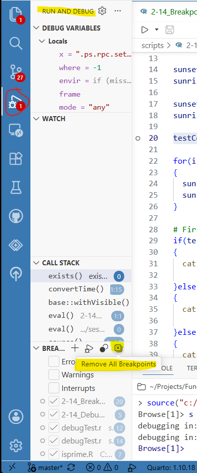

### To-do

- Is there a way to clear all breakpoints?
- breakpoints cannot be set while in debug mode (already an extension)

## Purpose

- set up breakpoints

- pausing execution of script for debugging

- use breakpoints inside for loops

- set up a conditional breakpoint

bp in script

- 5 controls

bp in if-else

bp in for loo

conditional bp

bp in function

bp in package function

## Material

The [script for the lesson is here](../scripts/2-14_Breakpoints.R)

A [second script that contains a function to debug](../scripts/debugTest.r)

The [data used for the lesson](../data/Lansing2016Noaa-3.csv) is here

## Debugging your code

One of the most powerful debugging tools in any programming language, and a staple of most professional programmers, is the breakpoint.  Breakpoints allows you to pause the execution of your script at a specific line or command.  While paused, you can look at ***Variables***, enter commands in the ***Console***, or move through your script one command at a time. This is a very useful tool when debugging ***for*** loop that cycles thousands of times.

 

The implementation of breakpoints in R was historically far less robust than most programming languages. However, in February 2026, Positron added a robust breakpoint implementation – marking the first time an R IDE has this feature (RStudio has breakpoints, but they are not well implemented).

## Setting up a breakpoint

A breakpoint is like a pause button in the execution your script. There are multiple ways to set a breakpoint. In this lesson we will focus on using the Positron interface to set a breakpoint. In Positrion, you set a breakpoint by clicking to the left of the line number -- this space is called the [gutter area]{.hl}.  A gray-outlined dot is initially put in the gutter area (line 4) – this is an unverified breakpoint. Once the script is executed and the code in the line is verified, the dot becomes red (line 8). Clicking again will get rid of the breakpoint.

{#fig-set_breakpoint .fs}

When you ***Source*** your code, the script will execute up to, [but not including]{.hl}, the line with the breakpoint.  Your script is now paused at the line with a breakpoint, and you are in [debug mode]{.hl}, which R calls ***Browse*** mode (@fig-source_with_bp).

 

[Note: A breakpoint only works when you ***Source*** your script.  It will not work if you use ***Control-Enter***to execute individual lines of code.]{.note}

### Debug Mode

There are 4 things in Positron that will indicate you are in debug mode:

1.  A hollow arrow will appear at the code line the script is paused at. The arrow shows you the line that will be executed next

2.  Floating debug controls will appear in file tab area

3.  The ***Console*** will indicate it is in browse mode  with `Browse[1]>`

    - The number (in this case, **1**) is supposed to tell you how many browsers you are inside. This is tough to explain, not meaningful at the point, and it does not even seem like it works. So, don't worry about it!

4.  The ***Run and Debug*** tab will appear on the left side

    - this tab has more advanced debugging tools that we will not get into in this lesson

 

{#fig-source_with_bp .fs}

## Using breakpoints

In this lesson I will put breakpoint instructions in comments like this so you can follow along:

[\## In the lesson script:]{.note}

[##    Place a breakpoint at line 8 in the lesson's script and click **Source**]{.note}

``` r
8 diffTemp = highTemps - lowTemps;
```

In @fig-source_with_bp, the script is currently paused at line 8, this means all commands in lines 1-7 have been executed.  In ***Variables*** you can see ***weatherData***, ***highTemps***, and ***lowTemps,*** which were added between lines 1-7.

``` {.r tab="Variables"}
weatherData   [366 rows x 24 columns] <data.frame>
highTemps     29 35 33 27 29...   int [366]
lowTemps      24 28 25 7 8 20...  int [366]
```

When in debug mode, you can enter commands in the ***Console***.  With these commands you can do things like view values in or execute functions on a vector:

``` {.r tab="Console"}
Browse[1]> highTemps[1:20]
[1] 29 35 33 27 29 36 42 39 42 38 16 23 18 34 42 33 26 15 21 22
Browse[1]> max(highTemps)
[1] 94
```

Or, you can create a new variable that gets added to ***Variables***:

``` {.r tab="Console"}
Browse[1]> highTemp_C = (5/9)*(highTemps-32)
Browse[1]>
```

``` {.r tab="Variables"}
highTemp_C     -1.667 1.667 0.556 -2.778...  int [366]
```

## Moving through code in debug (browse) mode

When your script arrives at a breakpoint (@fig-source_with_bp), six buttons to control the flow of your script appear in the ***Console*** tab:

1\) ***Continue***: unpauses the execution of the script (like hitting the Play button when a video is paused)

1\) ***Step Over***: executes the command at the arrow (in RStudio, this is called ***Next***)

2\) ***Step Into***: moves into a function

3\) ***Step Out***: completes a ***for*** loop or function

4\) ***Restart***: Stops execution and restarts R (not too useful...)

5\) ***Disconnect***: quits the script (no more code is executed)

 

When in debug mode [you should only use the buttons to control the flow of your script]{.hl}.  Clicking ***Source*** while in debug mode will cause problems with your script. [Extension: Clicking Source in debug mode] (read next section on ***Stop*** first).

{#fig-five_bp_controls .fs}

### Disconnect

Clicking ***Disconnect*** will take R out of debug mode and end the execution of the script.  In other words, no more commands in the script will be executed and all the components of debug mode (@fig-source_with_bp) will go away.

 

When you click ***Disconnect***, ***Q*** is put in the ***Console***. **Q** is the command to quit debug mode. You could directly type ***Q*** instead of clicking ***Disconnect***.

{#fig-bp_stop .fs}

### Continue to next Breakpoint

[\## In the lesson script:]{.note}

[\## Add a second breakpoint on line 17 (so, now we have breakpoints at lines 8 and 17) and click **Source**]{.note}

``` r
17 sunsetTimes_12Hour = c();
```

The script will pause at the first breakpoint (line 8).  If you click ***Continue***, the script will unpause and continue executing the script until the next breakpoint is reached on line 17 and pause there.  Between the first and second pause, lines 8-16 are executed and the results of these commands are in ***Variables***.

 

In ***Console***, the ***Continue*** command is ***c***.

{#fig-bp_continue .fs}

### Continue to end of script

After line 17 there are no more breakpoints, so if you click ***Continue*** again, the rest of the script will be executed and you will be taken out of debug (Browse) mode.

{#fig-continue_to_end .fs}

### breakpoint inside for loop

[\## In lesson script:]{.note}

[##   Remove the breakpoints at lines 8 and 17]{.note}

[##   Add a breakpoint at line 24 (inside the ***for*** loop)]{.note}

``` r
24 sunsetTimes_12Hour[i] = convertTime(sunsetTimes[i]);
```

If you put a breakpoint inside a ***for*** loop then ***Continue*** will stop at the breakpoint [every cycle of the **for** loop]{.hl}*.* In @fig-continue_for_loop, I clicked ***Continue*** 20 time and the ***for*** loop has cycled 20 times (and ***i = 21***)

{#fig-continue_for_loop .fs}

### Step Over (Next)

[\## In lesson script:]{.note}

[##   Remove breakpoint on line 24]{.note}

[##   Add a breakpoint on line 14]{.note}

``` r
14 sunsetTimes = weatherData$sunset;
```

If we ***Source*** the script, the code up until line 13 will execute and line 14 will have a green arrow in the gutter.

 

We can now execute one command at a time using ***Step Over***.

 

Clicking ***Step Over*** executes the command on line 14 and moves the arrow to the next command on line 15. [Note: In Console, the command for Step Over is ***n***]{.note}.

 

So, ***sunsetTimes*** is created and put in ***Variables*** and line 15, which creates ***sunriseTimes***, is highlighted with the arrow..

{#fig-bp_next .fs}

### Multiple Commands on one line

[\## In lesson script:]{.note}

[\##   Click ***Next*** until you get to line 20]{.note}

``` r
20 testCommand1=1; testCommand2=2; testCommand3=3;
```

***Step Over*** does not execute lines, **Step Over** [executes commands]{.hl}.  Lines 17 and 18 have one command each but line 20 has 3 commands. If there are multiple commands on one line then ***Step Over*** will execute them one at a time and the debugger will highlight the current command.

 

The first time I click Step Over when line 21 is highlighted, `testCommand1=1` gets executed and `testCommand2=2` becomes highlighted within the highlighted line, indicating its the next command to execute:

{#fig-multiple_command_line .fs}

## Debugging in a for loop

[\## In lesson script:]{.note}

[##   Click **Step Over** until you get to line 22]{.note}

``` r
22 for(i in 1:length(sunsetTimes))
```

When the green arrow gets to a ***for*** loop, Positron will highlight the whole ***for*** loop:

{#fig-whole_for_loop .fs}

###  Execute for loop initialization

Clicking ***Step Over*** again executes the initialization command for the ***for*** loop:

``` r
for(i in 1:length(sunsetTimes))
```

In this initialization command:

- the variable ***i*** is set to **1**

- a rule is given for how ***i*** changes each time the ***for*** loop cycles (i.e., ***i*** increases by **1**)

- the cycles end when ***i*** is equal to the length of ***sunsetTime***

 

The initialization command of a ***for*** loop executes once whereas everything inside the ***for*** loop executes [once per cycle]{.hl} of the ***for*** loop.

 

After the initialization command is executed, ***Step Over*** will move to the commands inside the ***for*** loop codeblock:

{#fig-arrow_within_for_loop .fs}

If you keep clicking ***Step Over*** and debug mode will go through each command in the ***for*** loop for each cycle of the ***for*** loop

### Step Out of the for loop

If you are inside a ***for*** loop and want to finish executing the whole ***for*** loop (i.e., complete every cycle of the loop), you can click ***Step Out***.  This will execute the rest of the ***for*** loop and put the control on the next command (in this case, the ***if-else*** structure).

{#fig-step_out .fs}

[Note: If you have a breakpoint inside the **for** loop then ***Step Out*** will just execute to the breakpoint -- similar to ***Continue*** (@fig-bp_continue).]{.note}

### Conditional breakpoints

Debugging a ***for*** loop can be quite tricky if is cycling thousands (or millions) of times. You likely do not want to pause the execution of your code every time the ***for*** loop cycle. Instead, you want to pause execution when an event occurs. To do this, we add a condition to the breakpoint. Conditional breakpoint only activate when the condition is met – this is one of the most powerful debugging tools in programming.

#### Pause for loop at a specific cycle

[\## In lesson script:]{.note}

[##   Click **Disconnect**]{.note}

[##   Remove all previous breakpoints]{.note}

[##   Right-click in the gutter area on line 25 (red circle)]{.note}

[##   Choose ***Add Conditional Breakpoint...***]{.note}

[##  Choose Expression and put in**i==200**]{.note}

[##  Click ***enter***]{.note}

{#fig-cond-bp .fs}

With the conditional breakpoint on line 25, the script will pause on the **200^th^** cycle of the ***for*** loop:

{#fig-if_null_bp .fs}

#### Pause for loop based on variable

This time we will pause the script inside the for loop when a variable meets a condition (***sunsetTimes\[i\] == 2000***)

[\## In lesson script:]{.note}

[##   Click **Disconnect**]{.note}

[##   Right-click in the gutter area on line 25 (red circle)]{.note}

[##   Choose ***Edit Breakpoint...***]{.note}

[##  Choose Expression and put in ***sunsetTimes\[i\] == 2000***]{.note}

[##  Click ***enter***]{.note}

The script will pause on the **141^st^** cycle of the ***for*** loop, which represents the first day that sunset is at exactly 8:00pm (2000 hours)

{#fig-conditional_br .fs}

## If-else statements

[\## In lesson script:]{.note}

[##   Remove all previous breakpoints]{.note}

[##   Add a breakpoint on line 29]{.note}

``` r
29 if(testCommand3 == 1) # FALSE
```

Similar to the initialization of ***for*** loops, the code inside the parentheses of ***if-else*** statements is a command.  The command, which is a conditional statements, outputs a Boolean (TRUE/FALSE) value that is used to determined if the codeblock gets executed.

 

When you set a breakpoint at the ***if()*** line, the whole ***if-else*** is highlighted in RStudio when the code is stopped at the line. 

{#fig-if_else_debug .fs}

As you click ***Step Over***, the control (arrow) will either:

- move to the next conditional statement (if the current conditional statement is **FALSE**)

- move inside the codeblock (if the current conditional statement is **TRUE**)

 

The following lines are not executed in an ***if-else*** structure and will be skipped over in debug mode:

- codeblocks attached to ***FALSE*** conditional statements

- ***else*** statements that were preceded by a **TRUE** conditional statement

  - the codeblock attached to these ***else*** statements will also not be executed

## Debugging within functions (Step In)

[\## In lesson script:]{.note}

[##   Remove all previous breakpoints]{.note}

[##   Add a breakpoint on line 25]{.note}

Inside the ***for*** loop on lines 24 and 25, we call ***convertTime()*** twice.  ***convertTime()*** is a function inside ***debugTest.R***.  If you click ***Step Over*** while on line 24, then the whole line is executed, along with the ***convertTime()*** function, and control will go to the next line.

 

You can debug inside the ***convertTime()*** function by clicking ***Step-In*** while on the lines 24 or 25 (the lines with the function) -- this will move control to the function and the whole function will be highlighted:

{#fig-step_in .fs}

***Step-in*** works whether the function is inside the same script or in another script.  However, ***Step-in*** will not work if the function is inside a package. To fix this, we need to

### Executing command within the function

Once inside the function you can use the debug buttons like before. ***Step Over*** will execute one command at a time inside the function.  ***Step Out*** will complete the whole function and return to the next command in the main script.

## Application

A\) In Comments at the end of the script answer the following questions:

1.  Why might it be a bad idea to put breakpoint without a condition inside a ***for*** loop?

2.  What happens when you try to put a breakpoint on a line with only comments? (try it)

3.  What happens if you put a breakpoint at line 48 and click ***Source***?  How about line 44?  Why is there a difference?

4.  What happens if you put a breakpoint in the middle of the ***ggplot()*** call? 

     

B\) Set up a conditional breakpoint within the ***for*** loop that pauses the script every 30^th^ cycle.

- A good way to to do this involves using [modulus division](1-14_Functions2.html#sec-mod)

 

C\) Set up a conditional breakpoint within a ***for*** loop to pause the code when ***windSpeed*** is between 35 and 40mph.



### End-of-class survey

[Please take this short (less than 5 minutes) survey regarding this class.](https://msu.co1.qualtrics.com/jfe/form/SV_b9I3VPJ2We28Qzs?online=true&sync=false&class=ggplot)

## Extension: Clicking Source in debug mode

Sourcing a script when it is in debug mode is never a good idea. When you click ***Source*** while in debug mode, you are creating a new instance of your script with all the breakpoints attached. What this effectively means is that you are in multiple debug modes for the same script. When you want to quit debug mode, you have to quit for each instance. Something like this:

::: {#fig-SourceInDebug}
``` r
Browse[1]> Q
Browse[1]> Q
Browse[1]> Q
Browse[1]> Q
Browse[1]> Q
Browse[1]> Q
Browse[1]> Q
Browse[1]> Q
Browse[1]> Q
Browse[1]> Q
> 
```

Had to quit 10 times because Source was clicked 9 times while in debug mode
:::

## Extension: Modifying breakpoints in debug mode

[Breakpoints added in debug mode will not work until the next time the script is Sourced]{.hl}*.* You will see an the outlined gray dot indicating the breakpoint is not active.

 

If you remove a breakpoint in debug mode, the red dot will disappear but the breakpoint remains in effect until you exit debug mode.

## Extension: Removing all breakpoints

IF you have put in a lot of breakpoint and cannot find them all, you can remove them all at once by going into the ***Run and Debug*** tab -\> ***Breakpoint*** -\> Click on ***Remove All Breakpoints***:

{#fig-remove-all-bp .fs}