### To-do

- Put function in same script for this lesson?

## Purpose

- set up breakpoints

- pausing execution of script for debugging

- use breakpoints inside for loops

- set up a conditional breakpoint

## Material

The [script for the lesson is here](../scripts/2-14_Breakpoints.R)

A [second script that contains a function to debug](../scripts/2-14_ConvertTime.r)

The [data used for the lesson](../data/Lansing2016Noaa-3.csv) is here

## Debugging your code

One of the most powerful debugging tools in any programming language, and a staple of most professional programmers, is the breakpoint.  Breakpoints allows you to pause the execution of your script at a specific line or command.  While paused, you can look at ***Variables*** as they are at that moment in the script's execution, enter commands in the ***Console***, or step through your script's execution. This is a very useful tool for tracking down hard-to-find problems in your script.

 

The implementation of breakpoints in R was historically far less robust than most programming languages. However, in February 2026, Positron added breakpoints – marking the first time an R development environment effectively implemented breakpoints (RStudio has breakpoints, but they were not well implemented).

### Issues with breakpoints in Positron

Breakpoints were first introduced to Positron in February 2026 and, while they work, there are still some obvious bugs and quirks. Positron knows about the issues and I would expect them to be fixed by mid-2027. Until then, I will mention the bugs, how things should work, and they currently work.

 

Here are the bugs (and a bit of self-promotion, too):

- <https://github.com/posit-dev/positron/issues/15532>

- <https://github.com/posit-dev/positron/issues/15533>

## Setting up a breakpoint

A breakpoint is like a pause button in the execution your script.  In Positron, you set a breakpoint by clicking to the left of the line number -- this space is called the [gutter area]{.hl}.  A gray-outlined dot is initially put in the gutter area (line 4) – indicating that this is an unverified breakpoint. Once the script is sourced and the code in the line is verified, the dot becomes red (line 8). [Note: Clicking on the breakpoint dot removes the breakpoint.]{.note}

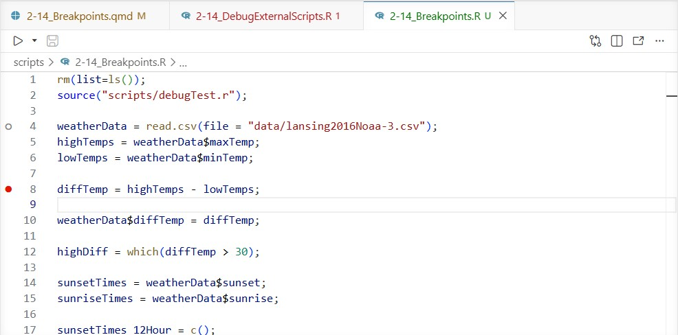{#fig-set_breakpoint .fs}

When you ***Source*** your code, the script will execute up to, [but not including]{.hl}, the line with the breakpoint.  Your script is now paused at the line with a breakpoint, and you are in [debug mode]{.hl}, which R calls ***Browse*** mode (@fig-source_with_bp).

 

[Note: A breakpoint only works when you ***Source*** your script.  It will not work if you use ***Control-Enter*** to execute individual lines of code.]{.note}

### Debug Mode

There are 4 things in Positron that indicate you are in debug mode:

1.  A hollow arrow appears at the code line the script is paused at. The arrow shows you the line that will be executed next (i.e., the script is paused right before the line of code)

2.  Floating debug controls appear in file tab area

3.  The ***Console*** indicates it is in browse mode with `Browse[1]>`

4.  The ***Run and Debug*** tab appears on the left side

    - this tab has more advanced debugging tools that we will not get into in this lesson

 

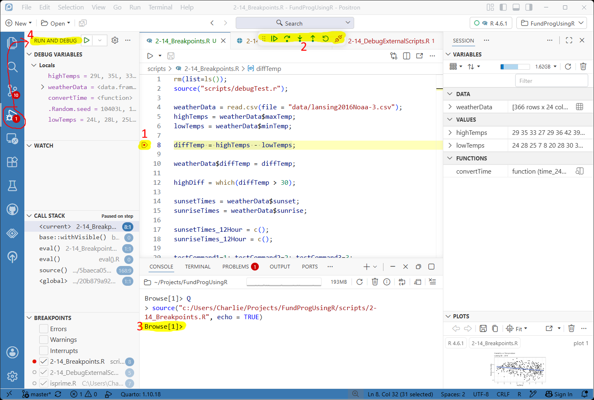{#fig-source_with_bp .fs}

## Using breakpoints

[In the lesson script:]{.note}

- [Place a breakpoint at line 8 in the lesson's script and click **Source**]{.note}

``` r
8 diffTemp = highTemps - lowTemps;
```

In @fig-source_with_bp, the script is currently paused at line 8, this means all commands in lines 1-7 have been executed.  In ***Variables*** you can see ***weatherData***, ***highTemps***, and ***lowTemps,*** which were added between lines 1-7.

``` {.r tab="Variables"}
weatherData   [366 rows x 24 columns] <data.frame>
highTemps     29 35 33 27 29...   int [366]
lowTemps      24 28 25 7 8 20...  int [366]
```

### Entering Console commands

When in debug mode, you can enter commands in the ***Console***.  With these commands you can do things like view values in or execute functions on a vector:

``` {.r tab="Console"}
Browse[1]> highTemps[1:20]
[1] 29 35 33 27 29 36 42 39 42 38 16 23 18 34 42 33 26 15 21 22
Browse[1]> max(highTemps)
[1] 94
```

Or, you can create a new variable that gets added to ***Variables***:

``` {.r tab="Console"}
Browse[1]> highTemp_C = (5/9)*(highTemps-32)
Browse[1]>
```

``` {.r tab="Variables"}
highTemp_C     -1.667 1.667 0.556 -2.778...  int [366]
```

Or you can modify an existing variable (this is used a lot to test different coding scenarios):

``` {.r tab="Console"}
Browse[1]> lowTemps = lowTemps - 10
Browse[1]> lowTemps
  [1]  14  18  15  -3  -2  10  18  20  28  ... 
 [36]   8  10  22  19  12   1   0  -4  -8  ...
...
[351]  -3   6  -2  -2  -1  10  19  17  24  ...
Browse[1]>
```

## Moving through code in debug (browse) mode

When your script arrives at a breakpoint (@fig-source_with_bp), a floating control bar with six buttons appears.

 

In order, the control buttons are:

1\) ***Continue***: unpauses the execution of the script (like hitting the Play button when a video is paused)

2\) ***Step Over***: executes the command at the arrow (in RStudio, this is called ***Next***)

3\) ***Step Into***: moves into a function

- if the command has no function, ***Step Into*** acts like ***Step Over***

4\) ***Step Out***: completes a ***for*** loop or function and pauses the script at the next line

- if not in a ***for*** loop or function, ***Step Out*** acts like ***Continue***
- [BUG]{.hl}: if the breakpoint is in a ***for*** loop or function, ***Step Out*** [will exit but not pause]{.hl} at the next line
  - this is a pretty nasty bug because it creates very confusing scenarios!

5\) ***Restart***: Stops execution and restarts R

- [BUG]{.hl}: broken – use Restart in ***Console*** (@fig-five_bp_controls), which performs the same function

6\) ***Disconnect***: quits the script (no more code is executed)

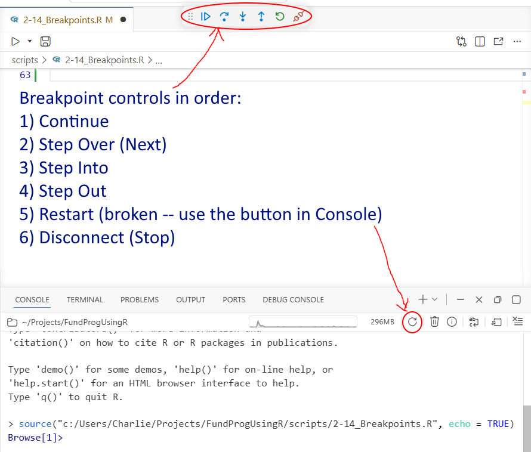{#fig-five_bp_controls .fs}

### Do not use Source in Debug Mode

When in debug mode [you should only use the six buttons to control the flow of your script]{.hl}.  Clicking ***Source*** while in debug mode will put you into multiple debug modes at once. This is not something you want to do at this point. [Extension: Clicking Source in debug mode].

### Disconnect

Clicking ***Disconnect*** will take R out of debug mode and end the execution of the script.  In other words, no more commands in the script will be executed and all the components of debug mode (@fig-source_with_bp) will go away.

 

When you click ***Disconnect***, ***Q*** is put in the ***Console***. **Q** is the command to quit debug mode. You could directly type ***Q*** instead of clicking ***Disconnect***.

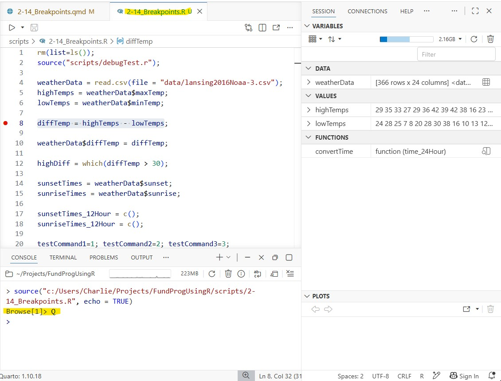{#fig-bp_stop .fs}

### Continue to next Breakpoint

[In the lesson script:]{.note}

- [Add a second breakpoint on line 17 (now there are breakpoints on lines 8 and 17) and click **Source**]{.note}

``` r
17 sunsetTimes_12Hour = c();
```

The script will pause at the first breakpoint (line 8).  If you click ***Continue***, the script will unpause and continue executing the script until the next breakpoint is reached on line 17 and pause there.  Between the first and second pause, lines 8-16 are executed and the results of these commands are in ***Variables***.

 

In ***Console***, the ***Continue*** command is ***c***.

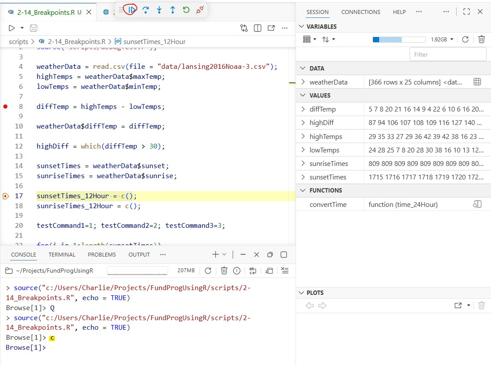{#fig-bp_continue .fs}

### Continue to end of script

After line 17 there are no more breakpoints, so if you click ***Continue*** again, the rest of the script will be executed and you will be taken out of debug (Browse) mode.

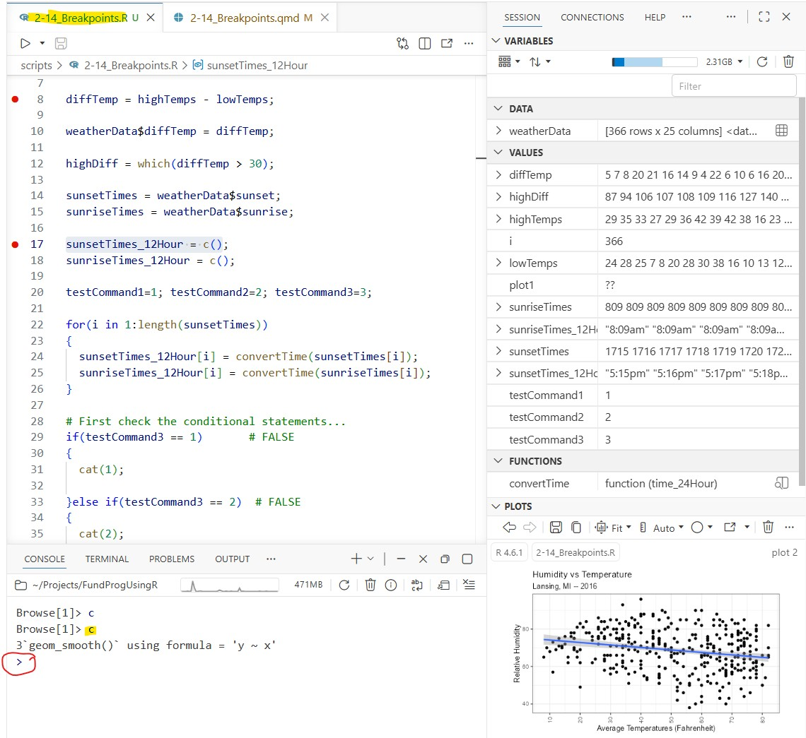{#fig-continue_to_end .fs}

### breakpoint inside ***for*** loop

[In lesson script:]{.note}

- [Remove the breakpoints at lines 8 and 17]{.note}

  - either click on breakpoints to remove or click ***Run*** -\> ***Remove All Breakpoints***

- [Add a breakpoint at line 24 (inside the ***for*** loop)]{.note}

``` r
24 sunsetTimes_12Hour[i] = convertTime(sunsetTimes[i]);
```

If you put a breakpoint inside a ***for*** loop then ***Continue*** will stop at the breakpoint [every cycle of the **for** loop]{.hl}*.* In @fig-continue_for_loop, I clicked ***Continue*** 20 time and the ***for*** loop has cycled 20 times (and ***i = 21***)

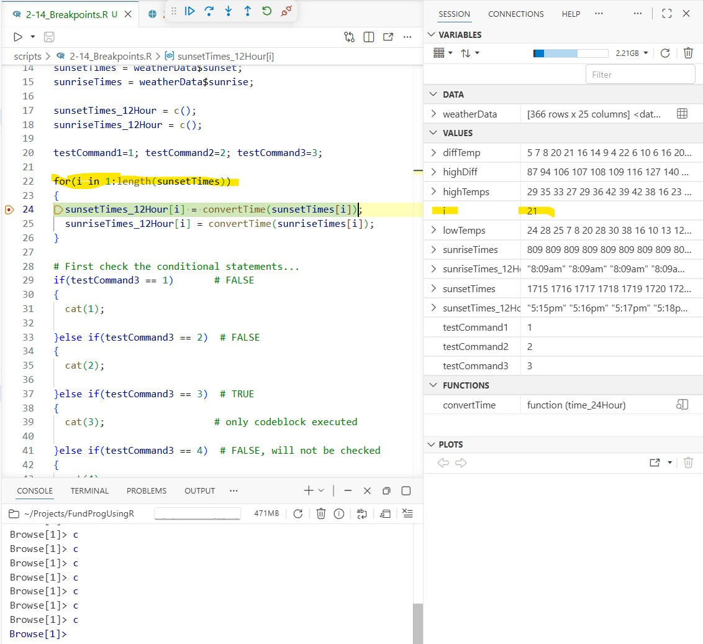{#fig-continue_for_loop .fs}

### Moving out of a for loop

If you are in a ***for*** loop with thousands of cycle then you do not want to keep clicking ***Continue*** until you are out of the ***for*** loop.

 

There are three ways to get out of the ***for*** loop with one click:

1.  Click ***Step Out*** – this [should]{.hl} complete the ***for*** loop and pause execution at the next command after the ***for*** loop (line 29)

    - [BUG]{.hl}: [***Step Out*** will not pause execution at the next command](https://github.com/posit-dev/positron/issues/15532)

    - [Bug fix: add breakpoint right after the ***for*** loop on line 29]{.note}

2.  Click ***Disconnect*** – this will end debug mode and stop the script but leave everything in ***Variables***

3.  Click ***Restart*** in ***Console*** tab (@fig-restartR) – this will end debug mode, restart the R session, and clean out ***Variables***

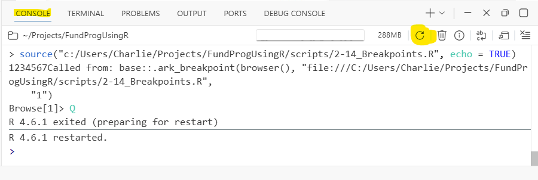{#fig-restartR .fs}

#### Restart control bug

The ***Restart*** button in the debug controls will also restart the R session and clean out ***Variables***, but breakpoints will not work after this ([this is a bug in Positron](https://github.com/posit-dev/positron/issues/15533)). If you click ***Restart*** in the debug controls, then you will need to either click ***Restart*** in the ***Console*** tab or close out and reopen Positron.

### Step Over (Next)

[In lesson script:]{.note}

- [Remove breakpoint on line 24]{.note} (or click ***Run*** -\> ***Remove All Breakpoints***)

- [Add a breakpoint on line 14]{.note}

``` r
14 sunsetTimes = weatherData$sunset;
```

If we ***Source*** the script, the code up until line 13 will execute and line 14 will have an arrow in the gutter.

 

We can now execute one command at a time using ***Step Over***.

 

Clicking ***Step Over*** executes the command on line 14 and moves the arrow to the next command on line 15. [Note: In Console, the command for Step Over is ***n***]{.note}.

 

So, ***sunsetTimes*** is created and put in ***Variables*** and line 15, which creates ***sunriseTimes***, is highlighted with the arrow..

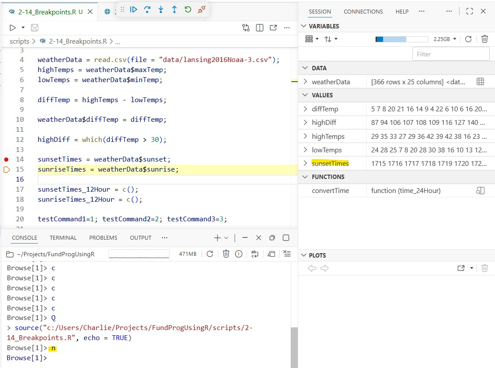{#fig-bp_next .fs}

#### Step Over and Next

Many debuggers choose to call the ***Step Over*** control ***Next***. ***Step Over*** and ***Next*** both functionally do the same thing but they take a different perspective.

 

Both tell the debugger to run the next command fully. But ***Step Over*** is explicitly saying to run all functions within the command (i.e., ***Step Over*** the functions), which could be thought of as subcommands. This is to contrast with ***Step In***, which explicitly tells the debugger to go inside the functions (i.e., ***Step In*** the function). I personally feel like the term ***Next*** is more intuitive.

### Multiple Commands on one line

[In lesson script:]{.note}

- [With breakpoint on line 14, click ***Next*** until you get to line 20]{.note}

``` r
20 testCommand1=1; testCommand2=2; testCommand3=3;
```

***Step Over*** does not execute lines, **Step Over** [executes commands]{.hl}.  Lines 14, 15, 17 and 18 have one command each but line 20 has 3 commands. If there are multiple commands on one line then ***Step Over*** will execute them one at a time and the debugger will highlight the current command.

 

The first time I click Step Over when line 20 is highlighted, `testCommand1=1` gets executed and `testCommand2=2` becomes highlighted within the highlighted line, indicating its the next command to execute:

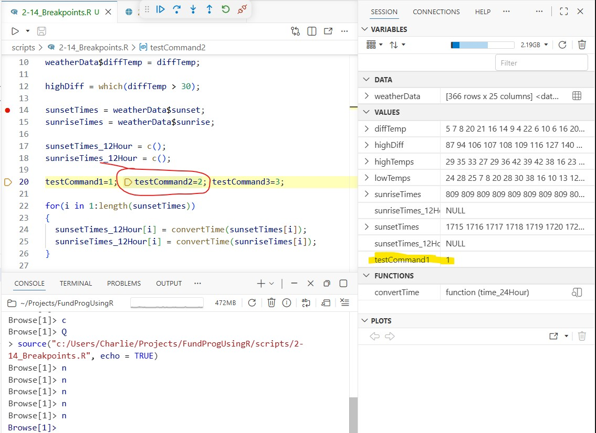{#fig-multiple_command_line .fs}

## Debugging inside a ***for*** loop

[In lesson script:]{.note}

- [Click **Step Over** until you get to line 22]{.note}

``` r
22 for(i in 1:length(sunsetTimes))
```

When the arrow gets to a ***for*** loop, Positron will highlight the whole ***for*** loop:

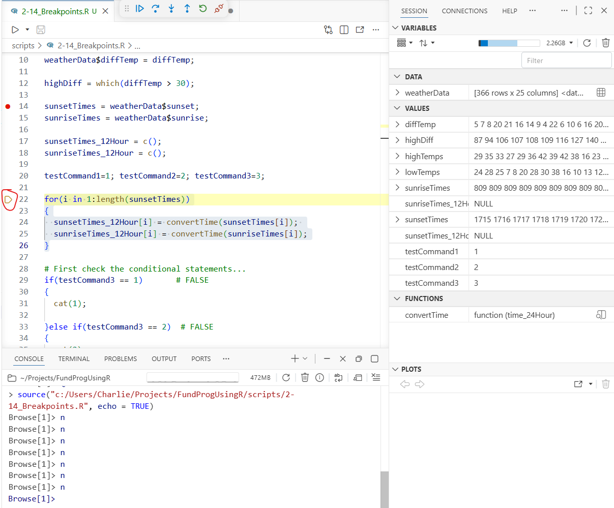{#fig-whole_for_loop .fs}

###  Execute for loop initialization

Clicking ***Step Over*** again executes the initialization command for the ***for*** loop:

``` r
for(i in 1:length(sunsetTimes))
```

In this initialization command:

- the variable ***i*** is set to **1** (***i*** will be put in ***Variables***)

- a rule is given for how ***i*** changes each time the ***for*** loop cycles (i.e., ***i*** increases by **1**)

- the cycles end when ***i*** is equal to the length of ***sunsetTime***

 

The initialization command of a ***for*** loop executes once whereas everything inside the ***for*** loop executes [once per cycle]{.hl} of the ***for*** loop.

 

After the initialization command is executed, ***Step Over*** will move to the commands inside the ***for*** loop codeblock:

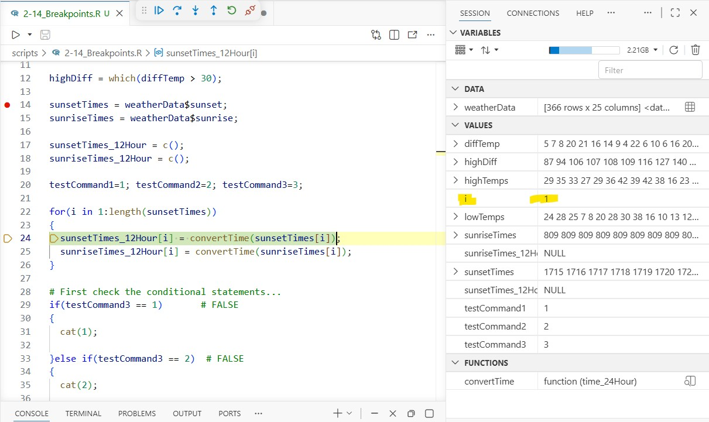{#fig-arrow_within_for_loop .fs}

If you keep clicking ***Step Over*** then debug mode will go through each command in the ***for*** loop for each cycle of the ***for*** loop (that could take a lot of time!). If you click ***Continue***, debug mode will go to the next breakpoint or the end of script if there are no more breakpoints.

### Step Out of the for loop

[Note: The ***for*** loop and ***Step Out*** bug only occurs when you stop at a breakpoint in the ***for*** loop, which is not true in this case.]{.note}

 

If you are inside a ***for*** loop and want to finish executing the whole ***for*** loop (i.e., complete every cycle of the loop), you can click ***Step Out***.  This will execute the rest of the ***for*** loop and put the control at the next command (in this case, the ***if-else*** structure).

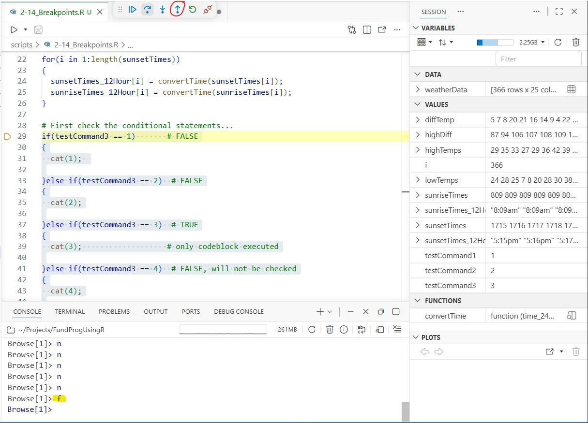{#fig-step_out .fs}

### Conditional breakpoints

Debugging a ***for*** loop can be quite tricky if it is cycling thousands (or millions) of times. You likely do not want to pause the execution of your code every time the ***for*** loop cycle. Instead, you want to pause execution when an event occurs. To do this, we add a condition to the breakpoint. Conditional breakpoint only activate in debug mode when the condition is met – this is one of the most powerful debugging tools in programming.

#### Pause for loop at a specific cycle

[In lesson script:]{.note}

- [Click **Disconnect**]{.note}

- [Remove all previous breakpoints]{.note} (click ***Run*** -\> ***Remove All Breakpoints...***)

- [Right-click in the gutter area on line 25]{.note} (@fig-conditional_br)

- [Choose ***Add Conditional Breakpoint...***]{.note}

- [Choose ***Expression*** (default choice) and put in **i==200**]{.note}

- [Click ***enter***]{.note}

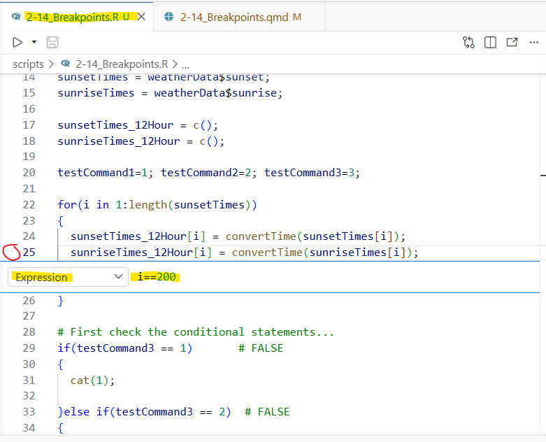{#fig-cond-bp .fs}

With the conditional breakpoint on line 25, the script will pause on the **200^th^** cycle of the ***for*** loop:

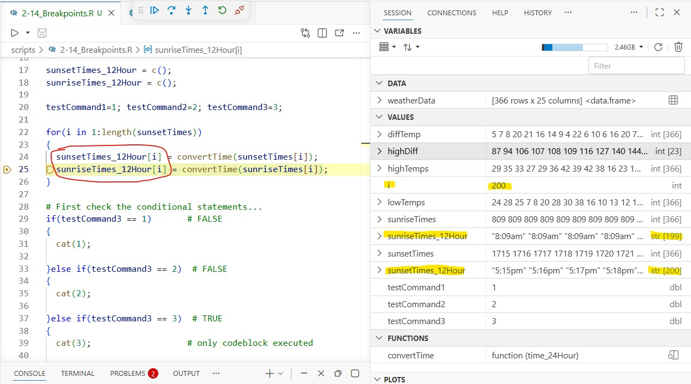{#fig-if_null_bp .fs}

#### Expressions are conditional statements

The ***Expression*** for the breakpoint works just like a conditional statement in an ***if()*** and uses the same logic.

- `i>200` \# i greater than 200

- `i<=200` \# i less than or equal to 200

- `i==200 & j==300` \# i equal to 200 and j equal to 300 (assuming there is a ***j***)

#### Pause for loop based on variable

This time we will pause the script inside the for loop when a variable meets a condition (***sunsetTimes\[i\] == 2000***)

 

[In lesson script:]{.note}

- [Click **Disconnect**]{.note}

- [Right-click in the gutter area on line 25]{.note}

- [Choose ***Edit Breakpoint...***]{.note}

- [Choose ***Expression*** and put in ***sunsetTimes\[i\] == 2000***]{.note}

- [Click ***enter***]{.note}

 

The script will pause on the **141^st^** cycle of the ***for*** loop, which represents the first day that sunset is at exactly 8:00pm (2000 hours)

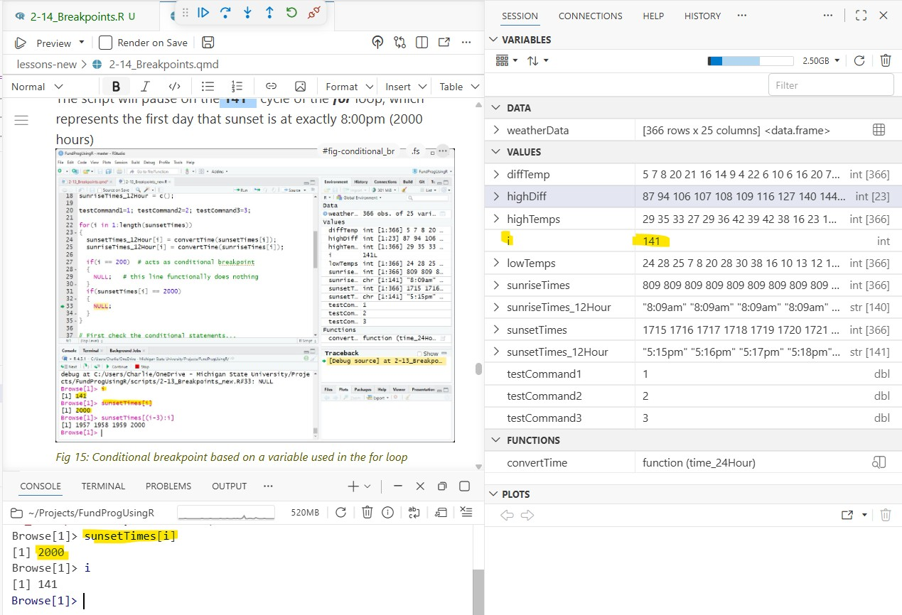{#fig-conditional_br .fs}

## If-else statements

[In lesson script:]{.note}

- [Remove all previous breakpoints]{.note} (click ***Run*** -\> ***Remove All Breakpoints...***)

- [Add a breakpoint on line 29]{.note}

``` r
29 if(testCommand3 == 1) # FALSE
```

Similar to the initialization of ***for*** loops, the conditional statement inside the parentheses of ***if-else*** statements is a command.  The command outputs a Boolean (TRUE/FALSE) value that is used to determined if the codeblock gets executed.

 

When you set a breakpoint at the ***if()*** line, the whole ***if-else*** is highlighted in Positron when the code is stopped at the line. 

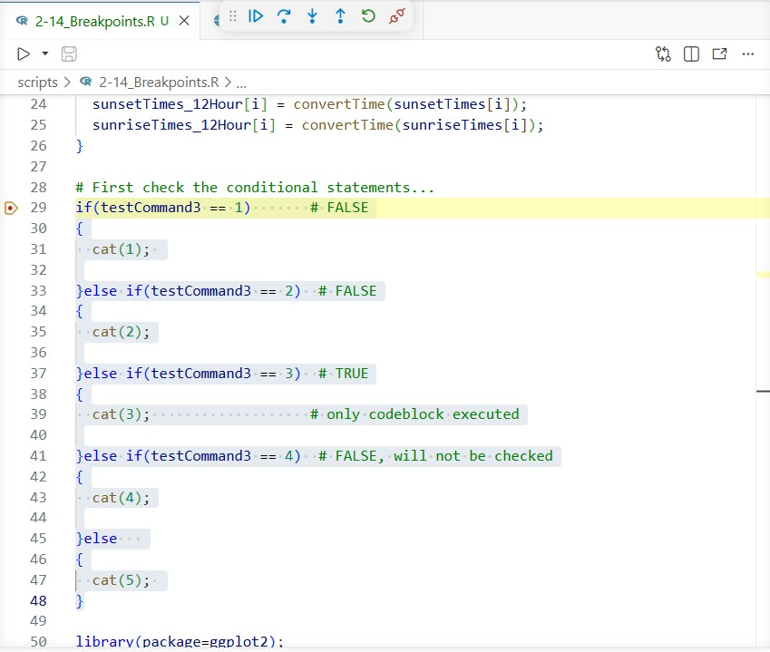{#fig-if_else_debug .fs}

As you click ***Step Over***, the control (arrow) will either:

- move to the next conditional statement (if the current conditional statement is **FALSE**)

- move inside the codeblock (if the current conditional statement is **TRUE**)

 

The following lines are not executed in an ***if-else*** structure and will be skipped over in debug mode:

- codeblocks attached to ***FALSE*** conditional statements

- ***else*** statements that were preceded by a **TRUE** conditional statement

  - the codeblock attached to these ***else*** statements will also not be executed

### Quirks with debugging if-else structures

If you put a breakpoint on an ***else if*** or ***else*** statement (lines 33, 37, 41, and 45 in @fig-if_else_debug) , that breakpoint will either not work or move to the ***if*** line (line 29 in @fig-if_else_debug). Breakpoints inside codeblocks attached to ***else if*** or ***else*** statements will work (assuming the codeblock gets executed).

 

If you put a breakpoint on line 29 in @fig-if_else_debug and click ***Source***, ***Step Over*** will go from line 29 to 33 to 37 to 39. But only line 39 will get highlighted making it hard to see the interim steps. This seems like a bug.

## Debugging within functions (Step In)

[In lesson script:]{.note}

- [Remove all previous breakpoints]{.note}

- [Add a breakpoint on line 25]{.note}

 

Inside the ***for*** loop on lines 24 and 25, we call ***convertTime()*** twice.  ***convertTime()*** is a function inside ***2-14_ConvertTime.r***.  If you click ***Step Over*** while on line 24, then the whole line is executed, along with the ***convertTime()*** function, and control will go to the next line.

 

You can also debug inside the ***convertTime()*** function by clicking ***Step In*** while on the lines 24 or 25 (the lines with the function) -- this will move control to the function and the whole function will be highlighted:

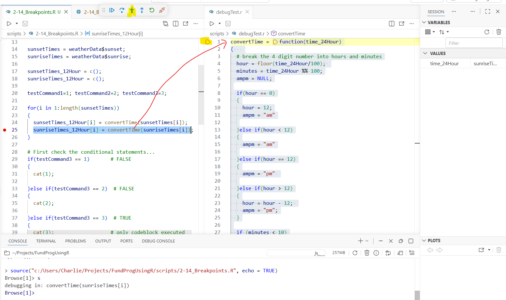{#fig-step_in .fs}

***Step In*** works whether the function is inside the same script or in another script.  However, ***Step In*** will not work if the function is loaded from a package – we will deal with this next lesson.

### Executing command within the function

Once inside the function you can use the debug buttons like before. ***Step Over*** will execute one command at a time inside the function.  ***Step Out*** [should]{.hl} complete the whole function and return to the next command in the main script.

[BUG]{.hl}: ***Step Out*** will act like ***Continue***, meaning it will run to the next breakpoint or the end of script, similar to a ***for*** loop

## Application

Breakpoints are designed so that someone can locally debug their script. This means breakpoints are not shared so I cannot see the breakpoint you put in your script. So, everything in this application has to be answered in comments

 

A\) Answer the following questions:

1.  Why might it be a bad idea to put breakpoint without a condition inside a ***for*** loop?

2.  What happens when you try to put a breakpoint on a line with only comments? (try it)

3.  What happens if you put a breakpoint at line 39 and click ***Source***?  How about line 35?  Why is there a difference?

4.  What happens if you put a breakpoint in the middle of the ***ggplot()*** call? 

5.  What is the difference between putting a breakpoint on line 33 vs. line 35?

     

B\) Set up a conditional breakpoint within the ***for*** loop that pauses the script every 30^th^ cycle.

- A good way to to do this involves using [modulus division](1-14_Functions2.html#sec-mod)

 

C\) Set up a conditional breakpoint within a ***for*** loop to pause the code when ***windSpeed*** is between 35 and 40mph.



D\) In the lesson script, where might you want to put a breakpoint if the time values are coming out like this: `12:8am`, `12:9am`, `12:10am`?

 

E\) What would you need to do if, after the first time the conditional breakpoint in part C is hit, you want to complete the whole ***for*** loop and pause the script (i.e., pause right after the for loop completes).

## Extension: Clicking Source in debug mode

Sourcing a script when it is in debug mode is never a good idea. When you click ***Source*** while in debug mode, you are creating a new instance of your script with all the breakpoints attached. What this effectively means is that you are running multiple debug modes for the same script. The only real solution now is to ***Disconnect*** (***Q*** in ***Console***):

::: {#fig-SourceInDebug}
``` r
Browse[1]> source("c:/Users/Charlie/Desktop/test/a.R", echo = TRUE)
Browse[2]> source("c:/Users/Charlie/Desktop/test/a.R", echo = TRUE)
Browse[3]> source("c:/Users/Charlie/Desktop/test/a.R", echo = TRUE)
Browse[4]> Q
> 
```

Had to Disconnect (Q) because Source added multiple debug mode
:::

## Extension: Modifying breakpoints in debug mode

Breakpoints can be added and removed at any time, even when you are already in debug mode. However, [breakpoints modified in debug mode will not work until the next time the script is Sourced]{.hl}*.* You will see an the outlined gray dot indicating the breakpoint is not active.

 

If you remove a breakpoint in debug mode, the red dot will disappear but the breakpoint remains in effect until you exit debug mode.