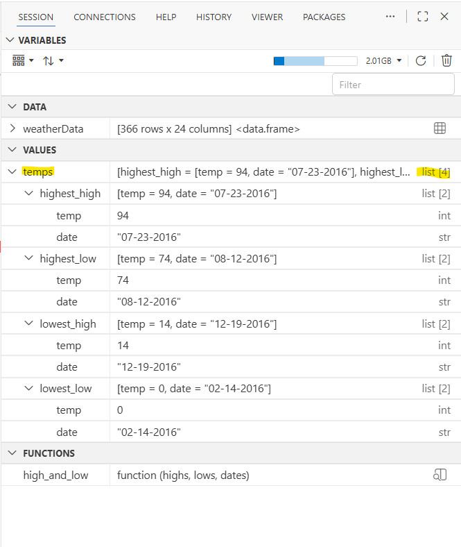
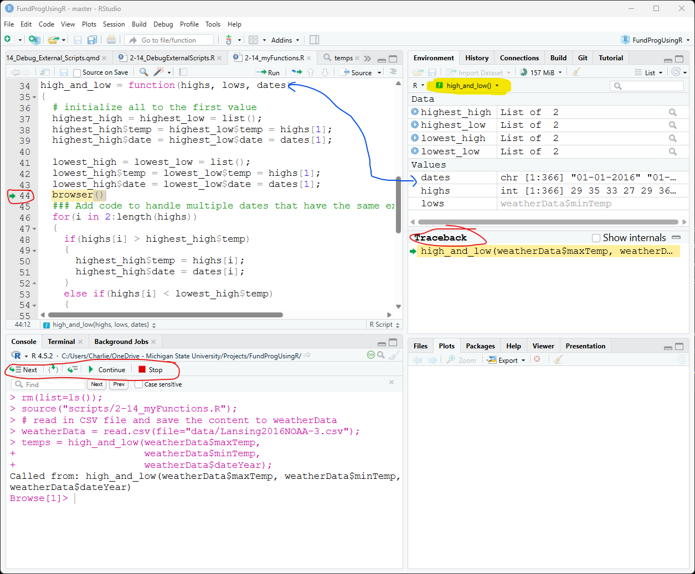
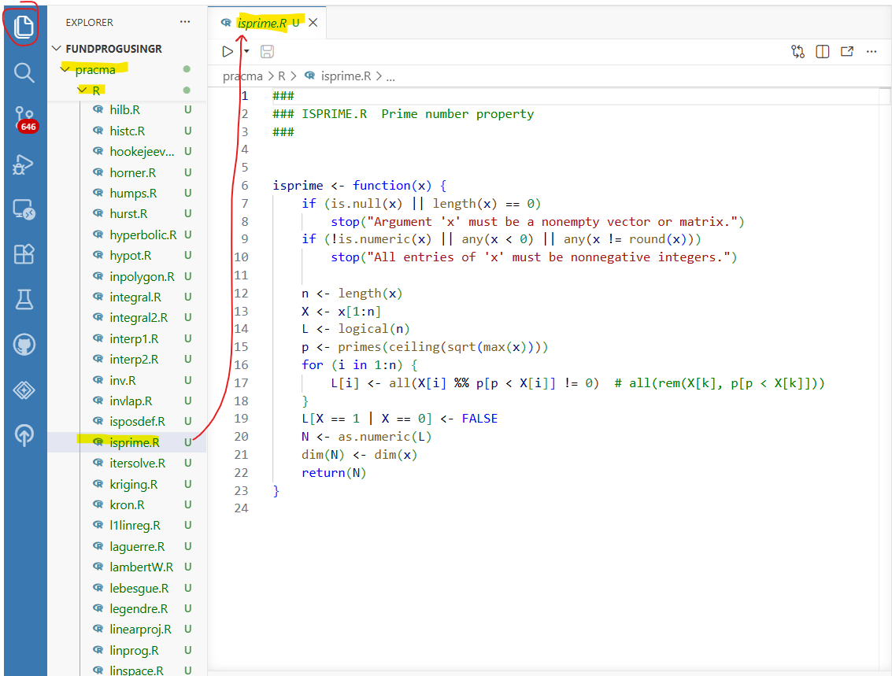
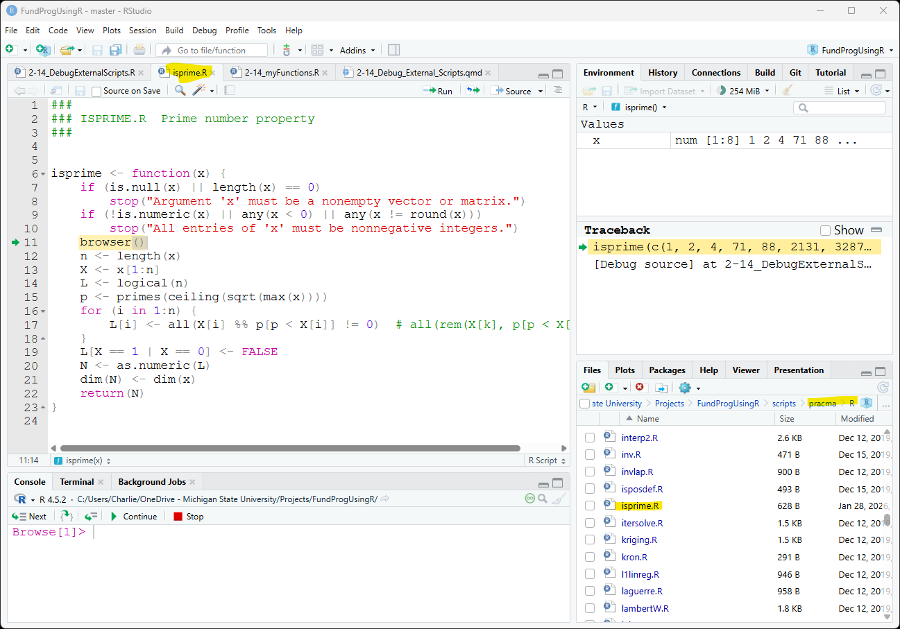

### To-do

- Can you switch environments?

- define scope

- REmove All Breakpoints very important!

## Purpose

- Debug external scripts with browser()

- Access scripts from packages and debug

## Material

The [script for the lesson is here](../scripts/2-15_DebugExternalScripts.R)

A [second script that contains a function to debug](../scripts/2-15_myFunctions.R)

The [data used for the lesson](../data/Lansing2016Noaa-3.csv) is here

## Adding breakpoints to external scripts  

Let's first ***Execute*** just the first seven line of the script ***2-15_DebugExternalScripts.R***.

``` r
rm(list=ls());
source("scripts/2-15_myFunctions.R");

# read in CSV file and save the content to weatherData
weatherData = read.csv(file="data/Lansing2016NOAA-3.csv");

temps = high_and_low(weatherData$maxTemp, 
                     weatherData$minTemp, 
                     weatherData$dateYear);
```

***high_and_low()*** is a function inside the script ***2-15_myFunctions.R***. On line 7, it is called with three arguments: the ***maxTemp***, ***minTemp***, and ***dateYear*** columns from ***weatherData***. After the function is called, ***temps*** appears in ***Variables*** as a List with 4 objects in it, which are the return value from ***high_and_low()***. [Note: each object in ***temps*** is also a List with 2 objects]{.note}

{#fig-return-list .fs}

### Add a breakpoint to a funciton

We can directly pause the function ***high_and_low()*** by adding a breakpoint to the script. Let's put a breakpoint at line 13:

``` {.r tab="2-15_myFunctions.R"}
13   for(i in 2:length(highs))
```

Initially, this will put a gray circle in the gutter area next to line 13. The gray circle indicates that the breakpoint is not yet active – when you mouseover the circle, Positron will indicate the breakpoint is ***unverified***.

 

The breakpoint will remain unverified until the script file is Sourced, which is done on line 2 of ***2-15_DebugExternalScripts.R:***

``` {.r tab="2-15_DebugExternalScripts.R"}
source("scripts/2-15_myFunctions.R");
```

### Executing a function with a breakpoint

When ***high_and_low()*** is called and the breakpoint is reached, R will pause the execution and put the script in debug mode.

 

This time when we Execute the first seven line of the script ***2-15_DebugExternalScripts.R***, Positron switches the file viewer to ***2-15_myFunctions.R*** and enters debug mode:

{#fig-debugMode .fs}

### Components of debug mode

Most of @fig-debugMode should look familiar from the last lesson. There is

- An arrow will appear at the code line the script is paused at. The arrow shows you the line that will be executed next

- Debug controls will appear in the ***Console*** tab

- The ***Console*** will indicate it is in browse mode  with `Browse[1]>`

- A ***Run and Debug*** pane will appear on the left side

One important difference in that ***Variables*** reflects the objects created in ***high_and_low()***. Another way to say this is that Variables reflects the scope of ***high_and_low()*** and does not see objects created in the original script.

 

When you are in you main script, Variables will switch to the scope on the main script. \<view Global Environment\>

### The function scope

Arguments in a function are variables in the function's scope that are set by the caller. In this case: ***high***, ***low***, and ***dates***, are variables set by the caller to three columns from ***weatherData*** and inside the ***high_and_low()*** scope.

 

The other variables in the function (***highest_high***, ***highest_low***, ***lowest_high***, and ***lowest_low***) and in ***Variables*** because the commands to set the values were executed before ***browser()*** .

### Debugging controls

All of the debugging control work the same as in last lesson.

- ***Continue*** will unpause the script's execution until the next ***browser()***

  - If there are no more ***browser()***, then ***Continue*** complete the function (like ***Step Out***)

- ***Step Out*** will execute the next command and move the green arrow

- ***Step In*** will move into a function (if there is one)

  - If there is no function, ***Step In*** acts like ***Next***

- ***Step Out*** will complete the execution of the function

- ***Disconnect*** will quit the script – no more code gets executed.

### conditional browser()

It is often useful to put a conditional breakpoint within a ***for*** loop, especially if you ***for*** loop is cycling many times. The ***for*** loop already has four conditional statement, each checking the extreme value against the current value. You could put a breakpoint on line **23** to see each time the ***lowest_high*** value was changed.

``` r
20    else if(highs[i] < lowest_high$temp)
21    { 
22      lowest_high$temp = highs[i];
23      lowest_high$date = dates[i];
24    }
```

Or you could add a conditional breakpoint that pauses on a certain cycle. In this case on line **15**, pause the script when ***i == 10***, the tenth cycle of the loop.

``` r
13  for(i in 2:length(highs))
14  {  
15    if(highs[i] > highest_high$temp)
«Expression:   i == 10»       
16    {
17      highest_high$temp = highs[i];
18      highest_high$date = dates[i];
19    }
    ...    
```

Or pause based on the value of a variable, in this case, when ***highs\[i\]*** is more than 90

``` r
13  for(i in 2:length(highs))
14  {  
15    if(highs[i] > highest_high$temp)
«Expression:   highs[i] > 90»      
16    {
17      highest_high$temp = highs[i];
18      highest_high$date = dates[i];
19    }
    ...   
```

### If function changes, you need to source again

When you Source a function, the function get put into Variable as it was when source – code and breakpoint. If you change either the breakpoints or the code, then you need to source the function again – otherwise Variable will have the old version.

## Positron detects the pracma call

In this case –

## Ignoring files in Git

In the next section you will be downloading a package named ***pracma*** and saving it to your project folder. This means that, without intervention, the ***pracma*** package will be added to your Git repository. This is not something you want to do because it is not really part of your project and it takes up a lot of space.

 

To avoid adding ***pracma*** to your Git repository:

1\) In Positron, click ***New -\> New File...***

2\) In the ***New File...*** prompt type in `.gitignore`

3\) In the ***Create File*** window, go to the root folder of your project and click ***Create***

4\) ***.gitignore*** will open in a file editor tab in Positron

5\) type `pracma/` in the first line and save

 

Now Git will ignore (i.e., never allow you to Stage) the ***pracma*** folder and everything in it.

## Functions from packages

R Packages have collections of script files with functions. However, it is difficult to debug a function inside a package because you do not have access to the script files – making it impossible to add breakpoints. To work around this, we are going to download the package to your computer and set up the package locally. Once installed locally, you can view, use, and modify the package’s script files just like any other external scripts.

 

The steps are:

- download the package (in this case, ***pracma***)

- unzip the package

- install ***pkgload*** library

- using ***pkgload***, load the local version of the package in your script

### Downloading package script

The ***utils*** package in R (installed with R) includes the function ***download.packages*** that lets you save a package to your computer. The command to download the ***pracma*** package is:

``` r
download.packages(pkgs="pracma", destdir = ".", type = "source")
```

This will save the ***pracma*** package, which has the name ***pracma\_#.#.#.tar.gz***, to the root folder of your project. You can change ***destdir*** to a different folder on your computer. [Note: #.#.# is the version number of pracma]{.note}.

### Unzipping package

The package is downloaded as a ***\*.tar.gz*** file, which is similar to a \*.zip file. We now need to unzip the package to extract all of the files within:

``` r
untar("pracma_#.#.#.tar.gz") # make sure you replace # with version numnber
```

You can now delete the ***pracma\_#.#.#.tar.gz*** file from the project folder.

### Install pkgload

***pkgload*** is the R package that lets you use a package directly from a local folder:

``` r
install.packages("pkgload")  
```

### load the local library

To use the functions from ***pracma***, you would normally call:

``` r
library(pracma) 
```

However, we want to use the local version of ***pracma*** so we can debug. To load the local version of ***pracma***:

``` r
pkgload::load_all("pracma")   
```

This command will make all the functions in the local ***pracma*** folder available.

 

[Note: If you do both calls, then the latter call is the one that will be in effect.]{.note}

## Debugging package script

All the script files are inside the ***R*** folder in the local ***pracma*** folder.

 

You can open the local ***pracma*** script files in Positron. Here I have opened ***isPrime.R***, which contains the function ***isprime()***. This script can be loaded, modified, and breakpoints added:

{#fig-local-package .fs}

### Debugging

Let's add a breakpoint to line 12 on isPrime.R:

``` r
12   n <- length(x)
```

When you can call ***isprime()*** from your main script and the breakpoint is reached in ***isprime()***, Positron will enter debug mode:

``` r
isprime(c(1,2,4,71,88,2131, 3287, 7819));
```

Debug mode will work exactly as is did before for your own external scripts.

{#fig-local_package .fs}

## Application

 

 

 

 

 

 

 

## Extension: Namespaces and Environments

... how packages are loaded into R

## Extension: Scope

...Why breakpoints work in main script and browser() in external script... but not vice-versa. Similar to the reason if-else structures are a little strange in R...

## Extension: Next in advanced class

- trace() to inject code

- functional programming

- object-oriented programming (S3 vs S7 objects)

- Rcpp